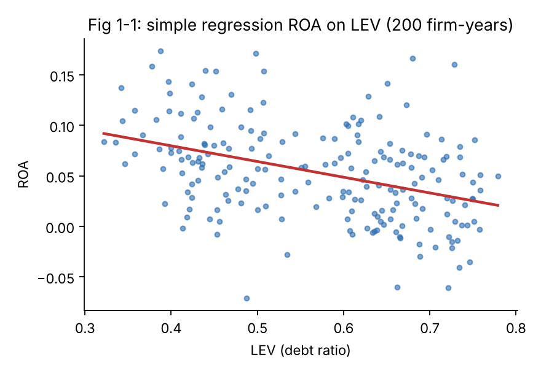
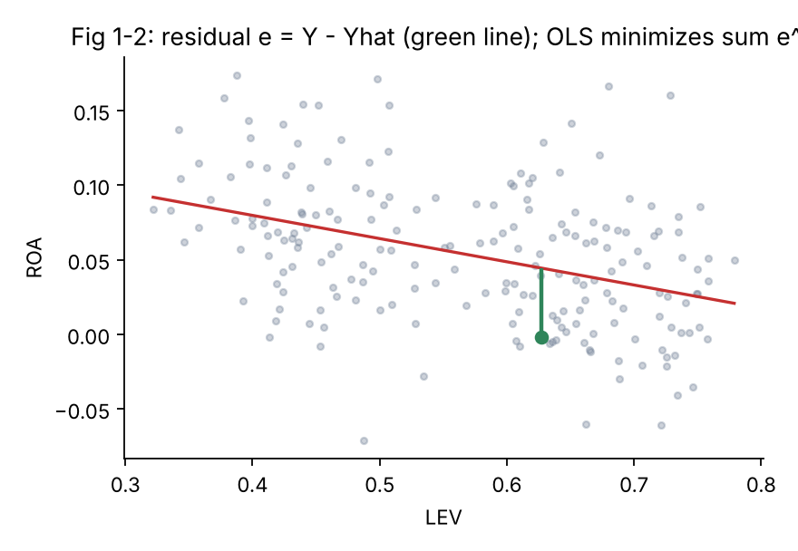

<div dir="rtl" lang="fa">

# فصل اول: مبانی اقتصادسنجی

> **هدف فصل:** پس از این فصل باید بتوانید (۱) مدل پایان‌نامهٔ خود را به‌صورت یک معادله با اجزای مشخص بنویسید، (۲) نوع داده و متغیرهای خود را درست نام‌گذاری کنید، (۳) گام‌های پژوهش را به فصل‌بندی پایان‌نامه نگاشت کنید و (۴) بدانید OLS چه می‌کند و چه زمانی «خوب» کار می‌کند.

---

## ۱-۱ اقتصادسنجی چیست و چه تفاوتی با آمار و ریاضیات مالی دارد؟

**اقتصادسنجی** (Econometrics) کاربرد روش‌های آماری برای **آزمودن نظریه‌های اقتصادی/مالی با داده‌های واقعی** و **برآورد اندازهٔ روابط** است. سه کار اصلی دارد:

1. **آزمون فرضیه:** آیا اهرم مالی بر سودآوری اثر دارد؟
2. **برآورد اندازهٔ اثر:** اگر اهرم ۱۰ درصد‌واحد افزایش یابد، سودآوری چقدر تغییر می‌کند؟
3. **پیش‌بینی:** با توجه به ویژگی‌های یک شرکت، سودآوری سال آینده‌اش چقدر است؟

### تفاوت با آمار عمومی و ریاضیات مالی

| | آمار عمومی | ریاضیات مالی | اقتصادسنجی |
|---|---|---|---|
| **پرسش اصلی** | داده‌ها چه الگویی دارند؟ | ارزش ابزار مالی/جریان نقد چقدر است؟ | آیا رابطهٔ نظری در داده‌ها تأیید می‌شود و چقدر قوی است؟ |
| **مثال** | میانگین ROA صنعت دارو | ارزش فعلی یک اوراق با نرخ ۲۵٪ | اثر اهرم بر ROA با کنترل اندازه و رشد |
| **نقش نظریه** | کم | فرض‌های قراردادی (بدون خطا) | محوری؛ مدل از نظریه می‌آید |
| **جملهٔ خطا** | گاهی | معمولاً ندارد (مدل قطعی) | **دارد و بحث‌های بسیاری حول آن است** |
| **داده** | هر داده‌ای | قراردادها و نرخ‌ها | داده‌های مشاهده‌ای (غیر آزمایشی) |

**شهود:** آمار می‌گوید «میانگین ROA برابر ۵٫۳٪ است». ریاضیات مالی می‌گوید «اگر ROA ثابت ۵٫۳٪ بماند، ارزش شرکت چنین می‌شود». اقتصادسنجی می‌گوید «به ازای هر ۱۰ واحد درصد افزایش اهرم، ROA به‌طور متوسط ۱٫۵ واحد درصد کمتر است و این رابطه از نظر آماری قابل‌اتکاست (p < 0.01)».

### چرا «داده‌های مشاهده‌ای» مهم است؟

در علوم تجربی، پژوهشگر شرایط را کنترل می‌کند (آزمایش). در مالی و حسابداری **نمی‌توان** شرکت‌ها را تصادفی به «اهرم بالا» و «اهرم پایین» تخصیص داد. ما فقط آنچه رخ داده را می‌بینیم. به همین دلیل بخش بزرگی از اقتصادسنجی دربارهٔ **جداسازی اثر یک متغیر از اثر سایر متغیرها** است؛ و به همین دلیل مفروضات کلاسیک (فصل سوم) اهمیت دارند.

> 💡 **نکتهٔ آموزشی:** هر وقت در پایان‌نامه می‌نویسید «اثر X بر Y»، داور ذهناً می‌پرسد: «آیا این علیت است یا فقط همبستگی؟». اقتصادسنجی ابزار پاسخ محتاطانه به این سؤال است، نه تضمین علیت.

> ⚠️ **هشدار:** «معنادار بودن آماری» با «درست بودن نظریه» یکی نیست. ضریب معنادار فقط می‌گوید رابطه در نمونهٔ شما به‌احتمال زیاد تصادفی نیست.


---

## ۱-۲ اجزای مدل اقتصادسنجی: متغیر، پارامتر، جمله خطا

### مدل در یک خط

> 🧮 **فرمول (۱-۱): مدل رگرسیونی خطی چندگانه**
>
> ```
> Yᵢ = β₀ + β₁·X₁ᵢ + β₂·X₂ᵢ + … + β_k·X_kᵢ + uᵢ
> ```
>
> **شرح کلمه‌به‌کلمه:**
> - `Yᵢ`: متغیر وابسته برای مشاهدهٔ i (مثلاً ROA شرکت i)
> - `β₀`: عرض از مبدأ؛ مقدار انتظاری Y وقتی همهٔ X ها صفر باشند
> - `β₁ … β_k`: ضرایب شیب؛ تغییر انتظاری Y به ازای یک واحد افزایش در Xj با ثابت‌بودن سایر متغیرها
> - `Xⱼᵢ`: متغیرهای مستقل (توضیحی)
> - `uᵢ`: جملهٔ خطا؛ هر چیزی که روی Y اثر دارد و در مدل نیست

### سه جزء اصلی

**۱) متغیر (Variable):** کمیتی که در نمونه تغییر می‌کند و اندازه‌گیری می‌شود (ROA، SIZE، LEV).

**۲) پارامتر (Parameter):** عدد **ثابت و ناشناختهٔ** جامعه که می‌خواهیم برآورد کنیم (β ها). ما آن‌ها را هرگز نمی‌بینیم؛ فقط **برآورد** `β̂` را داریم. تفاوت مهم: `β` یک عدد حقیقی و ثابت است؛ `β̂` یک متغیر تصادفی است (با نمونهٔ دیگر، عدد دیگری می‌شد).

**۳) جملهٔ خطا (Error term, u):** چهار منشأ دارد:
- **متغیرهای حذف‌شده:** مثلاً کیفیت مدیریت که قابل‌اندازه‌گیری نیست.
- **خطای اندازه‌گیری:** ارقام حسابداری با اقلام تعهدی و برآوردی ساخته می‌شوند.
- **شکل تابعی ساده‌شده:** رابطهٔ واقعی خطی نیست.
- **تصادف ذاتی:** شوک‌های غیرقابل‌پیش‌بینی (تحریم، نوسان ارز).

> ⚠️ **هشدار — خطا ≠ باقیمانده:** خطای `u` مقدار **نامشاهده** در جامعه است. باقیمانده `e = Y − Ŷ` مقداری است که پس از برآورد از نمونه محاسبه می‌شود. آزمون‌های «خطا» در عمل روی «باقیمانده‌ها» اجرا می‌شوند.

### مثال عددی: ROA و اهرم برای ۸ شرکت (سال ۱۴۰۱)

| شرکت | LEV (X) | ROA (Y) |
|---|---|---|
| ۱ | ۰٫۶۱۰ | −۰٫۰۰۸ |
| ۲ | ۰٫۷۰۰ | −۰٫۰۰۳ |
| ۳ | ۰٫۵۵۵ | ۰٫۰۶۰ |
| ۴ | ۰٫۷۲۲ | −۰٫۰۱۱ |
| ۵ | ۰٫۷۳۴ | −۰٫۰۴۱ |
| ۶ | ۰٫۵۰۷ | ۰٫۱۲۳ |
| ۷ | ۰٫۴۳۵ | ۰٫۱۲۸ |
| ۸ | ۰٫۴۲۴ | ۰٫۰۲۹ |

مدل: `ROA = β₀ + β₁·LEV + u`. برآورد OLS (بخش ۱-۷ محاسبه می‌شود): `ROA^ = 0.266 − 0.395·LEV`. برای شرکت ۶ (LEV = ۰٫۵۰۷): مقدار برازش‌شده ≈ ۰٫۰۶۶ و ROA واقعی ۰٫۱۲۳ است؛ **باقیمانده ≈ +۰٫۰۵۷** یعنی این شرکت ۵٫۷ واحد درصد بهتر از «پیش‌بینی مدل» عمل کرده است. این بخش «ناشناختهٔ» عملکرد شرکت ۶ (مدیریت، مزیت صنعتی، …) همان `u` است.

> ✍️ **جملهٔ آمادهٔ پایان‌نامه — معرفی مدل:**
> «برای آزمون فرضیهٔ [شمارهٔ فرضیه]، مدل رگرسیونی زیر برآورد شد: `[متغیر وابسته]ᵢₜ = β₀ + β₁[متغیر مستقل اصلی]ᵢₜ + β₂[کنترل ۱]ᵢₜ + … + uᵢₜ` که در آن i نشان‌دهندهٔ شرکت، t نشان‌دهندهٔ سال و u جملهٔ خطاست.»

---

## ۱-۳ انواع داده: مقطعی، سری زمانی، تابلویی

### سه ساختار

| نوع | تعریف | مثال بورسی/حسابداری | اندیس‌ها |
|---|---|---|---|
| **مقطعی** (Cross-section) | چند واحد در **یک زمان** | ROA ۲۰ شرکت دارویی فقط در سال ۱۴۰۱ | `i` |
| **سری زمانی** (Time series) | **یک واحد** در چند زمان | ROA ماهانه/سالانه شرکت «الف» در ۱۳۹۲–۱۴۰۱؛ یا شاخص کل بورس روزانه | `t` |
| **تابلویی** (Panel / Longitudinal) | چند واحد در چند زمان | ROA ۲۰ شرکت در ۱۰ سال = ۲۰۰ مشاهده | `i, t` |

### جزئیات هر نوع

**مقطعی:** ساده‌ترین؛ مشکل اصلی آن ناهمسانی واریانس (شرکت بزرگ و کوچک) و متغیرهای حذف‌شدهٔ ثابت در زمان (فرهنگ سازمانی) است.

**سری زمانی:** مشکل اصلی **خودهمبستگی** (سود امسال با سود پارسال مرتبط است) و **ناایستایی** (روند). فصل‌های ایستایی و هم‌انباشتگی (ادامهٔ کتاب) مخصوص این نوع داده‌اند.

**تابلویی:** بیشترین کاربرد در حسابداری. مزیت: کنترل ویژگی‌های ثابت و نامشاهدهٔ شرکت‌ها، افزایش مشاهدات و درجهٔ آزادی. 

**متوازن یا نامتوازن؟** اگر هر شرکت همهٔ سال‌ها داده داشته باشد، تابلو **متوازن** (Balanced) است: `N × T`. اگر سال‌هایی نداشته باشد (شرکت وسط دوره وارد بورس شده یا توقف نماد داشته)، **نامتوازن** است. در پایان‌نامه‌های ایرانی بیشتر فیلترهای انتخاب نمونه (سال مالی منتهی به اسفند، عدم توقف نماد بیش از ۶ ماه، عدم فعالیت در صنایع مالی) به تابلوی متوازن می‌انجامند.

### مثال عددی از مجموعه‌دادهٔ کتاب

مجموعه‌دادهٔ کتاب: `N = 20` شرکت، `T = 10` سال، پس `n = N × T = 200`. هر ردیف یک «شرکت-سال» است:

| firm | year | ROA | SIZE | LEV | GROWTH | CFO |
|---|---|---|---|---|---|---|
| ۱ | ۱۳۹۲ | ۰٫۰۰۵ | ۱۲٫۸۱ | ۰٫۷۲۹ | ۰٫۱۲۱ | ۰٫۱۴۳ |
| ۱ | ۱۳۹۳ | −۰٫۰۱۰ | ۱۳٫۰۲ | ۰٫۶۶۵ | −۰٫۲۵۷ | ۰٫۰۶۴ |
| ۱ | ۱۳۹۴ | ۰٫۰۱۵ | ۱۳٫۱۱ | ۰٫۶۰۹ | ۰٫۲۲۵ | ۰٫۰۴۱ |
| … | … | … | … | … | … | … |

> 🏦 **اگر داده تابلویی دارید:** تمام فصل‌های ۲ و ۳ برای تابلویی هم قابل‌استفاده‌اند، اما در فصل ۳ مدل «تجمیعی» (Pooled OLS) را برآورد می‌کنیم که ناهمگنی بین شرکت‌ها را نادیده می‌گیرد. آزمون لیمر، هاوسمن و اثرات ثابت/تصادفی موضوع **فصل چهارم** (خارج از این کتاب) است. هر جا فرض‌های کلاسیک برای تابلویی رفتار متفاوتی داشته باشند (مثلاً خودهمبستگی)، کادر «اگر داده تابلویی دارید» آن را یادآوری می‌کند.

> 💡 **نکتهٔ آموزشی:** پیش از هر کاری بنویسید: «داده‌های من N = … شرکت، T = … سال، تابلوی متوازن/نامتوازن و n = … مشاهده است.» این جمله باید دقیقاً در بخش «جامعه و نمونه» پایان‌نامه بیاید.

> ✍️ **جملهٔ آمادهٔ پایان‌نامه — توصیف داده:**
> «داده‌های پژوهش به‌صورت تابلویی [متوازن/نامتوازن] و شامل [N] شرکت پذیرفته‌شده در بورس اوراق بهادار تهران طی دورهٔ [سال شروع] تا [سال پایان] ([T] سال) است که مجموعاً [n] مشاهدهٔ سال-شرکت را در بر می‌گیرد.»

---

## ۱-۴ انواع متغیرها در پژوهش‌های مالی

### (الف) وابسته و مستقل

- **متغیر وابسته (Dependent):** پدیده‌ای که می‌خواهید تبیین کنید؛ سمت چپ معادله (ROA، مدیریت سود، ریسک سقوط قیمت).
- **متغیر مستقل (Independent / Explanatory):** عاملی که فرض می‌کنید اثر دارد؛ سمت راست. متغیر **مستقل اصلی** همان است که فرضیه دربارهٔ آن است؛ بقیه **کنترل** (Control) اند.

### (ب) متغیر مجازی (Dummy)

مقدار ۰/۱ برای ویژگی کیفی. مثال‌ها: `COVID` (۱ برای ۱۳۹۹ به بعد)، صنعت، اظهارنظر حسابرس (مقبول=۰/غیرمقبول=۱)، مالکیت دولتی. 

> ⚠️ **هشدار — تلهٔ مجازی:** اگر صنعت پنج دسته دارد، فقط **۴ مجازی** وارد کنید (یکی «مبنا»). ورود هر ۵ + عرض از مبدأ، همخطی کامل می‌سازد.

### (ج) لگاریتمی

`ln(ASSETS)` برای «اندازه»: دلایل: ۱) توزیع دارایی‌ها به‌شدت چوله است؛ ۲) تفسیر درصدی؛ ۳) تثبیت واریانس. فقط برای مقادیر **مثبت** تعریف می‌شود (برای ROA منفی نمی‌توان لگاریتم گرفت).

مثال: `ASSETS = 1,500,000` میلیون ریال → `ln = 14.22`.

### (د) وقفه‌ای (Lagged)

`Xₜ₋₁`: مقدار دورهٔ قبل. کاربرد: ۱) داده‌های مؤثر با تأخیر (اثر سود دورهٔ قبل بر سرمایه‌گذاری)؛ ۲) کاهش نگرانی درون‌زایی. هزینه: **از دست رفتن مشاهدهٔ اول هر شرکت** (در مثال ما: ۲۰۰ → ۱۸۰).

### (هـ) تعاملی (Interaction)

حاصل‌ضرب دو متغیر: `LEV × COVID`. نشان می‌دهد اثر یک متغیر **به سطح متغیر دیگر بستگی دارد**. قاعده: متغیرهای اصلی (مؤلفه‌ها) را هم حتماً وارد کنید.

### جدول جمع‌بندی با مثال

| نوع | نماد مثال | ساخت | تفسیر |
|---|---|---|---|
| وابسته | `ROA` | سود خالص ÷ دارایی | پدیدهٔ مورد تبیین |
| مستقل اصلی | `LEV` | بدهی ÷ دارایی | فرضیه دربارهٔ آن |
| کنترل | `SIZE, GROWTH, CFO` | — | مهار عوامل مزاحم |
| مجازی | `COVID` | `=1` اگر سال ≥ ۱۳۹۹ | اختلاف میانگین دو گروه |
| لگاریتمی | `SIZE` | `ln(ASSETS)` | شیب = کشش یا نیم‌کشش |
| وقفه‌ای | `LEV(-1)` | مقدار سال قبل | اثر با تأخیر |
| تعاملی | `LEV*COVID` | حاصل‌ضرب | تغییر شیب بین دو دوره |

> ✍️ **جملهٔ آمادهٔ پایان‌نامه — تعریف عملیاتی متغیرها:**
> «متغیر وابسته [نام]، از تقسیم [صورت] بر [مخرج] محاسبه شد. متغیر مستقل اصلی [نام]، برابر [تعریف] است. متغیرهای کنترلی شامل اندازهٔ شرکت (لگاریتم طبیعی کل دارایی‌ها)، اهرم مالی (نسبت کل بدهی‌ها به کل دارایی‌ها) و [سایر] هستند.»

---

## ۱-۵ از نظریه تا معادله: هشت گام پژوهش اقتصادسنجی

این بخش «نقشهٔ پایان‌نامه» است. هر گام به یک بخش پایان‌نامه نگاشت می‌شود.

| گام | چه می‌کنید | جایگاه در پایان‌نامه | ابزار در این کتاب |
|---|---|---|---|
| ۱ | **طرح پرسش و فرضیه** از نظریه | فصل ۱ و ۲ (مبانی نظری و پیشینه) | — |
| ۲ | **تصریح مدل**: تعیین متغیرها و شکل تابعی | فصل ۳ (روش‌شناسی) | بخش ۳-۱ |
| ۳ | **جمع‌آوری داده** و تعریف جامعه/نمونه | فصل ۳ | فصل ۲ |
| ۴ | **پاک‌سازی و توصیف داده** | فصل ۴ (جدول آمار توصیفی) | بخش‌های ۲-۵، ۲-۱۱ |
| ۵ | **برآورد مدل** | فصل ۴ | بخش‌های ۳-۲ تا ۳-۴ |
| ۶ | **آزمون مفروضات و تشخیص‌ها** | فصل ۴ | بخش ب فصل ۳ |
| ۷ | **آزمون فرضیه و تفسیر** | فصل ۴ و ۵ | بخش‌های ۳-۵ تا ۳-۷ |
| ۸ | **استحکام‌سنجی و نتیجه‌گیری** | فصل ۵ | بخش ۳-۱۰ |

*(در این کتاب «فصل ۳» پایان‌نامه یعنی روش‌شناسی و «فصل ۴» یعنی یافته‌ها؛ آن را با «فصل سوم کتاب» اشتباه نگیرید.)*

### مثال: از فرضیه تا معادله

- **نظریه:** نظریهٔ توازن ایستا و نظریهٔ سلسله‌مراتبی: بدهی بالاتر هزینهٔ مالی و ریسک ورشکستگی ایجاد می‌کند.
- **فرضیه (H₁):** اهرم مالی بر سودآوری اثر **منفی** و معنادار دارد.
- **مدل:** `ROA = β₀ + β₁LEV + β₂SIZE + β₃GROWTH + β₄CFO + u`
- **قاعدهٔ تصمیم:** `H₀: β₁ = 0` در برابر `H₁: β₁ < 0` (یا دوطرفه `≠ 0`)؛ در سطح ۵٪ رد می‌کنیم اگر `p < 0.05`.
- **پیش‌بینی علامت:** `β₁ < 0` (انتظار نظری). اگر علامت برعکس شد، باید توضیح بدهید.

> 💡 **نکتهٔ آموزشی:** فرضیهٔ خوب سه ویژگی دارد: **جهت** (مثبت/منفی)، **متغیرها** (کدام X و کدام Y) و **قابل‌آزمون بودن** (معیار رد/عدم رد).

> ⚠️ **هشدار — مدل را بعد از دیدن داده‌ها عوض نکنید (Data mining):** اگر آن‌قدر متغیر و مدل امتحان کنید تا «معنادار» شود، p-value ها دیگر معنی ندارند. تصریح را قبل از برآورد مستند کنید.

> ✍️ **جملهٔ آمادهٔ پایان‌نامه — فرضیه:**
> «فرضیهٔ [شماره]: [متغیر مستقل] بر [متغیر وابسته] تأثیر [مثبت/منفی] و معناداری دارد. بر این اساس فرض صفر `H₀: β₁ = 0` و فرض مقابل `H₁: β₁ ≠ 0` تدوین شد و آزمون در سطح اطمینان ۹۵ درصد انجام شد.»

---

## ۱-۶ رگرسیون ساده و چندگانه؛ تفاوت اساسی همبستگی و رگرسیون

### رگرسیون ساده

یک متغیر مستقل: `Y = β₀ + β₁X + u`. برای داده‌های ۲۰۰ مشاهده‌ای کتاب، رگرسیون ROA بر LEV:

```
ROA^ = 0.1419 − 0.1555·LEV        R² = 0.159     t(LEV) = −6.13
```

یعنی اگر اهرم ۰٫۱ (۱۰ واحد درصد) بیشتر باشد، ROA به‌طور متوسط ۰٫۰۱۵۶ (۱٫۶ واحد درصد) کمتر است.



### رگرسیون چندگانه

چند متغیر مستقل. ضریب هر متغیر، اثر آن را **با ثابت نگه‌داشتن سایرین** (Ceteris paribus) نشان می‌دهد. در مدل مرجع:

```
ROA^ = −0.1116 + 0.0150·SIZE − 0.1492·LEV + 0.0318·GROWTH + 0.3041·CFO
```

ضریب LEV در مدل ساده −۰٫۱۵۵۵ و در مدل چندگانه −۰٫۱۴۹۲ است؛ نزدیک اما نه برابر. اگر اندازه و اهرم همبستگی بالایی داشتند، این تفاوت بزرگ می‌شد. این همان تفاوت **کنترل کردن** است.

### همبستگی در برابر رگرسیون

| | همبستگی (r) | رگرسیون |
|---|---|---|
| **تقارن** | متقارن: `r(X,Y) = r(Y,X)` | نامتقارن: Y وابسته و X مستقل |
| **خروجی** | یک عدد بین ۱− و ۱+ | معادله با شیب و عرض از مبدأ |
| **واحد** | بدون واحد | شیب دارای واحد (Y به ازای واحد X) |
| **اندازهٔ اثر** | فقط قدرت خطی را نشان می‌دهد | مقدار تغییر را نشان می‌دهد |
| **کنترل** | دومتغیره | کنترل متغیرهای دیگر |
| **علیت** | ندارد | بدون طرح پژوهشی مناسب، آن هم ندارد |

ارتباط: در رگرسیون ساده `β̂₁ = r · (sY / sX)` و `R² = r²`. در داده‌های ما `r(ROA, LEV) = −0.399` و `r² = 0.159` که دقیقاً همان R² رگرسیون ساده است.

> ⚠️ **هشدار — «همبستگی ≠ علیت»:** بالابودن ROA در شرکت‌های بزرگ‌تر، لزوماً به‌معنای آن نیست که «بزرگ شدن» سود را زیاد می‌کند؛ ممکن است شرکت‌های سودآور بزرگ شده باشند (علیت معکوس).

> 💡 **نکتهٔ آموزشی:** آزمون معناداری همبستگی و آزمون t شیب در رگرسیون ساده معادل‌اند (همان p-value). اما رگرسیون اطلاعات بیشتری می‌دهد.

> ✍️ **جملهٔ آمادهٔ پایان‌نامه:**
> «نتایج ماتریس همبستگی پیرسون نشان می‌دهد بین [متغیر الف] و [متغیر ب] همبستگی [مثبت/منفی] ([r] = ......) وجود دارد. با این حال، همبستگی دومتغیره کنترل سایر عوامل را در نظر نمی‌گیرد؛ از این رو برای آزمون فرضیه‌ها از رگرسیون چندگانه استفاده شد.»

---

## ۱-۷ برآوردگر OLS در یک نگاه

### ایدهٔ OLS

از میان همهٔ خط‌های ممکن، خطی را بردار که **مجموع مربعات باقیمانده‌ها** کمینه باشد. باقیمانده فاصلهٔ عمودی نقطه تا خط است؛ مربع آن را می‌گیریم تا باقیمانده‌های مثبت و منفی همدیگر را خنثی نکنند و خطاهای بزرگ بیشتر جریمه شوند.

> 🧮 **فرمول (۱-۲): برآوردگر OLS در رگرسیون ساده**
>
> ```
> β̂₁ = Σ (Xᵢ − X̄)(Yᵢ − Ȳ) / Σ (Xᵢ − X̄)²
> β̂₀ = Ȳ − β̂₁ · X̄
> ```
> **شرح:**
> - `X̄, Ȳ`: میانگین نمونه
> - صورت کسر: «کوواریانس نمونه‌ای» X و Y (هم‌حرکتی)
> - مخرج: «واریانس نمونه‌ای» X (پراکندگی X)
> - پس شیب = هم‌حرکتی ÷ پراکندگی X
> - `β̂₀` تضمین می‌کند خط از نقطهٔ میانگین `(X̄, Ȳ)` می‌گذرد

> 🧮 **فرمول (۱-۳): ماتریسی (برای چندگانه، فقط برای آشنایی)**
> ```
> β̂ = (X′X)⁻¹ · X′Y
> ```
> نرم‌افزار همین را حساب می‌کند. نیازی به محاسبهٔ دستی نیست؛ فقط بدانید اگر ستون‌های X همخطی کامل باشند، `X′X` معکوس‌پذیر نیست و برآورد ناممکن است.

### مثال عددی دستی (۸ شرکت سال ۱۴۰۱)

داده‌های جدول بخش ۱-۲:

- `X̄ (LEV) = 0.5859`، `Ȳ (ROA) = 0.0346`
- `Σ(X−X̄)(Y−Ȳ) = −0.04362`
- `Σ(X−X̄)² = 0.11032`

```
β̂₁ = −0.04362 / 0.11032 = −0.3954
β̂₀ = 0.0346 − (−0.3954)(0.5859) = 0.0346 + 0.2317 = 0.2662
```

پس `ROA^ = 0.2662 − 0.3954·LEV`. مجموع مربعات باقیمانده‌ها `SSR = 0.01095`، مجموع مربعات کل `SST = 0.02819`:

```
R² = 1 − SSR/SST = 1 − 0.01095/0.02819 = 0.612
```

یعنی ۶۱٪ پراکندگی ROA این ۸ شرکت با اهرم توضیح داده شده است. (خطای معیار شیب ۰٫۱۲۹ و `t = −3.07` با `p = 0.022`.)

> ⚠️ **هشدار — نمونهٔ ۸تایی فقط برای آموزش است!** با ۸ مشاهده هیچ پایان‌نامه‌ای را دفاع نمی‌کنید. توجه کنید ضریب این ۸ شرکت (−۰٫۴۰) با ضریب کل نمونهٔ ۲۰۰تایی (−۰٫۱۵۵) تفاوت بزرگ دارد: همان **تغییرپذیری نمونه‌ای** که خطای معیار نشان می‌دهد.



### چهار شاخص که از OLS می‌آید

1. **ضرایب** `β̂`
2. **خطای معیار** `S.E.(β̂)`: دقت برآورد (هرچه کوچک‌تر، دقیق‌تر)
3. **آمارهٔ t** = `β̂ / S.E.`: چند خطای معیار از صفر دور است
4. **R²** = سهم واریانس تبیین‌شده

> 💡 **نکتهٔ آموزشی:** قاعدهٔ سرانگشتی: اگر `|t| > 2` (با حدود ۳۰ درجهٔ آزادی یا بیشتر)، ضریب در سطح ۵٪ معنادار است. در نمونهٔ ۲۰۰تایی ما مقدار بحرانی دقیق ≈ ۱٫۹۷ است.

> ✍️ **جملهٔ آمادهٔ پایان‌نامه:**
> «پارامترهای مدل با روش حداقل مربعات معمولی (OLS) برآورد شد. این روش ضرایب را به‌گونه‌ای تعیین می‌کند که مجموع مربعات باقیمانده‌ها حداقل شود و در صورت برقراری مفروضات کلاسیک، برآوردگری بهترین، خطی و نااریب (BLUE) است.»

---

## ۱-۸ مروری کلی بر مفروضات کلاسیک و مفهوم BLUE

### قضیهٔ گاوس–مارکوف (بدون اثبات)

اگر مفروضات مشخصی برقرار باشند، OLS در میان همهٔ برآوردگرهای **خطی** و **نااریب**، کمترین واریانس را دارد؛ یعنی **BLUE** است:

- **B (Best):** کمترین واریانس → دقیق‌ترین
- **L (Linear):** ترکیب خطی از Y
- **U (Unbiased):** `E(β̂) = β` یعنی «به‌طور متوسط» درست است
- **E (Estimator):** برآوردگر

### فهرست مفروضات (نقشهٔ فصل سوم)

| # | فرض | اگر نقض شود | سنگینی نقض | آزمون در EViews |
|---|---|---|---|---|
| ۱ | خطی بودن در پارامترها | برآورد نااریب نیست (شکل تابعی غلط) | 🔴 شدید | Ramsey RESET |
| ۲ | `E(u)=0` | سوگیری (متغیر مهم حذف‌شده) | 🔴 شدید | بازنگری مدل |
| ۳ | `Cov(X,u)=0` (درون‌زایی نداشتن) | **سوگیری و ناسازگاری** | 🔴 بسیار شدید | منطق پژوهش، IV |
| ۴ | همسان‌واریانس | ناکارا؛ **خطای معیار غلط** | 🟡 متوسط | BPG / White |
| ۵ | عدم خودهمبستگی | ناکارا؛ **خطای معیار غلط** | 🟡 متوسط | DW / BG |
| ۶ | نرمال بودن خطا | فقط استنباط (n کوچک) | 🟢 ملایم | Jarque-Bera |
| ۷ | عدم همخطی | خطای معیار بزرگ؛ ضرایب ناپایدار | 🟡 متوسط | VIF / همبستگی |
| ۸ | پایداری پارامتر | ضرایب متوسط‌گیری از رژیم‌های متفاوت | 🟡 متوسط | Chow / CUSUM |

**دو دستهٔ بسیار متفاوت:**
- نقض فروض ۱–۳ → **ضرایب غلط‌اند** (سوگیری). با خطای معیار قوی‌تر درست نمی‌شود.
- نقض فروض ۴–۷ → ضرایب هنوز نااریب‌اند، ولی **خطای معیار و آزمون‌ها غلط‌اند**. با خطای معیار مقاوم معمولاً حل می‌شود.

> 💡 **نکتهٔ آموزشی:** (فرض نرمالیتی و فرض ۸ جزو «فرض‌های گاوس–مارکوف» استاندارد نیستند: نرمالیتی برای آزمون‌های دقیق در نمونهٔ کوچک و پایداری برای تفسیر معنی‌دار لازم است. در پایان‌نامه‌ها همین هشت مورد بررسی می‌شود.)

> ✍️ **جملهٔ آمادهٔ پایان‌نامه:**
> «اعتبار استنباط‌های آماری رگرسیون خطی به برقراری مفروضات کلاسیک بستگی دارد. بر این اساس، پیش از تفسیر نتایج، مفروضات خطی بودن، میانگین صفر خطا، برون‌زایی، همسانی واریانس، عدم خودهمبستگی، نرمال بودن توزیع جملهٔ خطا، عدم همخطی و پایداری پارامترها بررسی شد.»

---

## ۱-۹ ده خطای رایج دانشجویان در پایان‌نامه‌های مالی/حسابداری

| # | خطا | چرا مشکل است | راه درست |
|---|---|---|---|
| ۱ | **تفسیر ضریب بدون واحد:** «ضریب ۰٫۰۱۵ معنادار است» و تمام | خواننده نمی‌داند اثر بزرگ است یا کوچک | همیشه واحد و اندازهٔ اثر را بنویسید (بخش ۳-۶، ۳-۷) |
| ۲ | **تکیه بر R² بالا** به‌عنوان «مدل خوب» | R² با افزودن متغیر بالا می‌رود؛ مدل می‌تواند سوگیر باشد | R² تعدیل‌شده؛ مفروضات؛ منطق نظری |
| ۳ | **نادیده‌گرفتن مفروضات** یا فقط ذکر نام آزمون بدون عدد | داور می‌پرسد نتیجه چه بود؟ | جدول طلایی (بخش ۳-۹) |
| ۴ | **اشتباه در جهت فرضیه** (یک‌طرفه/دوطرفه) و p-value | p دوطرفه نصف می‌شود برای یک‌طرفه؛ سوگیری در گزارش | از ابتدا مشخص و ثابت بماند |
| ۵ | **داده‌های پرت و چولگی** بدون بررسی | چند مشاهدهٔ حدی کل ضرایب را می‌کشد | Winsorize (۱٪ و ۹۹٪) و بازرسی نمودار |
| ۶ | **استفاده از متغیرهای ناهم‌مقیاس** (ریال و درصد) | ضرایب مقایسه‌پذیر نیستند؛ ضریب «۰٫۰۰۰۰۰۱» | واحدها را یکسان یا لگاریتم/نسبت کنید |
| ۷ | **نمونه‌گیری سوگیر (بقا):** فقط شرکت‌های زنده | نتایج برای کل جامعه تعمیم‌پذیر نیست | مستندسازی و محدودیت‌ها |
| ۸ | **اجرای OLS ساده روی تابلویی** و ادعای «اثر ثابت/تصادفی» | ناهمگنی شرکت‌ها نادیده؛ خطای معیار نادرست | فصل چهارم؛ دست‌کم خطای معیار خوشه‌ای |
| ۹ | **ادعای علیت** از رگرسیون مشاهده‌ای | درون‌زایی | زبان محتاط («مرتبط با»، «همراه با») + قوی‌سازی |
| ۱۰ | **مدل‌گزینی بعد از دیدن نتایج** و گزارش فقط مدل «معنادار» | p-hacking | همهٔ مدل‌های استحکام‌سنجی را در پیوست گزارش کنید |

> ⚠️ **هشدار:** خطای ۱ تا ۳ در بیشتر پایان‌نامه‌هایی که داور بازگرداند دیده می‌شود.

---

## ✅ کادر نتیجهٔ فصل ۱ — جمله‌های آماده برای پایان‌نامه

> **راهنما:** هر `[ ]` یا `......` را با مقادیر خودتان پر کنید. مثال‌ها از مجموعه‌دادهٔ کتاب (۲۰ شرکت × ۱۰ سال) آمده است.

**۱) جامعه و نمونه**
> «جامعهٔ آماری پژوهش شرکت‌های پذیرفته‌شده در بورس اوراق بهادار تهران است. پس از اعمال فیلترهای [سال مالی منتهی به ۲۹ اسفند، توقف نماد کمتر از ۶ ماه، عدم فعالیت در صنایع مالی]، تعداد [۲۰] شرکت طی [۱۰] سال ([۱۳۹۲–۱۴۰۱]) انتخاب و [۲۰۰] مشاهدهٔ سال-شرکت به‌صورت تابلویی [متوازن] تحلیل شد.»

**۲) فرضیه**
> «فرضیه: اهرم مالی بر بازده دارایی‌ها تأثیر منفی و معناداری دارد.»

**۳) مدل**
> «`ROAᵢₜ = β₀ + β₁SIZEᵢₜ + β₂LEVᵢₜ + β₃GROWTHᵢₜ + β₄CFOᵢₜ + uᵢₜ`»

**۴) روش برآورد**
> «مدل با روش OLS در نرم‌افزار EViews [نسخه] برآورد شد.»

**۵) قاعدهٔ تصمیم**
> «فرض صفر عدم تأثیر (`β = 0`) در سطح معناداری ۵٪ رد می‌شود اگر احتمال آمارهٔ t کمتر از ۰٫۰۵ باشد.»

**۶) تفسیر مقدماتی (مثال)**
> «در مدل نهایی، ضریب اهرم مالی برابر −۰٫۱۴۹ (t = −۷٫۴۶، p < ۰٫۰۱) است؛ بنابراین فرضیه [تأیید می‌شود].»

**۷) جملهٔ محدودیت**
> «نتایج این پژوهش بر پایهٔ داده‌های مشاهده‌ای است و نباید به‌صورت علیت قطعی تعبیر شود.»

</div>
