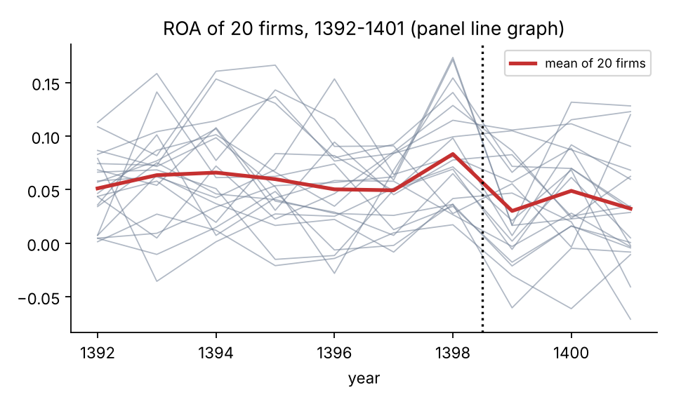
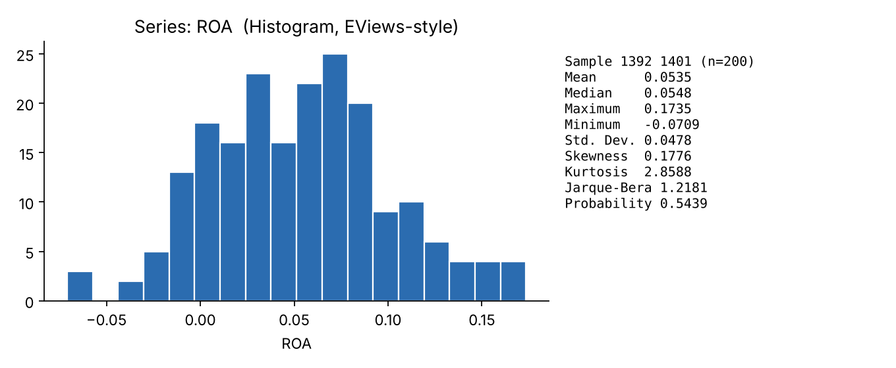

<div dir="rtl" lang="fa">

# فصل دوم: آشنایی با EViews، ورود داده و گزینه‌ها

> **هدف فصل:** در پایان این فصل باید بتوانید داده‌های پایان‌نامه را از Excel به EViews بیاورید، ساختار تابلویی را درست تعریف کنید، متغیرهای جدید بسازید، آمار توصیفی بگیرید و خروجی را به Word منتقل کنید — بدون این‌که داده «بی‌صدا» خراب شود.
>
> **قرارداد مسیرها:** پیکان `→` یعنی «سپس». مسیرها بر پایهٔ EViews 12/13 است؛ در نسخه‌های قدیمی‌تر عنوان برخی گزینه‌ها اندکی فرق دارد. معادل دستور (Command) هر کار هم آمده است.
>
> **داده‌های همراه:** فایل `data/thesis_sample.csv` (۲۰ شرکت × ۱۰ سال، شبیه‌سازی‌شده). همین فایل را وارد کنید تا خروجی‌های شما با کتاب یکسان شود. برنامهٔ `scripts/thesis_sample.prg` همهٔ مراحل را خودکار اجرا می‌کند.

---

## ۲-۱ نصب و اولین نگاه: پنجره‌ها، نوارها، Workfile چیست؟

### نصب (خلاصه)

۱. نسخهٔ قانونی از نرم‌افزار (دانشگاه معمولاً لایسنس آموزشی دارد؛ نسخهٔ «Student» هم موجود است) را نصب و فعال کنید. ۲. در اولین اجرا، پنجرهٔ ثبت/فعال‌سازی ظاهر می‌شود. ۳. توصیه: در `Options → General Options → Fonts` فونت جدول‌ها را به یک فونت خوانا (مثل Consolas یا Tahoma) تغییر دهید. ۴. چون EViews محیط انگلیسی/LTR است، **نام متغیرها را انگلیسی بگذارید** (بدون فاصله و بدون حروف فارسی).

> ⚠️ **هشدار:** نصب نسخه‌های کرک‌شده علاوه بر مشکل قانونی، باگ‌های محاسباتی و خراب‌شدن فایل‌های Workfile را به‌دنبال دارد؛ خروجی مشکوک در پایان‌نامه یعنی دفاع پرخطر.

### اولین نگاه به پنجرهٔ اصلی

```
┌──────────────────────────────────────────────────────────────┐
│ ① نوار عنوان:  EViews - [Workfile: THESIS]                   │
│ ② نوار منو:  File Edit Object View Proc Quick Options Add-ins│
│              Window Help                                       │
│ ③ Command Window:  (جای تایپ دستور؛ بالای پنجره)               │
│ ┌────────────────────────────────────────────────────────┐   │
│ │ ④ پنجرهٔ Workfile                                      │   │
│ │   نوار ابزار: View Proc Object | Save Freeze Details   │   │
│ │   Range: 1392 1401 x 20 ← ساختار داده                  │   │
│ │   Sample: 1392 1401     ← دورهٔ فعال تحلیل             │   │
│ │   فهرست اشیا:  ⚑ c  ⚑ resid  ⚑ roa  ⚑ size …          │   │
│ │   ┌ برگه‌ها (Pages):  [Untitled] [Page2] …             │   │
│ └────────────────────────────────────────────────────────┘   │
│ ⑤ نوار وضعیت (پایین): Path = …  DB = none  WF = thesis       │
└──────────────────────────────────────────────────────────────┘
```

**شکل ۲-۱ — نقشهٔ پنجرهٔ EViews.**

> 🖼️ **جای اسکرین‌شات ۲-۱:** پس از اجرای EViews، یک اسکرین‌شات کل پنجره بگیرید (`Alt+PrintScreen`) و شماره‌های ①–⑤ را روی آن علامت بزنید.

### Workfile چیست؟

Workfile **«میزکار» یا «پروندهٔ پروژه»** است؛ ظرفی که داده‌ها، مدل‌ها، جدول‌ها و نمودارهای پایان‌نامهٔ شما در آن نگهداری می‌شود. بدون Workfile هیچ کاری ممکن نیست. دو چیز را همیشه با Workfile تعریف می‌کنید:

- **ساختار** (Range): داده مقطعی است؟ سالانه؟ تابلویی؟ چند مشاهده؟
- **نمونهٔ فعال** (Sample): از میان داده‌ها، تحلیل روی کدام بخش است؟

> 💡 **نکتهٔ آموزشی:** ساختار را شبیه «ظرف کیک» و Sample را شبیه «برش کیکی که امروز می‌خورید» تصور کنید. می‌توانید Sample را عوض کنید، ولی ظرف ثابت است.

> 🖱️ **مسیر کلیک سریع:**
> - ایجاد: `File → New → Workfile...`
> - ذخیره: `File → Save As...` (فرمت `.wf1`)
> - پنجرهٔ دستور: اگر نوار دستور دیده نمی‌شود، از منوی `View` گزینهٔ Command Window را فعال کنید (نام دقیق منو بسته به نسخه فرق می‌کند)

---

## ۲-۲ مفاهیم پایه EViews: Workfile، Object، Series، Group، Equation

### تصویر ذهنی کامل

```
Workfile (پروندهٔ پروژه)
 ├─ Page (برگه)  ← هر Workfile یک یا چند برگه دارد (مثل شیت Excel)
 │    └─ Object (شیء)  ← هر چیزی که نام دارد
 │         ├─ Series (سری)      ← یک ستون داده، مثلاً ROA
 │         ├─ Group (گروه)      ← مجموعه‌ای از چند Series (برای آمار و همبستگی)
 │         ├─ Equation (معادله) ← مدل برآوردشده با نتایج
 │         ├─ Scalar            ← یک عدد (مثلاً آمارهٔ F ذخیره‌شده)
 │         ├─ Table / Graph     ← جدول و نمودار «منجمد‌شده» (Freeze)
 │         ├─ Sample / Matrix / Vector / Model / Text …
 │         └─ پیش‌فرض‌ها:  C (بردار ضرایب)  و  RESID (باقیمانده‌ها)
```

**شکل ۲-۲ — سلسله‌مراتب اشیا.**

### جدول واژگان کلیدی

| مفهوم | تعریف ساده | نماد در فهرست | مثال |
|---|---|---|---|
| **Workfile** | ظرف پروژه (فایل `.wf1`) | عنوان بالای پنجره | `thesis.wf1` |
| **Page** | برگه‌ای در Workfile؛ هر برگه می‌تواند ساختار متفاوت داشته باشد | تب پایین پنجره | `raw` (داده خام)، `model` |
| **Object** | هر چیز نام‌دار در Workfile | آیکن | — |
| **Series** | یک متغیر (ستون) | آیکن نمودار خطی | `roa`، `lev` |
| **Group** | چند Series با هم | آیکن جدول | `g1 = roa size lev` |
| **Equation** | مدل رگرسیونی برآوردشده | آیکن `=` | `eq01` |
| **Scalar** | یک عدد | آیکن `α` | `scalar r2 = eq01.@r2` |
| **C** | بردار ضرایب آخرین برآورد | `c` | `c(1)` = عرض از مبدأ |
| **RESID** | باقیمانده‌های آخرین برآورد | `resid` | برای آزمون‌ها |

### دو قاعدهٔ طلایی

۱. **هر Object یک نام یکتا دارد** و حروف بزرگ/کوچک در نام فرقی ندارند (`ROA = roa`). ۲. اشیای بی‌نام (Untitled) پس از بستن پنجره از بین می‌روند؛ برای نگهداری، **Name** بزنید.

> ⚠️ **هشدار:** اگر دو بار `ls roa c size` را اجرا کنید، `RESID` و `C` **بازنویسی می‌شوند**. اگر می‌خواهید نتایج مدل حفظ شود، برآورد را با نام ذخیره کنید: `equation eq01.ls roa c size lev growth cfo`.

> 💡 **نکتهٔ آموزشی:** درک «Object» پایهٔ همهٔ کارهاست: **هر Object سه منو دارد:** `View` (نمای متفاوتی از آن Object را ببین)، `Proc` (کاری با آن انجام بده)، `Object` (مدیریتش کن: Name، Freeze، Delete). مثلاً در Equation: View → Residual Diagnostics (نمای باقیمانده‌ها)؛ Proc → Forecast (کار پیش‌بینی)؛ Object → Name (نام‌گذاری).

---

## ۲-۳ ساخت Workfile: داده تاریخ‌دار، بدون تاریخ، ساختار تابلویی

### سه ساختار اصلی

| ساختار | چه زمانی؟ | Frequency/Type در EViews |
|---|---|---|
| **Dated – regular frequency** (تاریخ‌دار منظم) | سری زمانی با فاصله‌های ثابت (سالانه/فصلی/ماهانه) | `Annual`، `Quarterly`، `Monthly` … |
| **Unstructured / Undated** | مقطعی یا داده‌ای که ردیف‌ها فقط شمارهٔ مشاهده دارند | `Unstructured/Undated` |
| **Balanced Panel / Dated Panel** | چند شرکت × چند سال (پایان‌نامهٔ معمول) | `Balanced Panel` یا `Dated Panel` |

### الف) ساخت دستی Workfile

> 🖱️ **مسیر:** `File → New → Workfile...`

۱. در پنجرهٔ **Workfile Create**، در بخش **Workfile structure type** یکی از سه نوع بالا را انتخاب کنید.
۲. **داده سالانه تاریخ‌دار:** نوع `Dated - regular frequency`، Frequency = `Annual`، Start date = `1392`، End date = `1401`.
۳. **مقطعی:** نوع `Unstructured / Undated`، Observations = `200`.
۴. **تابلویی متوازن:** نوع `Balanced Panel`، Start date = `1392`، End date = `1401`، Number of cross sections = `20`.
۵. نام برای Workfile و Page را (اختیاری) بنویسید و `OK` بزنید.

**دستور معادل:**

```
wfcreate(wf=thesis) a 1392 1401 20        ' تابلویی متوازن: سالانه، ۲۰ مقطع
wfcreate(wf=thesis) a 1392 1401           ' سری زمانی سالانه
wfcreate(wf=thesis) u 1 200               ' بدون تاریخ، ۲۰۰ مشاهده
```

> 🖼️ **جای اسکرین‌شات ۲-۳:** پنجرهٔ `Workfile Create` با گزینهٔ `Balanced Panel` و مقادیر ۱۳۹۲، ۱۴۰۱ و ۲۰.

### ب) نکتهٔ مهم: تاریخ شمسی

EViews تقویم میلادی را می‌شناسد. برای **سالانه** هیچ مشکلی نیست: ۱۳۹۲ را به‌عنوان یک «سال» عددی می‌پذیرد. برای **فصلی/ماهانه** شمسی: بهتر است یک Workfile **Undated** بسازید و ستون‌های `year` و `month` (یا `quarter`) را خودتان نگه دارید؛ یا ماه‌های شمسی را به «شمارهٔ ماه ۱ تا ۱۲» نگاشت کنید و مشخصاً در پایان‌نامه ذکر کنید.

### ج) ساختار تابلویی با داده‌های موجود

اگر داده‌ها را ابتدا وارد کرده‌اید (ستون `firm` و `year` دارند) و Workfile شما Undated است:

> 🖱️ **مسیر:** `Proc → Structure/Resize Current Page...` → در `Workfile structure type` گزینهٔ `Dated Panel` → `Cross-section ID series` = `firm` و `Date series` = `year` → `OK`.

دستور معادل (در صورت خطا، منوی بالا را استفاده کنید):

```
pagestruct firm @date(year)
```

پس از موفقیت، بالای Workfile می‌بینید:

```
Range: 1392 1401 x 20 -- 200 obs
Sample: 1392 1401 x 20 -- 200 obs
```

> ⚠️ **هشدار:** اگر پیام `Non-unique panel identifiers` گرفتید، یعنی یک ترکیب `(firm, year)` تکراری است؛ ورود داده‌تان ردیف‌های تکراری دارد (بخش ۲-۱۱، خطای ۳).

> 💡 **نکتهٔ آموزشی:** **چرا ساختار تابلویی مهم است؟** در Workfile تابلویی، `lev(-1)` مقدار **سال قبلِ همان شرکت** است، نه ردیف بالایی (که شاید شرکت دیگری باشد). در Workfile Undated، `lev(-1)` فقط ردیف بالایی را می‌گیرد و برای اولین سال هر شرکت داده‌های شرکت قبل را وارد می‌کند — خطای خاموش.

> 🏦 **اگر داده تابلویی دارید:** همیشه ساختار را به `Dated Panel` یا `Balanced Panel` تبدیل کنید، حتی اگر در فصل ۳ فقط OLS تجمیعی اجرا می‌کنید. این کار برای وقفه‌ها (lag)، تفاضل‌ها و برآورد اثرات ثابت/تصادفی در فصل چهارم لازم است.

---

## ۲-۴ چهار روش ورود داده

### روش ۱: تایپ دستی

> 🖱️ **مسیر:** `Object → New Object...` → `Series` → نام (مثلاً `roa`) → `OK` → در پنجرهٔ Series دکمهٔ `Edit +/-` → سلول‌ها را تایپ کنید.

یا گروهی: `Quick → Empty Group (Edit Series)` → در سلول‌های خالی بالا، نام متغیرها را در ردیف نام و مقادیر را در ستون‌ها تایپ کنید.

دستور: `series roa` و سپس `roa.edit`. فقط برای دادهٔ بسیار کم (کمتر از ۲۰ مشاهده) مناسب است.

### روش ۲: کپی-پیست از Excel

۱. در Excel، ستون‌ها را **با ردیف نام در بالا** انتخاب و `Ctrl+C` کنید.
۲. در EViews: `Quick → Empty Group (Edit Series)`.
۳. مکان‌نما را روی سلول `obs` ستون اول (ردیف نام‌ها) بگذارید و `Ctrl+V` کنید.
۴. پیام `Do you want to create series?` را تأیید کنید.

> ⚠️ **هشدار:** در Workfile تابلویی، ترتیب پیست باید با **ترتیب مقاطع و زمان در Workfile** (اول شرکت ۱ تمام سال‌ها، بعد شرکت ۲، …) یکی باشد؛ در غیر این صورت داده‌ها جابه‌جا می‌شود (بخش ۲-۱۱، خطای ۴).

### روش ۳: Import از CSV/Excel (توصیه‌شده)

> 🖱️ **مسیر (EViews 12/13):** `File → Open → Foreign Data as Workfile...` برای ساخت **Workfile جدید از فایل**؛ یا `File → Import → Import from file...` برای **افزودن به Workfile موجود**.

مراحل ویزارد (چهار صفحه):

۱. **فایل:** `thesis_sample.csv` را انتخاب کنید.
۲. **Data Format (Text Import Wizard):** جداکننده را `Comma` بگذارید؛ `Column headers` = `1` (یعنی ردیف اول نام ستون است).
۳. **Column types:** ستون `industry` را `Alpha` ببینید؛ بقیه `Numeric`. نمونهٔ ردیف‌ها را بازبینی کنید.
۴. **Structure:** `Date series`/`Identifier series` را `year` و `firm` تعیین کنید → EViews خودبه‌خود `Dated Panel` می‌سازد.

دستور معادل:

```
wfopen "C:\thesis\thesis_sample.csv" ftype=ascii delim=comma colhead=1
pagestruct firm @date(year)
save "C:\thesis\thesis.wf1"
```

> 🖼️ **جای اسکرین‌شات ۲-۴:** مرحلهٔ «Column types» از Text Import Wizard.

### روش ۴: Import از صفحه‌گسترده (xlsx)

> 🖱️ **مسیر:** `File → Open → Foreign Data as Workfile...` → فایل `.xlsx` را انتخاب (Files of type: Excel) → نام شیت را مشخص کنید → ردیف اول را نام ستون قرار دهید → همان مراحل ۳ و ۴ بالا.

دستور:

```
wfopen "C:\thesis\data.xlsx" range="Sheet1" colhead=1
```

### مقایسهٔ چهار روش

| روش | سرعت | خطر خطا | مناسب برای |
|---|---|---|---|
| تایپ دستی | کند | زیاد | مثال آموزشی |
| کپی-پیست | سریع | متوسط (جابه‌جایی ردیف) | داده کم |
| Import CSV | سریع | کم | **پایان‌نامه (توصیهٔ اصلی)** |
| Import xlsx | سریع | کم (به‌شرط تمیز بودن شیت) | داده‌های Excel با چند شیت |

> 💡 **نکتهٔ آموزشی — آماده‌سازی Excel پیش از Import:** (۱) فقط **یک جدول مستطیلی** در شیت (بدون ردیف‌های ادغام‌شده یا توضیح در بالا)؛ (۲) نام ستون‌ها انگلیسی و بدون فاصله؛ (۳) اعداد را از ارقام فارسی به **ارقام انگلیسی** و جداکنندهٔ اعشار **نقطه** تبدیل کنید (جداکنندهٔ فارسی «٫» به‌عنوان متن خوانده می‌شود)؛ (۴) هر سلول گم‌شده را **خالی** بگذارید یا `NA` بنویسید، نه `-` و نه `0`؛ (۵) ستون سال و ستون شرکت (کد) حتماً داشته باشید.

> ⚠️ **هشدار:** اگر ستونی که باید عدد باشد در Import به‌صورت `Alpha` تشخیص داده شد، یعنی در آن ستون **متن** هست (یک `-`، `n/a`، فاصله، یا ارقام فارسی). Import را متوقف کنید و Excel را اصلاح کنید.

---

## ۲-۵ مرور و بازرسی داده: Sheet، Graph، Description

پیش از هر برآوردی **باید** داده را ببینید. سه ابزار:

### الف) Sheet (جدول داده)

> 🖱️ **مسیر:** روی `roa` دوبار کلیک کنید (یا `View → Spreadsheet`). برای چند متغیر: انتخاب چند Series با `Ctrl+Click` → کلیک راست → `Open → as Group`.

دستور: `show roa size lev growth cfo`

چه چیزی را بازرسی کنید؟ وجود `NA`، مقادیر غیرمنطقی (مثلاً `LEV = 7` یا اندازهٔ منفی)، ردیف‌های تکراری، یکنواختی واحد.

### ب) Graph (نمودار)

> 🖱️ **مسیر:** در Series: `View → Graph... → Line & Symbol` (برای روند)، `Histogram`، `Boxplot`. در Group: `View → Graph... → Scatter → Simple Scatter` یا `Scatter with Regression`.

برای تابلویی: `View → Graph...` → گزینهٔ `Panel options → Individual cross sections` تا هر شرکت یک خط داشته باشد.

دستورها:

```
roa.line
roa.hist
graph g1.scat lev roa           ' نمودار پراکندگی
```


**شکل ۲-۴ — نمودار خطی ROA برای ۲۰ شرکت (خط قرمز: میانگین مقطعی).** افت میانگین پس از ۱۳۹۹ نشانهٔ بصری یک شکست ساختاری احتمالی است (فرض ۸ در فصل ۳).

### ج) Description: آمار توصیفی

**برای یک متغیر:** `View → Descriptive Statistics & Tests → Histogram and Stats`


**شکل ۲-۵ — خروجی Histogram and Stats برای ROA (بازتولید به سبک EViews).**

**برای چند متغیر:** ابتدا گروه بسازید و سپس `View → Descriptive Stats → Common Sample` (نمونهٔ مشترک: فقط ردیف‌هایی که همهٔ متغیرها مقدار دارند) یا `Individual Samples` (هر متغیر با مشاهدات خودش).

دستورها:

```
group g1 roa size lev growth cfo
g1.stats                       ' آماره‌های توصیفی
g1.cor                         ' ماتریس همبستگی
freeze(tab_desc) g1.stats      ' جدول منجمد برای انتقال به Word
```

### معنی هر ردیف

| ردیف | معنی | چه وقت نگران شوید؟ |
|---|---|---|
| **Mean** | میانگین | با Median خیلی فرق داشته باشد → چولگی/پرت |
| **Median** | میانه | — |
| **Maximum / Minimum** | بزرگ‌ترین/کوچک‌ترین | مقدار غیرمنطقی (مثلاً LEV > ۱ اگر نباید) |
| **Std. Dev.** | انحراف معیار | نسبت به میانگین خیلی بزرگ → پراکندگی زیاد |
| **Skewness** | چولگی (۰ = متقارن) | `|S| > 1` چولگی جدی |
| **Kurtosis** | کشیدگی (۳ = نرمال) | `K` خیلی بیشتر از ۳ → دم‌های سنگین/پرت |
| **Jarque-Bera / Probability** | آزمون نرمالیتی توزیع **خود متغیر** | `p<0.05` نرمال نیست (برای متغیرهای مستقل معمولاً مشکلی نیست) |
| **Observations** | تعداد مشاهدات | کمتر از انتظار → NA |

> ⚠️ **هشدار:** آزمون JB در آمار توصیفی دربارهٔ **توزیع خود متغیر** است. نرمالیتی مهم در رگرسیون مربوط به **باقیمانده‌ها** است (فرض ۶ فصل ۳). این دو را در پایان‌نامه با هم اشتباه نگیرید.

---

## ۲-۶ ساخت متغیر جدید با دستور Genr

> 🖱️ **مسیر:** `Quick → Generate Series...` یا دکمهٔ `Genr` در Workfile. یا در Command Window: `genr` (یا `series`) + معادله.

قالب کلی: `genr نام_جدید = عبارت`

### جدول مثال‌های پرکاربرد: دستور → مثال → نتیجه

| هدف | دستور | مثال با داده‌های کتاب | نتیجه |
|---|---|---|---|
| لگاریتم طبیعی | `genr lnassets = log(assets)` | `assets = 366272` | `12.81` (مقدار `SIZE` شرکت ۱، ۱۳۹۲) |
| نسبت/تقسیم | `genr lev = debt/assets` | بدهی ÷ دارایی | `0.729` |
| تفاضل مرتبهٔ اول | `genr droa = d(roa)` یا `roa - roa(-1)` | ROA شرکت ۱: `0.0149 − (−0.0104)` در ۱۳۹۴ | `0.0253` (برای هر شرکت جداگانه) |
| درصد تغییر (رشد) | `genr growth = d(sales)/sales(-1)` | فروش امسال نسبت به پارسال | `0.18` = ۱۸٪ |
| لگاریتم‌تفاضل | `genr g_ln = dlog(sales)` | تقریب نرخ رشد | — |
| وقفهٔ یک‌دورهٔ | `genr lev_l1 = lev(-1)` | مقدار سال قبل | اولین سال هر شرکت: `NA` |
| پیشرو (lead) | `genr roa_f1 = roa(1)` | مقدار سال بعد | آخرین سال: `NA` |
| متغیر مجازی بر پایهٔ شرط | `genr covid = (year>=1399)` | ۱۳۹۹ به بعد | `0` یا `1` |
| مجازی بر پایهٔ رشته | `genr d_auto = (industry="Auto")` | صنعت خودرو | `0/1` |
| متغیر تعاملی | `genr lev_covid = lev*covid` | حاصل‌ضرب | `0` قبل از ۱۳۹۹، `lev` پس از آن |
| مجذور (جملهٔ درجه دوم) | `genr size2 = size^2` | برای RESET/غیرخطی | — |
| قدرمطلق | `genr abs_e = abs(resid)` | برای آزمون Glejser | — |
| تبدیل مقدار گم‌شده | `genr y2 = @recode(roa=0, na, roa)` | صفرهای ساختگی را NA کن | — |
| میانگین هر شرکت | `genr roa_m = @meansby(roa, firm)` | میانگین ROA هر شرکت | ثابت درون هر شرکت |
| میانگین هر سال | `genr roa_t = @meansby(roa, year)` | میانگین سال | — |
| Winsorize ۱٪ و ۹۹٪ | `scalar q1=@quantile(roa,0.01)` ، `scalar q99=@quantile(roa,0.99)` ، `genr roa_w = @recode(roa<q1,q1,@recode(roa>q99,q99,roa))` | حذف اثر پرت‌ها | — |
| روند زمانی | `genr trend = @trend` | شمارندهٔ زمان | `0,1,2,…` |
| شمارهٔ مشاهده | `genr obsno = @obsno` | شمارندهٔ ردیف | — |

> ⚠️ **هشدار — پرانتز در مقایسه:** `genr covid = year>=1399` درست کار می‌کند، اما `genr y = (a>b)*c` را همیشه با پرانتز بنویسید تا ترتیب اجرا مشخص باشد.

> 💡 **نکتهٔ آموزشی — NA ها گسترش می‌یابند:** هر عبارتی که یکی از اجزایش `NA` باشد، `NA` می‌شود. بنابراین ساخت `lev_l1` یک `NA` به هر شرکت می‌افزاید و نمونهٔ رگرسیون از ۲۰۰ به ۱۸۰ می‌رسد. EViews این را در خروجی با «Included observations: 180 after adjustments» نشان می‌دهد.

> 🏦 **اگر داده تابلویی دارید:** در Workfile تابلویی، `x(-1)` و `d(x)` **درون هر شرکت** محاسبه می‌شوند. اگر اشتباهاً از Sample تکه‌تکه استفاده کنید، پیش از ساخت وقفه‌ها `smpl @all` را بزنید.

### روش «سلسله‌مراتب ساخت متغیرها» در پایان‌نامه

برای مستندسازی، تمام `genr` ها را در یک برنامه (Program: `File → New → Program`) بنویسید و ذخیره کنید. در دفاع می‌توانید نشان دهید هر متغیر از چه ترکیبی ساخته شده است. نمونه در پیوست ج.

---

## ۲-۷ Sample و Quick Sample: تعیین دورهٔ تحلیل و نکات خطرناک

### Sample چیست؟

Sample **ردیف‌هایی است که در محاسبات فعلی شرکت می‌کنند**. هر دستور (آمار، رگرسیون، `genr`) فقط روی Sample فعلی کار می‌کند.

> 🖱️ **مسیر:** `Quick → Sample...` (یا دکمهٔ `Sample` در Workfile، یا دوبار کلیک روی خط `Sample:`).

در پنجرهٔ **Sample**:
- **Sample range pairs:** `1392 1401` (یا `@all` برای کل داده)
- **IF condition (optional):** مثلاً `industry="Pharma"` یا `year>=1395 and lev<1`

دستورها:

```
smpl @all                                  ' کل داده
smpl 1395 1401                             ' فقط ۱۳۹۵ تا ۱۴۰۱
smpl @all if lev<1 and assets>0            ' فیلتر شرطی
smpl if covid=0                            ' فقط پیش از کرونا
```

### سه کار متداول

| کار | دستور |
|---|---|
| دورهٔ تحلیل کامل | `smpl @all` |
| حذف سال‌های ابتدایی (به‌دلیل وقفه) | `smpl 1393 1401` |
| فقط یک صنعت | `smpl @all if industry="Pharma"` |

### نکات خطرناک

۱. **Sample قبل از `genr` عوض شود:** متغیر ساخته‌شده فقط برای ردیف‌های داخل Sample مقدار می‌گیرد و بقیه `NA` می‌ماند.
۲. **نمونهٔ تنظیم‌شده (Adjusted sample):** در خروجی رگرسیون ببینید `Included observations: 180 after adjustments`؛ یعنی ۲۰ ردیف به‌دلیل `NA` کنار رفته‌اند. اگر **متفاوت‌ بودن نمونه در مدل‌های مختلف** باشد، مقایسهٔ R² و AIC بین آن‌ها معتبر نیست.
۳. **Sample فراموش‌شده:** اگر دیروز `smpl 1395 1401` زده‌اید و امروز Workfile را باز کرده‌اید، Sample همان است! همیشه خط `Sample:` را پیش از رگرسیون بخوانید.
۴. **در تابلویی، سال حذف یعنی ردیف همهٔ شرکت‌ها حذف می‌شود**، که تابلو را نامتوازن نمی‌کند ولی طول زمان را کوتاه می‌کند.

> ⚠️ **هشدار:** شایع‌ترین خطای مدل‌های وقفه‌ای: نمونه را `1392 1401` نگه می‌دارند و تعجب می‌کنند چرا ۱۸۰ مشاهده دارند. پاسخ: ۲۰ ردیف سال ۱۳۹۲ به‌دلیل وقفه `NA` شده است. این رفتار **درست** است؛ فقط باید در پایان‌نامه گزارش شود.

> 💡 **نکتهٔ آموزشی — چرا Sample عوض می‌شود و خطا می‌سازد؟** (۱) `Quick → Show`، `Freeze` و بسیاری از پنجره‌ها نمونه را از Workfile به ارث می‌برند؛ (۲) برخی دستورات (مثل `smpl` در داخل برنامه) نمونه را عوض می‌کنند و در پایان برنامه به حالت اول برنمی‌گردانند؛ (۳) در برنامه‌ها همیشه با `smpl @all` شروع و با `smpl @all` پایان دهید.

> 🖱️ **مسیر کلیک سریع:** `Quick → Sample...` → `@all` → `OK`.

---

## ۲-۸ ذخیرهٔ Workfile و خروجی گرفتن از جدول‌ها/نمودارها به Word

### ذخیره

> 🖱️ **مسیر:** `File → Save As...` → نوع `EViews Workfile (*.wf1)`. دستور: `save "C:\thesis\thesis.wf1"`.

قواعد: ۱) ذخیرهٔ دوره‌ای با `Ctrl+S`؛ ۲) نسخه‌های شماره‌دار (`thesis_v1.wf1`، `thesis_v2.wf1`)؛ ۳) پشتیبان در دو مکان؛ ۴) همراه با برنامه (`.prg`) برای بازتولید.

### خروجی جدول (رگرسیون، آمار، آزمون) به Word

**روش ۱ — Freeze:** در پنجرهٔ Equation یا Group، دکمهٔ `Freeze` را بزنید. جدولی «منجمد» با نام جدید ساخته می‌شود (تغییرناپذیر با تغییر داده‌ها).

**روش ۲ — کپی:** در پنجرهٔ جدول: `Edit → Select All` سپس `Edit → Copy...` → گزینهٔ `Formatted - Copy numbers as they appear in table` → در Word: `Paste Special → Formatted Text (RTF)` یا `Paste as Table`.

> 🖱️ **مسیر:** `Freeze → Edit → Select All → Edit → Copy… → Formatted` → در Word `Ctrl+V`.

### خروجی نمودار

۱. در پنجرهٔ Graph: `Proc → Save graph to disk...` → قالب `PNG` یا `EMF` (وکتور) با وضوح ۳۰۰ dpi. ۲. یا `Edit → Copy` و `Paste` در Word. ۳. برای حذف حاشیه یا تغییر رنگ: `Proc → Options...` یا دوبار کلیک روی اجزا. برای پایان‌نامه رنگ را خاکستری/ساده بگیرید (چاپ سیاه‌وسفید).

> ⚠️ **هشدار — نمودار مستقیماً از View:** پنجرهٔ `View` گذرا است؛ پیش از انتقال `Freeze` کنید تا تغییر Sample بعدی آن را عوض نکند.

> ⚠️ **هشدار — جدول EViews در Word:** جدول‌های منجمد انگلیسی‌اند و چپ‌به‌راست. در پایان‌نامهٔ فارسی، **جدول را بازنویسی کنید** (طبق قالب جدول‌های دانشگاه) و فقط اعداد را منتقل کنید. اسکرین‌شات مستقیم خروجی را برای پیوست نگه دارید، نه متن اصلی.

---

## ۲-۹ گشت‌وگذار در منوها: Quick، Object/View/Proc، Undo و تاریخچه

### منوی Quick (میان‌بُر)

| گزینه | کار |
|---|---|
| `Quick → Sample...` | تعیین نمونه |
| `Quick → Generate Series...` | همان `genr` |
| `Quick → Show...` | نمایش چند Series |
| `Quick → Graph...` | نمودار از یک فهرست متغیر |
| `Quick → Series Statistics → ...` | آمار هر Series |
| `Quick → Group Statistics → ...` | همبستگی، کوواریانس، آمار |
| `Quick → Estimate Equation...` | **برآورد رگرسیون** (مهم‌ترین) |
| `Quick → Empty Group (Edit Series)` | گروه خالی برای پیست |

### سه‌گانهٔ Object / View / Proc

| منو | مفهوم | مثال در Equation |
|---|---|---|
| **View** | نمای دیگری از **همان Object** (فقط می‌بیند) | `View → Representations`، `View → Residual Diagnostics → ...` |
| **Proc** | **عملیاتی** که با Object انجام می‌شود (ممکن است چیز جدید بسازد) | `Proc → Forecast...`، `Proc → Make Residual Series...` |
| **Object** | **مدیریت** Object (نام، حذف، منجمد) | `Object → Name...`، `Object → Freeze Output`، `Object → Delete` |

> 💡 **نکتهٔ آموزشی:** آزمون‌های مفروضات فصل ۳ همگی از منوی `View` پنجرهٔ Equation هستند: View → Residual Diagnostics / Stability Diagnostics / Coefficient Diagnostics.

### Undo و تاریخچه

EViews **Undo ندارد** (به‌جز ویرایش جدول داده). مدیریت خطا:
1. **ذخیره‌های مکرر** با نام جدید.
2. **History:** `View → Command History`... یا پنجرهٔ **Command Capture** (`Window → Command Capture`) که دستورها را ثبت می‌کند.
3. **تمام تغییرات را با برنامه انجام دهید** تا قابل‌تکرار باشد.
4. **قبل از حذف (`delete`)**، نام Object را بررسی کنید؛ حذف غیرقابل‌بازگشت است.
5. **`Edit +/-`** را حتماً بعد از ویرایش دستی بزنید تا اتفاقی چیزی تغییر نکند.

> ⚠️ **هشدار:** دکمهٔ `Edit +/-` روی Series، حالت ویرایش را روشن می‌کند. اگر در این حالت کلیدی بزنید، داده تغییر می‌کند. پس از بازرسی، خاموش کنید.

---

## ۲-۱۰ نکات ویژهٔ داده‌های مالی/حسابداری

### ۱) تورم‌زدایی (داده‌های واقعی در برابر اسمی)

ایران با تورم بالا مواجه است؛ مقایسهٔ ارقام ریالی سال ۱۳۹۲ و ۱۴۰۱ بدون تعدیل گمراه‌کننده است. گزینه‌ها: ۱) **نسبت‌های مالی** (ROA، LEV) ذاتاً بی‌واحد و تا حد زیادی از اثر تورم مصون‌اند؛ ۲) برای مقادیر ریالی (فروش، دارایی)، با **شاخص قیمت مصرف‌کننده** یا شاخص ضمنی تولید ناخالص داخلی (مرکز آمار/بانک مرکزی) تعدیل کنید:

```
genr sales_real = sales / (cpi/100)       ' cpi با پایهٔ ۱۰۰ سال مبنا
```

۳) **لگاریتم** مقادیر ریالی و **اثرات ثابت سال** (مجازی‌های سال) تأثیر سطح عمومی قیمت‌ها را جذب می‌کنند.

> ✍️ **جملهٔ آماده:** «به‌منظور کنترل اثر تورم، اقلام ریالی با استفاده از شاخص قیمت مصرف‌کننده (سال پایه [......]) به ارقام ثابت تبدیل شد/متغیرهای پژوهش به‌صورت نسبت تعریف شدند.»

### ۲) واحد پول و واحد گزارش

بسیاری از صورت‌های مالی بر حسب **میلیون ریال** و گاهی **ریال** یا **هزار ریال** منتشر می‌شوند. اگر شرکت‌های نمونه واحدهای متفاوتی دارند، پیش از ترکیب، همه را به یک واحد برسانید. نشانهٔ خطا: لگاریتم اندازه برای چند شرکت به‌طور ناگهانی ۶ یا ۳ واحد بیشتر/کمتر از بقیه.

### ۳) داده سالانه در برابر فصلی

- سالانه: ساده‌ترین؛ تعداد مشاهدات کم.
- فصلی: مشاهدات بیشتر ولی **فصلی‌بودن** (Seasonality) و داده‌های ناقص (برخی اقلام فقط سالانه افشا می‌شوند). برای فصلی شمسی از Workfile تاریخ‌دار با نگاشت یا Undated استفاده کنید (بخش ۲-۳-ب).

### ۴) وحدت مقیاس

مقیاس‌ها (ریال با ده‌ها میلیارد در برابر نسبت ۰ تا ۱) را یکی کنید: ۱) نسبت‌ها در نسبت، ۲) ریالی‌ها به لگاریتم یا تقسیم به دارایی. دلیل: ضرایب «۰٫۰۰۰۰۰۰۱» تفسیر ناپذیرند و ممکن است مشکلات عددی در معکوس‌گیری ماتریس ایجاد کنند.

### ۵) تعریف دوره مالی و تغییر سال مالی

شرکت‌هایی که سال مالی منتهی به ۳۰ آذر یا ۳۱ شهریور دارند، با شرکت‌های اسفندماهی هم‌ارز نیستند؛ معمولاً حذف می‌شوند. اعلام کنید.

### ۶) پرت‌ها و Winsorize

نسبت‌های مالی دم‌های سنگین دارند (شرکت با حقوق صاحبان سهام نزدیک صفر → ROE غیرعادی). روش متداول: **Winsorize در صدک ۱٪ و ۹۹٪** (جدول بخش ۲-۶).

> 🏦 **اگر داده تابلویی دارید:** Winsorize را **در مقطع زمانی (هر سال جداگانه)** یا روی کل نمونه انجام می‌دهید؟ هر دو در ادبیات دیده می‌شود؛ مهم این است که انتخابتان را اعلام و ثابت نگه دارید.

---

## ۲-۱۱ هفت خطای رایج ورود داده و راه‌های تشخیص

| # | خطا | نشانه | تشخیص | راه‌حل |
|---|---|---|---|---|
| ۱ | **جای خالی/`NA`:** سلول گم‌شده یا یک `-`، `n/a` | مشاهدات کمتر از انتظار (`Obs 183`)؛ ستون Alpha | `Group → Descriptive Stats → Individual Samples`؛ `show @isna(x)` | Excel را اصلاح؛ یا `genr x2 = @recode(x=0, na, x)` |
| ۲ | **ارقام فارسی/جداکنندهٔ ٫**: اعداد به‌صورت متن | متغیر عددی، `Alpha` شد؛ یا Import با خطا | بررسی نوع ستون در ویزارد | در Excel تبدیل ارقام و حذف جداکنندهٔ هزارگان |
| ۳ | **ردیف تکراری** `(firm, year)` | `Non-unique panel identifiers` | `Proc → Structure → ...` پیام خطا؛ `@obsby` | حذف تکراری‌ها در Excel با `Remove Duplicates` |
| ۴ | **جابه‌جایی ردیف** پس از Sort یا پیست | ضرایب نامعقول/علامت عوض‌شده؛ ROA و اندازهٔ شرکت نمی‌خواند | بررسی ۳–۴ ردیف تصادفی با منبع؛ `show firm year roa` | یکسان‌سازی ترتیب؛ ایمپورت از یک جدول واحد |
| ۵ | **فرمت تاریخ:** ۹۲، ۱۳۹۲، «۱۳۹۲/۱۲/۲۹» یا تاریخ میلادی | ساختار تابلو ساخته نمی‌شود؛ `NA` در `year` | `year.hist`؛ `show year` | ستون `year` را فقط عدد صحیح چهاررقمی نگه دارید |
| ۶ | **واحدهای ناهمگون** (ریال/میلیون ریال) | پرت‌های شدید در `LN_ASSETS` | `lnassets.line` به‌ازای شرکت‌ها؛ جدول `min/max` | یکسان‌سازی واحد |
| ۷ | **تعریف نادرست متغیر ساخته‌شده** (مثلاً `lev = assets/debt`) | میانگین غیرمنطقی (`LEV` میانگین ۱٫۸) | `g1.stats`: Min/Max و میانگین را با منطق بسنجید | بازبینی `genr` با یک شرکت و محاسبهٔ دستی |

> 💡 **نکتهٔ آموزشی — «آزمون سلامت» پنج‌دقیقه‌ای پیش از رگرسیون:**
> ۱) `Range` و `Sample` را بخوانید (۲۰ × ۱۰ = ۲۰۰؟)؛ ۲) `g1.stats` را اجرا کنید (Obs یکسان؟ Min/Max منطقی؟)؛ ۳) `roa.line` (جهش ناگهانی؟)؛ ۴) سه ردیف تصادفی را با منبع مقایسه کنید؛ ۵) علامت همبستگی را با انتظار نظری بسنجید.

> ⚠️ **هشدار:** خطاهای ورود داده **خاموش** هستند: EViews بدون اخطار رگرسیون را اجرا می‌کند و شما ضرایب غلط را در پایان‌نامه می‌نویسید.

---

## ✅ کادر نتیجهٔ فصل ۲ — جدول توصیف داده‌های پایان‌نامه (قالب آماده)

**مراحل تولید:** `group g1 roa size lev growth cfo` → `g1.stats` → `Freeze` → انتقال به Word. جدول زیر **خروجی واقعی** اجرای این مراحل روی `thesis_sample.csv` (۲۰ شرکت × ۱۰ سال = ۲۰۰ مشاهده) است.

**جدول ۲-۱ — آمار توصیفی متغیرهای پژوهش (۱۳۹۲–۱۴۰۱)**

| متغیر | تعداد مشاهده | میانگین | میانه | انحراف معیار | کمینه | بیشینه | چولگی | کشیدگی | آمارهٔ JB | (p) |
|---|---|---|---|---|---|---|---|---|---|---|
| `ROA` | ۲۰۰ | ۰٫۰۵۳۵ | ۰٫۰۵۴۸ | ۰٫۰۴۷۸ | −۰٫۰۷۰۹ | ۰٫۱۷۳۵ | ۰٫۱۷۸ | ۲٫۸۵۹ | ۱٫۲۲ | ۰٫۵۴۴ |
| `SIZE` | ۲۰۰ | ۱۴٫۳۶۹ | ۱۴٫۳۰۷ | ۱٫۱۷۹ | ۱۲٫۱۳۲ | ۱۶٫۹۴۹ | ۰٫۲۳۲ | ۲٫۱۱۶ | ۸٫۳۱ | ۰٫۰۱۶ |
| `LEV` | ۲۰۰ | ۰٫۵۶۸۷ | ۰٫۶۰۱۲ | ۰٫۱۲۲۵ | ۰٫۳۲۱۸ | ۰٫۷۷۸۸ | −۰٫۱۵۵ | ۱٫۷۱۳ | ۱۴٫۶۱ | ۰٫۰۰۱ |
| `GROWTH` | ۲۰۰ | ۰٫۱۶۹۹ | ۰٫۱۶۸۴ | ۰٫۱۶۶۰ | −۰٫۲۵۷۴ | ۰٫۵۸۵۲ | ۰٫۰۴۴ | ۲٫۶۵۲ | ۱٫۰۷ | ۰٫۵۸۴ |
| `CFO` | ۲۰۰ | ۰٫۰۹۶۶ | ۰٫۰۹۸۰ | ۰٫۰۶۳۰ | −۰٫۰۵۵۷ | ۰٫۲۷۳۱ | ۰٫۰۸۸ | ۲٫۹۱۸ | ۰٫۳۲ | ۰٫۸۵۳ |

**منبع:** یافته‌های پژوهش (دادهٔ شبیه‌سازی‌شدهٔ کتاب). *در پایان‌نامهٔ خود «منبع: یافته‌های پژوهش» بنویسید و اعداد خودتان را جایگزین کنید.*

### خواندن جدول (نمونهٔ تفسیر)

- میانگین ROA ≈ ۵٫۳۵٪ و انحراف معیار ≈ ۴٫۸٪ است: شرکت‌های نمونه به‌طور متوسط سودآورند، ولی پراکندگی قابل‌توجه دارند (کمینهٔ −۷٫۱٪: زیان؛ بیشینه ۱۷٫۴٪).
- میانگین اهرم ۵۶٫۹٪: ساختار سرمایهٔ نمونه به بدهی متکی است.
- `SIZE` و `LEV` طبق آزمون JB از نرمال مطلق انحراف دارند (`p < 0.05`)؛ این دربارهٔ **توزیع خود متغیر** است و مانع رگرسیون نیست. `ROA` (متغیر وابسته) نرمال است.
- اختلاف میانگین و میانه کم است؛ اثر پرت‌های شدید در متغیرها دیده نمی‌شود.

> ✍️ **جملهٔ آمادهٔ پایان‌نامه — تفسیر آمار توصیفی:**
> «جدول (۲-۱) آمار توصیفی متغیرهای پژوهش را نشان می‌دهد. میانگین [بازده دارایی‌ها] برابر [......] و انحراف معیار آن [......] است که بیانگر [سطح پراکندگی] شرکت‌های نمونه است. میانگین [اهرم مالی] [......] است؛ یعنی به‌طور متوسط [......] درصد دارایی‌ها از محل بدهی تأمین شده است. اختلاف اندک میانگین و میانه در [متغیرها] [نشانهٔ تقارن نسبی توزیع] است. آمارهٔ جارک-برا برای [متغیرها] نشان می‌دهد توزیع آن‌ها نرمال [نیست/است]؛ با توجه به حجم نمونه ([n] مشاهده)، این امر در برآورد [مانع نیست].»

> 🏦 **اگر داده تابلویی دارید:** جدول فوق **تجمیعی** است. برخی داورها آمار توصیفی به تفکیک صنعت یا سال می‌خواهند: در پنجرهٔ Series از `View → Descriptive Statistics & Tests → Stats by Classification` استفاده کنید و `industry` یا `year` را به‌عنوان «Series/Group for classify» بدهید. آمار «بین‌مقطعی/درون‌مقطعی» جداگانه در فصل چهارم می‌آید.

</div>
