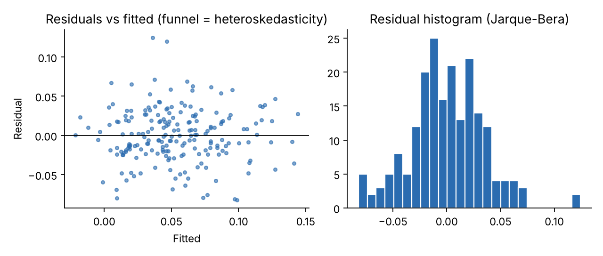
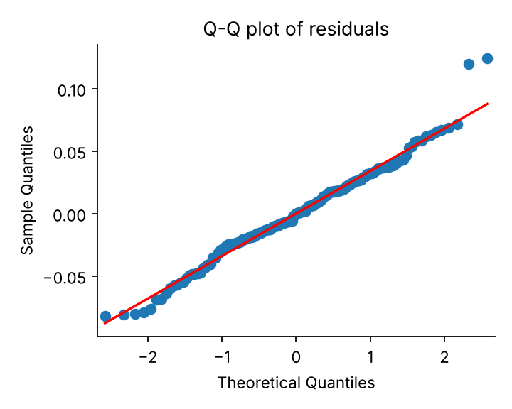
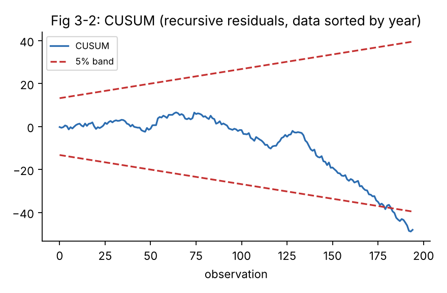

<div dir="rtl" lang="fa">

# فصل سوم: رگرسیون، متغیرها و مفروضات کلاسیک

> **هدف فصل:** این کامل‌ترین فصل کتاب است. پس از مطالعه باید بتوانید (۱) رگرسیون پایان‌نامه را در EViews برآورد و **سطر به سطر** تفسیر کنید، (۲) هر هشت فرض کلاسیک را آزمون و خروجی را بخوانید، (۳) در صورت نقض، درمان مناسب را اجرا کنید و (۴) جملهٔ آمادهٔ فصل یافته‌ها را بنویسید.
>
> **داده:** `thesis_sample.csv` (۲۰ شرکت × ۱۰ سال = ۲۰۰ مشاهده، شبیه‌سازی‌شده). تمام اعداد این فصل از اجرای واقعی آن (اسکریپت `scripts/make_data_and_results.py`) آمده‌اند. **مدل مرجع:**
>
> ```
> ROA = β0 + β1·SIZE + β2·LEV + β3·GROWTH + β4·CFO + u
> ```
> فرضیهٔ مثال: «اهرم مالی بر بازده دارایی‌ها اثر منفی دارد» (`H₁: β2 < 0`).

---

# بخش الف: رگرسیون و متغیرها

## ۳-۱ از فرضیهٔ پژوهش تا معادلهٔ رگرسیونی

### گام‌های تصریح

**۱) متغیر وابسته:** دقیقاً همان پدیده‌ای که فرضیه دربارهٔ آن است. در مثال: `ROA` (بازده دارایی‌ها). **قاعده:** برای هر فرضیه یک متغیر وابسته؛ اگر چند معیار دارید (ROA و ROE)، هر کدام یک مدل (مدل اصلی + استحکام‌سنجی).

**۲) متغیر مستقل اصلی:** عامل مورد فرضیه: `LEV`.

**۳) متغیرهای کنترل:** عواملی که **هم** بر Y اثر دارند **هم** با X مستقل اصلی همبسته‌اند (در غیر این صورت حذفشان سوگیری ایجاد نمی‌کند). در مالی/حسابداری استاندارد: اندازه (`SIZE`)، رشد (`GROWTH`)، سودآوری یا جریان نقد (`CFO`)، سن شرکت، مجازی‌های صنعت و سال. **از پیشینه** انتخاب کنید و ذکر کنید.

**۴) شکل تابعی:** خطی؟ لگاریتمی؟ اگر پیشینه رابطهٔ نسبی (کشش) را مطرح می‌کند، لگاریتم؛ اگر مقدار منفی/صفر وجود دارد، لگاریتم ممکن نیست.

**۵) علامت مورد انتظار** هر ضریب (از نظریه):

| متغیر | نقش | علامت مورد انتظار | پشتوانهٔ نظری |
|---|---|---|---|
| `LEV` | مستقل اصلی | منفی (−) | هزینهٔ بدهی و ریسک ورشکستگی |
| `SIZE` | کنترل | مثبت (+) | صرفه‌جویی ناشی از مقیاس |
| `GROWTH` | کنترل | مثبت (+) | فرصت‌های رشد |
| `CFO` | کنترل | مثبت (+) | کیفیت سود/نقدینگی |

### مدل مفهومی (نمودار)

```
          SIZE (+) ─┐
        GROWTH (+) ─┤
           CFO (+) ─┼──►  ROA  ◄──  u (خطا: عوامل نامشاهده)
 LEV (−)  [فرضیهٔ اصلی] ─┘
```

**شکل ۳-۱ — مدل مفهومی پژوهش (پیکان‌ها: اثر فرضی).**

> 💡 **نکتهٔ آموزشی:** مدل مفهومی را قبل از هر محاسبه رسم کنید و در پایان‌نامه بیاورید. هر پیکان یک **علامت پیش‌بینی‌شده** دارد؛ نتایج را با همان علامت‌ها مقایسه می‌کنید.

> ⚠️ **هشدار — «همه چیز را کنترل کن» غلط است:** کنترل کردن متغیری که **پیامد** X است (واسطه) اثر کل X را مخدوش می‌کند. کنترل کردن متغیرهای بی‌ارتباط نیز درجهٔ آزادی را هدر می‌دهد.

> ✍️ **جملهٔ آمادهٔ پایان‌نامه:**
> «با توجه به مبانی نظری و پیشینهٔ پژوهش، برای آزمون فرضیهٔ [ ... ] از مدل زیر استفاده شد: `[Y]ᵢₜ = β₀ + β₁[X]ᵢₜ + β₂[کنترل۱]ᵢₜ + … + uᵢₜ`. متغیرهای کنترلی بر مبنای [نام پژوهش‌ها] انتخاب شده‌اند و علامت مورد انتظار ضریب [X]، [منفی/مثبت] است.»

---

## ۳-۲ برآورد رگرسیون در EViews

### مسیر کلیک

> 🖱️ **مسیر:** `Quick → Estimate Equation...`

در پنجرهٔ **Equation Estimation**:

| تب/بخش | مقدار | توضیح |
|---|---|---|
| **Specification → Equation specification** | `roa c size lev growth cfo` | نخست متغیر وابسته، سپس `c` (عرض از مبدأ) و سپس مستقل‌ها |
| **Method** | `LS - Least Squares (NLS and ARMA)` | OLS |
| **Sample** | `1392 1401` (یا `@all`) | همان که در Workfile دارید |
| **Options** | (پیش‌فرض) | در بخش‌های آتی برای White/HAC تغییر می‌دهیم |
| **Panel Options** (فقط تابلویی) | `Cross-section: None`، `Period: None` | یعنی OLS تجمیعی (Pooled) |

سپس `OK`.

**دستور معادل:**

```
ls roa c size lev growth cfo
equation eq01.ls roa c size lev growth cfo      ' برآورد با نام
```

> ⚠️ **هشدار:** **`c` را فراموش نکنید.** بدون `c`، EViews مدل را بدون عرض از مبدأ برآورد می‌کند (بخش ۳-۸).

> 🖼️ **جای اسکرین‌شات ۳-۱:** پنجرهٔ `Equation Estimation` با پر شدن `roa c size lev growth cfo`.

> 🏦 **اگر داده تابلویی دارید:** در Workfile تابلویی تب `Panel Options` ظاهر می‌شود. در آن `Effects specification` را روی `None` بگذارید تا برآورد تجمیعی (فصل سوم) باشد. انتخاب `Fixed` یا `Random` در فصل چهارم است.

### خروجی (واقعی، روی داده‌های کتاب)

```
Dependent Variable: ROA
Method: Least Squares
Sample: 1392 1401
Total panel (balanced) observations: 200

Variable        Coefficient   Std. Error   t-Statistic   Prob.
------------------------------------------------------------------
C                -0.111550     0.033060     -3.374162    0.0009
SIZE              0.014971     0.002101      7.126018    0.0000
LEV              -0.149215     0.020005     -7.458735    0.0000
GROWTH            0.031765     0.014841      2.140280    0.0336
CFO               0.304117     0.039026      7.792586    0.0000
------------------------------------------------------------------
R-squared             0.489382   Mean dependent var     0.053492
Adjusted R-squared    0.478908   S.D. dependent var     0.047757
S.E. of regression    0.034474   Akaike info criterion  -3.872539
Sum squared resid     0.231749   Schwarz criterion      -3.790081
Log likelihood      392.2539     Hannan-Quinn criter.   -3.839161
F-statistic          46.72254    Durbin-Watson stat      1.437262
Prob(F-statistic)     0.000000
```

**شکل ۳-۲ — خروجی OLS مدل مرجع (بازنویسی به قالب EViews).**

> 💡 **نکتهٔ آموزشی:** برای دسترسی به اعداد: `eq01.@r2`، `eq01.@coefs(2)`، `eq01.@se`، `eq01.@dw`؛ و برای ذخیرهٔ باقیمانده‌ها: `eq01.makeresids res01`.

---

## ۳-۳ خواندن جدول خروجی رگرسیون سطر به سطر

### بخش بالای خروجی

| سطر | معنی | در مثال |
|---|---|---|
| **Dependent Variable** | متغیر وابسته | `ROA` |
| **Method** | روش برآورد | `Least Squares` |
| **Sample (adjusted)** | نمونهٔ واقعاً استفاده‌شده | `1392 1401`، اگر `1393 1401` باشد یعنی وقفه استفاده شده |
| **Included observations** | تعداد مشاهدات | ۲۰۰ (اگر کمتر از انتظار: NA) |

### جدول ضرایب (چهار ستون)

۱) **Coefficient** `β̂`: برآورد نقطه‌ای اثر.
۲) **Std. Error**: دقت برآورد. هرچه کوچک‌تر، برآورد دقیق‌تر.
۳) **t-Statistic** = `Coefficient / Std. Error`: «چند خطای معیار از صفر دورید؟»
۴) **Prob.**: احتمال دیدن چنین t (یا بزرگ‌تر) اگر `β = 0` درست باشد؛ **دوطرفه**.

**ردیف‌به‌ردیف تفسیر:**

- **C = −۰٫۱۱۱۶ (p = ۰٫۰۰۰۹):** مقدار انتظاری ROA وقتی همهٔ X ها صفر باشند. معمولاً **معنی اقتصادی ندارد** (SIZE = ۰ یعنی دارایی = ۱ میلیون ریال!). فقط «تنظیم‌کننده» است؛ تفسیرش لازم نیست.
- **SIZE = +۰٫۰۱۴۹۷ (t = ۷٫۱۳):** با ثابت بودن سایر متغیرها، به ازای هر ۱ واحد افزایش لگاریتم دارایی، ROA به‌طور متوسط ۰٫۰۱۵ (۱٫۵ واحد درصد) بیشتر است. علامت مثبت = مطابق انتظار.
- **LEV = −۰٫۱۴۹۲ (t = −۷٫۴۶):** به ازای ۰٫۱ افزایش اهرم (۱۰ واحد درصد)، ROA ۰٫۰۱۴۹ (۱٫۵ واحد درصد) کمتر. معنادار و منفی → **فرضیه تأیید**.
- **GROWTH = +۰٫۰۳۱۸ (p = ۰٫۰۳۴):** معنادار در ۵٪ (ولی نه در ۱٪) — حاشیه‌ای.
- **CFO = +۰٫۳۰۴۱:** قوی‌ترین؛ ۰٫۱ افزایش CFO/دارایی ← ۰٫۰۳ افزایش ROA.

### بخش پایین خروجی (در بخش ۳-۴ تفصیلی)

> ⚠️ **هشدار — عرض از مبدأ:** برخی دانشجویان با دیدن عرض از مبدأ منفی نگران می‌شوند («ROA منفی؟»). آن عدد فقط در نقطهٔ `X = 0` معنی دارد که در دادهٔ شما وجود ندارد.

> 💡 **نکتهٔ آموزشی — فاصلهٔ اطمینان ۹۵٪:** `β̂ ± t* × S.E.` با `t* ≈ 1.97`. برای LEV: `−0.1492 ± 1.97×0.0200 = [−0.189, −0.110]`. چون صفر در بازه نیست، در ۵٪ معنادار است. (EViews: `View → Coefficient Diagnostics → Confidence Intervals`.)

> ✍️ **جملهٔ آمادهٔ پایان‌نامه — خواندن ضریب:**
> «نتایج جدول ([ ]) نشان می‌دهد ضریب [متغیر مستقل اصلی] برابر [......] با آمارهٔ t معادل [......] و سطح معناداری [......] است. با توجه به آن‌که سطح معناداری کمتر از ۰٫۰۵ است، فرض صفر مبنی بر عدم تأثیر [..] بر [..] در سطح اطمینان ۹۵٪ رد می‌شود.»

---

## ۳-۴ شاخص‌های اعتبار مدل

| شاخص | مقدار در مثال | معنی | قاعدهٔ داوری |
|---|---|---|---|
| **R²** | ۰٫۴۸۹۴ | سهم واریانس Y که مدل توضیح می‌دهد | در داده‌های مقطعی/تابلویی حسابداری ۰٫۱ تا ۰٫۵ طبیعی است |
| **Adjusted R²** | ۰٫۴۷۸۹ | R² با جریمهٔ تعداد متغیر | **این را گزارش و مقایسه کنید** |
| **S.E. of regression** | ۰٫۰۳۴۴۷ | انحراف معیار باقیمانده‌ها (واحد Y) | با SD متغیر وابسته (۰٫۰۴۷۸) مقایسه: کاهش ≈ ۲۸٪ |
| **F-statistic** | ۴۶٫۷۲ | آزمون معناداری **کل** مدل | `Prob(F) < 0.05` → مدل کلاً معنادار |
| **Durbin-Watson** | ۱٫۴۳۷ | خودهمبستگی مرتبهٔ اول | نزدیک ۲ مطلوب (فرض ۵) |
| **AIC / SIC (BIC) / HQ** | ۳٫۸۷۳− / ۳٫۷۹۰− / ۳٫۸۳۹− | مقایسهٔ مدل‌های رقیب؛ **کمتر = بهتر** | فقط روی **همان نمونه و همان Y** |
| **Log likelihood** | ۳۹۲٫۲۵ | بنیان AIC/SIC؛ **بیشتر = بهتر** | مقایسهٔ مدل‌های تودرتو |
| **Mean/S.D. dependent var** | ۰٫۰۵۳۵ / ۰٫۰۴۷۸ | توصیف Y | مرجع تفسیر |

### فرمول‌ها

> 🧮 **فرمول (۳-۱): R² و R² تعدیل‌شده**
> ```
> R²    = 1 − SSR / SST
> R²adj = 1 − (1 − R²)·(n − 1)/(n − k − 1)
> ```
> **شرح:** `SSR` مجموع مربعات باقیمانده؛ `SST` مجموع مربعات کل؛ `n` تعداد مشاهدات؛ `k` تعداد متغیر مستقل (بدون `c`). مثال: `1 − (1−0.4894)·199/195 = 0.4789`.

> 🧮 **فرمول (۳-۲): معیارهای اطلاعات (قالب EViews؛ هر مشاهده)**
> ```
> AIC = (−2·logL + 2·K)/n        SIC = (−2·logL + K·ln n)/n        K = k + 1
> ```
> مثال: `AIC = (−784.51 + 10)/200 = −3.8725`.

### نکات تفسیری

۱. **R² پایین ≠ مدل بد:** هدف شما برآورد ضریب است، نه حداکثر کردن R².
۲. **R² بالا ≠ مدل خوب:** با متغیر وقفهٔ Y یا رگرسیون ناایستا، R² کاذب بالا (۰٫۹+) می‌شود.
۳. **هرگز R² را بین مدل‌هایی که Y متفاوت دارند (ROA در برابر ln(ROA)) یا نمونهٔ متفاوت دارند مقایسه نکنید.**
۴. **AIC و SIC** وقتی دو مدل رقیب دارید (مثلاً با/بدون `GROWTH`) به کار می‌روند؛ SIC محافظه‌کارتر (مدل کوچک‌تر) است.

> 💡 **نکتهٔ آموزشی — مثال مقایسهٔ AIC:** مدل بدون `CFO` را برآورد کنید: R² از ۰٫۴۸۹ به ۰٫۳۳۰ کاهش می‌یابد؛ AIC بزرگ‌تر (بدتر) می‌شود. پس `CFO` ارزش حفظ دارد.

> ✍️ **جملهٔ آمادهٔ پایان‌نامه:**
> «ضریب تعیین تعدیل‌شدهٔ مدل [......] است؛ یعنی متغیرهای مستقل [......] درصد از تغییرات [متغیر وابسته] را توضیح می‌دهند. آمارهٔ F برابر [......] با سطح معناداری [......] بیانگر معناداری کلی مدل است. آمارهٔ دوربین-واتسون [......] نشان‌دهندهٔ [عدم وجود/وجود] خودهمبستگی مرتبهٔ اول است.»

---

## ۳-۵ آزمون t (تک‌متغیر) و آزمون F (کلیت مدل)

### آزمون t

> 🧮 **فرمول (۳-۳):**
> ```
> t = (β̂ⱼ − β₀ⱼ) / S.E.(β̂ⱼ)         معمولاً β₀ⱼ = 0
> ```
> **فرض‌ها:** `H₀: βⱼ = 0` در برابر `H₁: βⱼ ≠ 0` (دوطرفه). **قاعده:** رد `H₀` اگر `|t| > t_بحرانی` یا `p < α`.

**مقادیر بحرانی** (با ۱۹۵ درجهٔ آزادی، دوطرفه): ۵٪ → ۱٫۹۷؛ ۱٪ → ۲٫۶۰؛ ۱۰٪ → ۱٫۶۵.

**ستاره‌گذاری استاندارد:** `*` p<0.10، `**` p<0.05، `***` p<0.01.

**آزمون یک‌طرفه:** اگر فرضیه جهت دارد (`H₁: β₂ < 0`) و ضریب علامت درست دارد، `p_یک‌طرفه = p_دوطرفه / 2`. برای LEV: `p < 0.0001` در هر دو حالت. **مراقب باشید:** اگر علامت خلاف فرضیه باشد، فرضیه رد می‌شود حتی اگر |t| بزرگ باشد.

### آزمون F (کلیت مدل)

> 🧮 **فرمول (۳-۴):**
> ```
> F = (R²/k) / ((1 − R²)/(n − k − 1))  ~  F(k, n−k−1)
> ```
> **فرض صفر:** `H₀: β₁ = β₂ = … = β_k = 0` (هیچ متغیری اثر ندارد).
> **مثال:** `F = (0.4894/4)/(0.5106/195) = 46.72` در برابر مقدار بحرانی ۲٫۴۲ (۵٪) → رد قاطع `H₀`، `p = 1.7×10⁻²⁷`.

### آزمون‌های مشترک (Wald)

برای آزمون فرضیهٔ مشترک (مثلاً `SIZE` و `GROWTH` هر دو صفرند):

> 🖱️ **مسیر:** در پنجرهٔ Equation: `View → Coefficient Diagnostics → Wald Test - Coefficient Restrictions...` → در کادر بنویسید: `c(2)=0, c(4)=0` → `OK`.

نتیجه (واقعی): `F = 26.30`، df (۲، ۱۹۵)، `p = 7.7×10⁻¹¹` → دست‌کم یکی از این دو متغیر اثر دارد.

> 💡 **نکتهٔ آموزشی — رابطهٔ t و F:** برای یک ضریب، `F = t²`. مثلاً حذف `CFO`: `t² = 7.79² = 60.7` که برابر F آزمون محدودیت `c(5)=0` است.

> ⚠️ **هشدار — دو غلط‌فهمی:** (الف) **معناداری F با معناداری تک‌تک t ها لزوماً هم‌راستا نیست** (با همخطی، F معنادار و همهٔ t ها غیرمعنادارند). (ب) **p-value احتمال درست‌بودن فرض صفر نیست**؛ احتمال دیدن چنین داده‌ای **با فرض** درست‌بودن آن است.

> ✍️ **جملهٔ آمادهٔ پایان‌نامه:**
> «آمارهٔ F مدل برابر [......] با سطح معناداری [......] است که نشان می‌دهد مدل در سطح [۹۵/۹۹] درصد اطمینان به‌طور کلی معنادار است. بر اساس آزمون t، ضریب [متغیر] در سطح [......] معنادار است و فرضیهٔ [..] [تأیید/رد] می‌شود.»

---

## ۳-۶ تفسیر ضرایب رگرسیون — چهار مثال عددی حل‌شده

### جدول راهنمای شکل تابعی

| شکل مدل | معادله | تفسیر `β` |
|---|---|---|
| **سطح–سطح** | `Y = β₀ + β₁X` | یک واحد افزایش X ← `β₁` واحد تغییر Y |
| **لگاریتم–لگاریتم** | `ln Y = β₀ + β₁ ln X` | ۱٪ افزایش X ← `β₁`٪ تغییر Y (**کشش**) |
| **لگاریتم–سطح** | `ln Y = β₀ + β₁X` | یک واحد X ← تقریباً `100·β₁`٪ تغییر Y |
| **سطح–لگاریتم** | `Y = β₀ + β₁ ln X` | ۱٪ افزایش X ← `β₁/100` واحد تغییر Y |
| **مجازی** | `Y = … + β D` | میانگین Y در گروه `D=1` به اندازهٔ `β` با گروه مبنا فرق دارد |
| **تعاملی** | `Y = … + β₁X + β₂D + β₃ X·D` | شیب X در گروه `D=1` برابر `β₁+β₃` است |

### مثال ۱ — ضریب واحدی (سطح–سطح)

**ضریب LEV = −۰٫۱۴۹۲.** هر دو سمت نسبت‌اند. «به ازای هر ۰٫۱ (۱۰ واحد درصد) افزایش اهرم، ROA به‌طور متوسط **۰٫۰۱۴۹** (۱٫۴۹ واحد درصد) کاهش می‌یابد.»
 
**مقایسه با میانگین:** میانگین ROA ۰٫۰۵۳۵ است؛ ۱٫۴۹ واحد درصد کاهش، حدود **۲۸٪ از میانگین ROA** است — اثر اقتصادی بزرگ.

### مثال ۲ — لگاریتمی

الف) **لگاریتم–لگاریتم (کشش):** رگرسیون `ln(SALES) = −0.3862 + 1.0187·ln(ASSETS)` (R² = ۰٫۹۵۸؛ داده کتاب). تفسیر: ۱٪ افزایش دارایی با ۱٫۰۲٪ افزایش فروش همراه است؛ **کشش ≈ ۱ (رابطهٔ همنسبت)**.

ب) **سطح–لگاریتم:** در مدل مرجع `SIZE = ln(ASSETS)` است و `Y = ROA` (سطح). ضریب ۰٫۰۱۵۰ یعنی ۱٪ افزایش دارایی ← ROA به اندازهٔ `0.0150/100 = 0.00015` (۰٫۰۱۵ واحد درصد) بیشتر؛ یا **دو برابر شدن دارایی** (`ln 2 = 0.693`) ← `0.0150×0.693 = 0.0104` (حدود ۱ واحد درصد) افزایش ROA.

### مثال ۳ — متغیر مجازی

مدل با افزودن `COVID` (۱ برای ۱۳۹۹ به بعد):

```
ROA^ = −0.1275 + 0.0166·SIZE − 0.1475·LEV + 0.0366·GROWTH + 0.3056·CFO − 0.0300·COVID
                                                                   (S.E.=0.0049، t=−6.1، p<0.01)
```

تفسیر: «با ثابت بودن سایر عوامل، ROA در دورهٔ ۱۳۹۹ به بعد به‌طور متوسط **۰٫۰۳۰۰ (۳ واحد درصد)** کمتر از دورهٔ پیشین بوده است.» (این حدود ۵۶٪ میانگین ROA نمونه است.)

مقایسهٔ صنعت (مبنا: خودرو، خطای معیار مقاوم): ضریب `Chem` = +۰٫۰۱۳۶ (p = ۰٫۱۹)؛ یعنی تفاوت **معنادار نیست**.

> ⚠️ **هشدار:** ضریب مجازی همیشه **نسبت به گروه مبنا** تفسیر می‌شود. گروه مبنا را در متن اعلام کنید.

### مثال ۴ — متغیر تعاملی

مدل: `ROA = … + β₂LEV + β₅COVID + β₆(LEV×COVID)` (خطای معیار وایت):

| ضریب | برآورد | S.E. | p |
|---|---|---|---|
| `LEV` | −۰٫۱۳۰۴ | ۰٫۰۲۱ | ۰٫۰۰۰ |
| `COVID` | +۰٫۰۰۶۰ | ۰٫۰۲۲ | ۰٫۷۹ |
| `LEV×COVID` | −۰٫۰۶۳۱ | ۰٫۰۳۹ | ۰٫۱۱ |

شیب LEV پیش از ۱۳۹۹: **−۰٫۱۳۰۴**؛ پس از آن: `−0.1304 + (−0.0631) = −0.1935`. یعنی اثر منفی اهرم پس از ۱۳۹۹ به‌ظاهر شدیدتر است. **اما** ضریب تعامل (p = ۰٫۱۱) در ۵٪ معنادار نیست؛ لذا ادعای «تغییر اثر» پشتوانهٔ قوی ندارد و باید با احتیاط گفته شود.

مثال دیگر — تعامل پیوسته `SIZE×LEV`: اثر نهایی اهرم `= −0.0414 − 0.0075·SIZE`. در اندازهٔ میانگین (۱۴٫۳۷): `−0.1492`. ضریب تعامل (p = ۰٫۶۴) غیرمعنادار → اثر اهرم به اندازه وابسته نیست.

> 💡 **نکتهٔ آموزشی:** در مدل تعاملی، ضرایب مؤلفه (`LEV` و `COVID`) به‌تنهایی معنی «اثر وقتی دیگری صفر است» دارند، نه «اثر متوسط». برای اثر متوسط باید متغیرها را میانگین‌زدایی کنید.

> ✍️ **جملهٔ آمادهٔ پایان‌نامه:**
> «ضریب متغیر [X] برابر [......] است؛ یعنی با ثابت‌بودن سایر متغیرها، یک واحد افزایش در [X] با [......] واحد [افزایش/کاهش] در [Y] همراه است. ضریب متغیر مجازی [D] برابر [......] نشان می‌دهد [Y] در گروه [D=1] به‌طور متوسط [......] واحد بیش/کمتر از گروه مبنا ([D=0]) است.»

---

## ۳-۷ تفکیک رابطهٔ معنادار از مهم‌ترین: حجم اثر و اهمیت عملی

**معناداری آماری** می‌گوید «رابطه تصادفی نیست». **اهمیت عملی/اقتصادی** می‌گوید «به‌قدر کافی بزرگ هست که به آن اهمیت دهیم». با نمونهٔ بسیار بزرگ، حتی اثر ناچیز معنادار می‌شود؛ با نمونهٔ کوچک، اثر بزرگ ممکن است معنادار نشود.

### معیارهای حجم اثر

۱) **اثر یک انحراف معیار:** `β̂ × SD(X)` به واحد Y. ۲) **ضریب استاندارد (Beta):** `β̂ × SD(X)/SD(Y)`. ۳) **نسبت به میانگین Y.**

**جدول ۳-۱ — مقایسهٔ اهمیت عملی متغیرها**

| متغیر | ضریب | SD(X) | اثر یک SD بر ROA | Beta استاندارد | معناداری |
|---|---|---|---|---|---|
| `SIZE` | ۰٫۰۱۵۰ | ۱٫۱۷۹ | +۰٫۰۱۷۷ (۱٫۸ واحد درصد) | ۰٫۳۷۰ | ★★★ |
| `LEV` | −۰٫۱۴۹۲ | ۰٫۱۲۲۵ | −۰٫۰۱۸۳ (۱٫۸ واحد درصد) | −۰٫۳۸۳ | ★★★ |
| `GROWTH` | ۰٫۰۳۱۸ | ۰٫۱۶۶۰ | +۰٫۰۰۵۳ (۰٫۵ واحد درصد) | ۰٫۱۱۰ | ★ (p=۰٫۰۳۴) |
| `CFO` | ۰٫۳۰۴۱ | ۰٫۰۶۳۰ | +۰٫۰۱۹۲ (۱٫۹ واحد درصد) | ۰٫۴۰۱ | ★★★ |

**خواندن جدول:** `CFO`، `LEV` و `SIZE` هر یک اثری در حدود ۱٫۸ تا ۱٫۹ واحد درصد در ROA دارند (حدود ۴۰٪ یک انحراف معیار ROA که ۴٫۸ واحد درصد است)؛ `GROWTH` هم معناداری ضعیف‌تر دارد هم اثری کمتر از یک‌سوم آن‌ها. بنابراین **از نظر عملی** `GROWTH` در این مدل فرعی است.

**اثر برتر:** `CFO` (Beta = ۰٫۴۰) و `LEV` (۰٫۳۸) نزدیک‌اند؛ اولی را «مهم‌تر» اعلام کردن بدون بررسی بازهٔ اطمینان بیش از حد جسورانه است.

> ⚠️ **هشدار:** عبارت «متغیر X مهم‌ترین عامل است» را فقط وقتی بنویسید که **اثر استاندارد** و **بازهٔ اطمینان** پشتیبانش باشند، نه صرفاً کوچک‌ترین p-value.

> 💡 **نکتهٔ آموزشی:** p-value بسیار کوچک (۰٫۰۰۰۰) به‌معنی اثر بزرگ **نیست**؛ فقط به این معنی است که برآورد دقیق است.

> ✍️ **جملهٔ آمادهٔ پایان‌نامه:**
> «علاوه بر معناداری آماری، اندازهٔ اثر نیز بررسی شد. افزایش یک انحراف معیار در [X] با [......] واحد درصد تغییر در [Y] (معادل [......] درصد از میانگین [Y]) همراه است که از نظر اقتصادی [قابل‌توجه/ناچیز] ارزیابی می‌شود.»

---

## ۳-۸ برآورد بدون عرض از مبدأ

### چیست؟

حذف `c` از مدل: `Y = β₁X₁ + … + u` (رگرسیون از مبدأ).

> 🖱️ **مسیر:** در `Equation specification` فقط بنویسید: `roa size lev growth cfo` (بدون `c`). دستور: `ls roa size lev growth cfo`.

### چه زمانی مجاز است؟

فقط وقتی **نظریهٔ قوی** می‌گوید در `X = 0` حتماً `Y = 0` است. (مثال: مدل CAPM برای بازده مازاد: `Rᵢ−R_f = β(R_m−R_f)` که α انتظاری صفر است — و حتی آنجا معمولاً α را آزاد می‌گذارند و آزمون می‌کنند.)

### چرا معمولاً غلط است؟

۱. **باقیمانده‌ها میانگین صفر ندارند** و برآورد سوگیر می‌شود: در مثال، ضریب `SIZE` از ۰٫۰۱۵۰ به ۰٫۰۰۸۴ **تقریباً نصف** و ضریب `LEV` از −۰٫۱۴۹ به −۰٫۱۷۵ تغییر کرد.
۲. **R² «غیرمرکزی» می‌شود** و قابل مقایسه با R² معمولی نیست: R² ظاهراً از ۰٫۴۸۹ به **۰٫۷۶۱** رفت — پیشرفت جعلی! (فرمول عوض شده است.)
۳. فرض ۲ (`E(u)=0`) را عملاً به مدل **تحمیل می‌کند** و با نقض آن، تمام ضرایب مخدوش می‌شوند.

**جدول مقایسه (واقعی):**

| متغیر | با `c` | بدون `c` |
|---|---|---|
| `SIZE` | ۰٫۰۱۵۰ | ۰٫۰۰۸۴ |
| `LEV` | −۰٫۱۴۹۲ | −۰٫۱۷۵۳ |
| `GROWTH` | ۰٫۰۳۱۸ | ۰٫۰۲۳۸ |
| `CFO` | ۰٫۳۰۴۱ | ۰٫۳۰۱۶ |
| R² | ۰٫۴۸۹ | ۰٫۷۶۱ (غیرقابل‌مقایسه) |
| میانگین باقیمانده | ≈ ۰ | −۰٫۰۰۰۶ |

> ⚠️ **هشدار:** هرگز برای «بهتر شدن R²» عرض از مبدأ را حذف نکنید. این از بدترین ترفندها است و داور آگاه فوراً متوجه می‌شود.

> ✍️ **جملهٔ آمادهٔ پایان‌نامه:**
> «با توجه به آن‌که از نظر نظری دلیلی برای صفر بودن مقدار [Y] در شرایط صفر بودن متغیرهای توضیحی وجود ندارد، مدل با عرض از مبدأ برآورد شد.»

---


# بخش ب: مفروضات کلاسیک (هشت فرض + درمان)

> **راهنمای مطالعه:** برای هر فرض این قالب ثابت دنبال می‌شود: **(۱) تعریف شهودی ← (۲) فرمول ← (۳) نشانه‌های نقض ← (۴) آزمون در EViews ← (۵) خواندن خروجی ← (۶) درمان ← (۷) جملهٔ آمادهٔ پایان‌نامه ← (۸) کادر نتیجه.**
>
> **پیش‌نیاز:** ابتدا مدل مرجع را با نام `eq01` برآورد کنید: `equation eq01.ls roa c size lev growth cfo`. همهٔ آزمون‌ها از منوی `View` همین پنجره اجرا می‌شوند.


**شکل ۳-۳ — راست: هیستوگرام باقیمانده‌ها؛ چپ: باقیمانده در برابر مقدار برازش‌شده. پراکندگی بازشونده (قیفی) نشانهٔ ناهمسانی واریانس است.**

---

## فرض ۱: خطی بودن مدل در پارامترها

### ۱) تعریف شهودی
مدل باید نسبت به **ضرایب** `β` خطی باشد؛ یعنی هر ضریب فقط در یک متغیر ضرب شود و نتایج جمع شوند. (خطی بودن در `X` لازم نیست: `ln X` یا `X²` هم مجازند.)

### ۲) فرمول
> 🧮 `Y = β₀ + β₁X + u` ← **مجاز** (خطی در β).
> `Y = β₀ + β₁X + β₂X² + u` ← **مجاز** (درجه دوم در X، ولی خطی در β).
> `Y = β₀·X^β₁ · e^u` ← غیرخطی در β؛ با لگاریتم‌گیری `ln Y = ln β₀ + β₁ ln X + u` خطی می‌شود.
> `Y = β₀ + β₁·β₂·X + u` ← **غیرمجاز** (حاصل‌ضرب پارامترها).

### ۳) نشانه‌های نقض
شکل تابعی واقعاً غیرخطی است ولی ما خطی برآورد کرده‌ایم (مثلاً رابطهٔ U-شکل بین اندازه و سودآوری، یا اثر نزولی). نتیجه: **برآوردها سوگیر** و باقیمانده‌ها الگوی منظم (منحنی) نشان می‌دهند.

### ۴) آزمون در EViews: Ramsey RESET
> 🖱️ **مسیر:** در پنجرهٔ `eq01`: `View → Stability Diagnostics → Ramsey RESET Test...` → `Number of fitted terms` = `1` → `OK`.

دستور: `eq01.reset(1)`

**ایدهٔ آزمون:** توان‌های دوم (و سوم، …) مقادیر برازش‌شده `Ŷ²` را به مدل می‌افزاید و می‌پرسد: «آیا اضافه شدنشان توان توضیحی را معنادار بالا می‌برد؟» اگر بله، شکل تابعی ناقص است.

### ۵) خواندن خروجی

```
Ramsey RESET Test
Equation: EQ01
Specification: ROA C SIZE LEV GROWTH CFO
Omitted Variables: Powers of fitted values from 2 to 2

                 Value       df        Probability
t-statistic      0.394925    194       0.6934
F-statistic      0.155961    (1, 194)  0.6934
```

- **H₀:** شکل تابعی صحیح (خطی) است. **قاعده:** `p < 0.05` → H₀ رد → شکل تابعی مشکل دارد.
- مثال: `F = 0.156، p = 0.693 > 0.05` → H₀ رد **نمی‌شود** → ✓ مشکلی در تصریح نیست. (با دو جملهٔ برازش‌شده: `F = 0.297، p = 0.743`؛ نتیجه یکسان.)

### ۶) درمان
۱. **لگاریتم‌گیری** از Yها/Xهای مثبت و چوله (`genr lny = log(y)`).
۲. **جملات درجهٔ دوم:** `genr size2 = size^2` و افزودن به مدل؛ و آزمون معناداری آن.
۳. **تعاملات** مناسب.
۴. بازنگری نظری: آیا رابطه پلکانی/آستانه‌ای است؟ → مجازی‌ها.

> 💡 **نکتهٔ آموزشی:** RESET «آزمون عمومی» است؛ می‌گوید مشکلی هست، نه چه مشکلی. اگر رد شد، نمودار باقیمانده‌ها در برابر هر X را رسم کنید تا منبع را پیدا کنید.

> ⚠️ **هشدار:** RESET فقط **یک** نشانه‌است؛ قبولی‌اش اثبات صحت مدل نیست.

### ۷) جملهٔ آمادهٔ پایان‌نامه
> «آزمون رمزی (F = [......]، p = [......]) نشان داد که شکل تابعی مدل [معنادار نیست/معنادار است]؛ بنابراین [نیازی به اصلاح تصریح نبود/با افزودن جملهٔ مجذور ... تصریح اصلاح شد].»

### ۸) ✅ کادر نتیجه — فرض ۱

| | |
|---|---|
| **آزمون** | Ramsey RESET (۱ جمله) |
| **آماره** | F = ۰٫۱۵۶ (df ۱ و ۱۹۴)، t = ۰٫۳۹۵ |
| **p-value** | ۰٫۶۹۳ |
| **تصمیم** | H₀ رد نمی‌شود → **فرض تأیید** |
| **اقدام** | لازم نیست |

---

## فرض ۲: میانگین صفر جملهٔ خطا — E(u) = 0

### ۱) تعریف شهودی
جملهٔ خطا باید «بی‌سمت» باشد: به‌طور متوسط نه بالاتر و نه پایین‌تر از خط رگرسیون. هیچ **الگوی سیستماتیکی** نباید در خطا مانده باشد.

### ۲) فرمول
> 🧮 `E(uᵢ | X) = 0`
> **شرح:** مقدار انتظاری خطا، به شرط هر مقدار از متغیرهای مستقل، برابر صفر است. (در EViews با وجود `c`، میانگین باقیمانده‌ها **ریاضی‌وار** صفر است؛ پس آزمون مستقیم بی‌معنی است. مسئله فقط «سیستماتیک نبودن» است.)

### ۳) نشانه‌های نقض
نقض ⇐ **حذف متغیر مهم** (Omitted Variable Bias). اگر متغیر حذف‌شده `Z` هم با Y و هم با X همبسته باشد، ضریب X سوگیر است:

```
سوگیری ≈ β_Z · (کوواریانس X و Z / واریانس X)
```

### ۴) تشخیص (آزمون)
چون آزمون مستقیم ندارد، سه راه:

**الف) بازنگری نظری و مقایسهٔ ضرایب با انتظار:** آیا علامت‌ها با نظریه می‌خوانند؟ همهٔ کنترل‌های استاندارد پیشینه آمده‌اند؟

**ب) آزمون متغیر جاافتاده:**
> 🖱️ **مسیر:** `eq01` → `View → Coefficient Diagnostics → Omitted Variables Test - Likelihood Ratio...` → نام متغیرهای کاندید (`covid`) را بنویسید → `OK`.

دستور: `eq01.testadd covid`

**ج) الگوی باقیمانده‌ها:** `View → Actual, Fitted, Residual → Residual Graph`. باقیمانده‌ها را به تفکیک سال/صنعت بازرسی کنید؛ میانگین مثبت/منفی در یک گروه = متغیر جاافتادهٔ آن گروه.

### ۵) خواندن خروجی
مثال (افزودن `COVID` به مدل):

```
Omitted Variables Test    Specification: ROA C SIZE LEV GROWTH CFO
Omitted Variables: COVID
                 Value        df        Probability
F-statistic      36.81        (1, 194)  0.0000
```

`p < 0.05` → **متغیر جاافتاده معنادار است** → مدل اولیه ناقص بود. ضریب `COVID` = −۰٫۰۳۰۰ (۳ واحد درصد).

**تغییر ضرایب با افزودن کنترل‌ها (آزمون استحکام):**

| متغیر | بدون کنترل | با مجازی صنعت و سال (S.E. وایت) |
|---|---|---|
| `SIZE` | ۰٫۰۱۴۹۷ | ۰٫۰۱۵۰ |
| `LEV` | −۰٫۱۴۹۲ | −۰٫۱۶۴۴ |
| `GROWTH` | ۰٫۰۳۱۸ | ۰٫۰۳۶۴ |
| `CFO` | ۰٫۳۰۴۱ | ۰٫۲۹۴۹ |
| R² تعدیل‌شده | ۰٫۴۷۹ | ۰٫۵۶۰ |

ضرایب نزدیک‌اند و علامت‌ها ثابت → **سوگیری ناشی از حذف عوامل صنعتی/زمانی جدی نیست**. (مجازی‌های سال، به‌ویژه ۱۳۹۹ به بعد، معنادارند: F مشترک = ۴٫۷۳، `p < 0.001`؛ مجازی‌های صنعت مشترکاً معنادار نیستند: `p = 0.33`.)

### ۶) درمان
۱. **افزودن کنترل‌ها** (اندازه، اهرم، رشد، سن، مجازی صنعت، مجازی سال): `ls roa c size lev growth cfo @expand(year, @dropfirst) @expand(industry, @dropfirst)`
۲. **اثرات ثابت** (برای نامشاهده‌های ثابت شرکت) ← فصل چهارم.
۳. **ارائهٔ مدل‌های جایگزین** در بخش استحکام‌سنجی.

### ۷) جملهٔ آمادهٔ پایان‌نامه
> «برای کاهش خطر حذف متغیرهای مهم، مدل با متغیرهای کنترلی [اندازه، اهرم، رشد، ...] و مجازی‌های [صنعت و سال] برآورد شد. آزمون متغیر جاافتاده (F = [......]، p = [......]) نشان داد افزودن [متغیر] [معنادار است/نیست] و ضریب متغیر اصلی با افزودن کنترل‌ها [تغییر معناداری نکرد].»

### ۸) ✅ کادر نتیجه — فرض ۲

| | |
|---|---|
| **تشخیص** | آزمون متغیر جاافتاده (`COVID`) + مقایسهٔ ضرایب با کنترل‌های صنعت/سال |
| **آماره** | F = ۳۶٫۸۱ (برای `COVID`) |
| **p-value** | < ۰٫۰۰۱ |
| **تصمیم** | `COVID` متغیر مهم جاافتاده بود؛ پس از افزودن، ضرایب اصلی پایدار |
| **اقدام** | مجازی سال و کنترل‌ها در مدل نهایی |

---

## فرض ۳: عدم همبستگی متغیرهای مستقل با خطا (درون‌زایی نداشتن)

### ۱) تعریف شهودی
متغیرهای مستقل باید «برون‌زا» باشند: مقدارشان از چیزهایی که در `u` هست، **مستقل** باشد. یعنی شرکت‌ها اهرمشان را بر اساس همان عواملی تعیین نکنند که سودآوری را هم تعیین می‌کند و از آن «تأثیر» نپذیرد.

### ۲) فرمول
> 🧮 `Cov(Xⱼ, u) = 0` یا `E(u | X) = 0`
> **شرح:** هیچ همبستگی بین X و بخشی از Y که توسط مدل توضیح داده نشده نباید باشد. اگر باشد، ضریب `β̂` حتی در نمونهٔ بسیار بزرگ هم به `β` نزدیک نمی‌شود (**ناسازگاری**).

### ۳) نشانه‌های نقض (سه منبع)
۱. **خودگزینی (Self-selection):** شرکت‌های سودآور «انتخاب می‌کنند» بدهی کمتری بگیرند → LEV با u همبسته.
۲. **علیت معکوس (Reverse causality):** ROA پایین ← شرکت وام بیشتر می‌گیرد (نه برعکس).
۳. **متغیر حذف‌شده همبسته با X** (فرض ۲).
۴. **خطای اندازه‌گیری** در X (مثلاً سود دستکاری‌شده).

> ⚠️ **هشدار:** برخلاف فروض ۴ تا ۷، درون‌زایی را **نمی‌توان** با خطای معیار مقاوم درمان کرد؛ خودِ ضریب غلط است.

### ۴) تشخیص در پایان‌نامهٔ حسابداری
هیچ آزمون «ساده» و قطعی روی OLS وجود ندارد. در عمل سه کار:

**الف) استدلال نظری:** بنویسید چرا X برون‌زاست یا نیست.

**ب) آزمون قوی‌سازی با وقفه (مقایسهٔ ضرایب):** مدل را با مقادیر **وقفهٔ** X برآورد کنید و ببینید علامت/اندازه حفظ می‌شود یا نه.

```
ls roa c size(-1) lev(-1) growth(-1) cfo(-1)
```

**ج) آزمون درون‌زایی هاسمن/رگرسورها** (فقط با ابزار): پس از برآورد 2SLS (بخش ۶): `View → IV Diagnostics & Tests → Regressor Endogeneity Test...` (نام دقیق بسته به نسخه).

### ۵) خواندن خروجی (مثال: مقایسهٔ هم‌زمان و با وقفه)

| متغیر | هم‌زمان (مدل مرجع) | با وقفه X(−۱) (۱۸۰ مشاهده) |
|---|---|---|
| `SIZE` | +۰٫۰۱۴۹۷ (p<۰٫۰۰۱) | +۰٫۰۱۶۲ (p<۰٫۰۰۱) |
| `LEV` | −۰٫۱۴۹۲ (p<۰٫۰۰۱) | −۰٫۱۳۹۸ (p<۰٫۰۰۱) |
| `GROWTH` | +۰٫۰۳۱۸ (p=۰٫۰۳۴) | −۰٫۰۰۰۲ (p=۰٫۹۹) |
| `CFO` | +۰٫۳۰۴۱ (p<۰٫۰۰۱) | **−۰٫۰۷۴۱ (p=۰٫۱۷)** |

**تفسیر:**
- `LEV` و `SIZE`: **علامت و اندازه پایدارند** → یافتهٔ اصلی در برابر نگرانی علیت معکوس قوی است.
- `CFO` و `GROWTH`: **اثر هم‌زمان محو شد** (حتی علامت CFO برگشت و بی‌معنا شد) → رابطهٔ هم‌زمان CFO با ROA بیشتر «هم‌افتادگی حسابداری/هم‌زمانی» است تا اثر با تأخیر. ادعای علّی دربارهٔ CFO **نباید** مطرح شود.

> 💡 **نکتهٔ آموزشی:** قاعدهٔ داوری در پایان‌نامه: **اگر ضرایب با وقفه، علامت و معناداری را حفظ کنند، نگرانی کاهش می‌یابد**؛ اگر علامت برعکس شود، گزارش دقیق و محدودیت را اعلام کنید.

### ۶) درمان
۱. **متغیرهای وقفه‌ای** (`X(−1)`): ساده‌ترین؛ هزینه: از دست رفتن یک سال و فرض اینکه X وقفه‌دار از u جاری مستقل است.
۲. **کنترل‌های کافی** و **اثرات ثابت** (فصل چهارم) برای حذف بخشی از عوامل ثابت.
۳. **متغیر ابزاری و 2SLS:**

> 🖱️ **مسیر:** `Quick → Estimate Equation...` → `Method: TSLS - Two-Stage Least Squares (TSNLS and ARMA)` → `Equation specification: roa c size lev growth cfo` → `Instrument list: c size lev growth cfo(-1) cfo(-2) growth(-1)`.
>
> دستور: `tsls roa c size lev growth cfo @ c size lev growth growth(-1) cfo(-1) cfo(-2)`

**اخطار روش:** ابزار خوب باید **مرتبط** (با X درون‌زا همبسته) و **معتبر** (با u نه) باشد. در داده‌های مثال، F مرحلهٔ اول ابزارهای وقفه‌ای فقط **۰٫۹۳** (< ۱۰) است؛ یعنی ابزارها **ضعیف**‌اند و 2SLS بی‌فایده و ناپایدار می‌شد. این بررسی را **حتماً** انجام دهید: `View → IV Diagnostics & Tests → Weak Instrument Diagnostics`.

### ۷) جملهٔ آمادهٔ پایان‌نامه
> «به‌منظور کاهش نگرانی دربارهٔ درون‌زایی احتمالی (علیت معکوس و خودگزینی)، مدل با استفاده از [متغیرهای وقفه‌ای/کنترل‌های اضافی/متغیر ابزاری [نام]] مجدداً برآورد شد. علامت و معناداری ضریب [متغیر مستقل اصلی] ([ضریب] = ......، p = ......) [تغییر نکرد/تغییر کرد]؛ بنابراین نتایج [در برابر این نگرانی استوار است/باید با احتیاط تفسیر شود].»

### ۸) ✅ کادر نتیجه — فرض ۳

| | |
|---|---|
| **روش تشخیص** | بازبینی نظری + برآورد با وقفه |
| **نتیجه** | `LEV` و `SIZE` پایدار؛ `CFO` و `GROWTH` اثر هم‌زمان محو |
| **تصمیم** | فرضیهٔ اصلی (اهرم) در برابر نگرانی درون‌زایی استوار؛ تفسیر CFO صرفاً «همراهی» |
| **اقدام** | گزارش مدل وقفه‌ای در استحکام‌سنجی؛ 2SLS به‌دلیل ضعف ابزار انجام نشد |

---

## فرض ۴: همسان‌واریانس — Var(u) = σ²

### ۱) تعریف شهودی
پراکندگی خطا باید در تمام سطوح X یکسان باشد. در مالی عموماً **شرکت بزرگ‌تر = خطای بزرگ‌تر** (سودهای ریالی بزرگ‌تر نوسان بزرگ‌تر)؛ نمودار باقیمانده «قیفی» می‌شود.

### ۲) فرمول
> 🧮 **فرض:** `Var(uᵢ | X) = σ²` (ثابت برای همهٔ i).
> **نقض (ناهمسانی):** `Var(uᵢ | X) = σᵢ²` (متغیر).
>
> **آزمون بروش-پاگان-گادفری (BPG):**
> ```
> مرحله ۱: برآورد مدل و ذخیرهٔ باقیمانده e
> مرحله ۲: رگرسیون کمکی  e² = α₀ + α₁X₁ + … + α_kX_k + v
> آماره:   LM = n · R²_کمکی  ~  χ²(k)
> ```
> **شرح:** اگر X ها نتوانند `e²` را توضیح دهند (R² کمکی کوچک)، واریانس به X وابسته نیست.

### ۳) نشانه‌های نقض
- ضرایب هنوز **نااریب**اند ولی **ناکارا** هستند.
- **خطاهای معیار غلط** → t و p-value غلط → نتیجه‌گیری اشتباه (معمولاً معناداری کاذب).
- نمودار قیفی (شکل ۳-۳).

### ۴) آزمون در EViews
> 🖱️ **مسیر:** `eq01` → `View → Residual Diagnostics → Heteroskedasticity Tests...` → در پنجره `Test type` را انتخاب:
> - `Breusch-Pagan-Godfrey` (پیش‌فرض و پرکاربردترین)
> - `Harvey`
> - `Glejser`
> - `White` (با گزینهٔ `Include White cross terms`)
>
> `OK`.

دستورها:
```
eq01.hettest(type=bpg)            ' بروش-پاگان-گادفری
eq01.hettest(type=white)
eq01.hettest(type=harvey)
eq01.hettest(type=glejser)
```

### ۵) خواندن خروجی

```
Heteroskedasticity Test: Breusch-Pagan-Godfrey
Null hypothesis: Homoskedasticity

F-statistic          3.966904   Prob. F(4,195)         0.0041
Obs*R-squared       15.04977   Prob. Chi-Square(4)    0.0046
Scaled explained SS 21.96340   Prob. Chi-Square(4)    0.0002
```

- **H₀:** همسان‌واریانسی. **قاعده:** `Prob < 0.05` → ناهمسان‌واریانس تأیید می‌شود.
- **آمارهٔ اصلی:** `Obs*R-squared` (= LM)؛ اگر نمونه کوچک است، `F` را بخوانید.

**خلاصهٔ چهار آزمون روی داده‌های مثال:**

| آزمون | آماره | df | p-value | نتیجه |
|---|---|---|---|---|
| Breusch-Pagan-Godfrey | LM = ۱۵٫۰۵ (F = ۳٫۹۷) | ۴ | **۰٫۰۰۴۶** | ناهمسانی ✔ |
| White (با ضرب متقاطع) | LM = ۲۵٫۰۴ (F = ۱٫۸۹) | ۱۴ | **۰٫۰۳۴** | ناهمسانی ✔ |
| Glejser | LM = ۱۳٫۳۶ (F = ۳٫۴۹) | ۴ | **۰٫۰۰۹۷** | ناهمسانی ✔ |
| Harvey | LM = ۴٫۷۰ (F = ۱٫۱۷) | ۴ | ۰٫۳۱۹ | رد نمی‌شود |

سه آزمون از چهار آزمون ناهمسانی را تأیید می‌کنند؛ آزمون Harvey (که شکل نمایی را فرض می‌کند) نمی‌کند. **قاعدهٔ عملی:** اگر **بروش-پاگان یا وایت** رد کرد، درمان انجام دهید؛ درمان مقاوم هزینهٔ زیادی ندارد.

### ۶) درمان
**روش ۱ — خطای معیار مقاوم وایت (توصیهٔ اصلی):**

> 🖱️ **مسیر:** در پنجرهٔ `Equation Estimation` → تب **Options** → `Coefficient covariance matrix` را `White` بگذارید (`d.f. adjustment` را فعال بگذارید که همان HC1 است) → `OK`.
>
> دستور: `ls(cov=white) roa c size lev growth cfo`

ضرایب تغییر نمی‌کنند؛ فقط خطاهای معیار و t ها اصلاح می‌شوند.

**جدول مقایسهٔ قبل/بعد (واقعی):**

| متغیر | ضریب | S.E. معمولی | t | p | S.E. وایت | t | p |
|---|---|---|---|---|---|---|---|
| `C` | −۰٫۱۱۱۶ | ۰٫۰۳۳۱ | −۳٫۳۷ | ۰٫۰۰۰۹ | ۰٫۰۳۵۱ | −۳٫۱۸ | ۰٫۰۰۱۵ |
| `SIZE` | ۰٫۰۱۴۹۷ | ۰٫۰۰۲۱ | ۷٫۱۳ | ۰٫۰۰۰۰ | ۰٫۰۰۲۳ | ۶٫۶۵ | ۰٫۰۰۰۰ |
| `LEV` | −۰٫۱۴۹۲ | ۰٫۰۲۰۰ | −۷٫۴۶ | ۰٫۰۰۰۰ | ۰٫۰۱۹۶ | −۷٫۶۲ | ۰٫۰۰۰۰ |
| `GROWTH` | ۰٫۰۳۱۸ | ۰٫۰۱۴۸ | ۲٫۱۴ | **۰٫۰۳۳۶** | ۰٫۰۱۶۶ | ۱٫۹۲ | **۰٫۰۵۵۴** |
| `CFO` | ۰٫۳۰۴۱ | ۰٫۰۳۹۰ | ۷٫۷۹ | ۰٫۰۰۰۰ | ۰٫۰۴۰۵ | ۷٫۵۱ | ۰٫۰۰۰۰ |

**خواندن:** نتیجهٔ اصلی (`LEV`) تغییر نکرد؛ اما `GROWTH` که در ۵٪ معنادار بود (p = ۰٫۰۳۴) پس از تصحیح فقط در ۱۰٪ معنادار است (p = ۰٫۰۵۵). این نمونهٔ **همان خطری است که تصحیح ناهمسانی جلوگیری می‌کند.**

**روش ۲ — تبدیل لگاریتمی Y:** اگر Y همیشه مثبت است، `ln(Y)` اغلب ناهمسانی را کم می‌کند. (ROA می‌تواند منفی باشد؛ این روش اینجا ممکن نیست.)

**روش ۳ — GLS/WLS (کمترین مربعات وزنی):** اگر ساختار ناهمسانی را می‌دانید (مثلاً واریانس با اندازه بالا می‌رود)، مشاهدات را وزن می‌دهیم: واریانس کمتر ← وزن بیشتر.
> 🖱️ **مسیر:** `Estimate Equation → Options → Weights → Type: Inverse std. dev.` و نام Series وزن را بنویسید (`wt`).

*(مثال آموزشی: با وزن‌هایی متناسب با `exp(−0.25·(SIZE−14.2))` ضرایب WLS به ترتیب `SIZE=۰٫۰۱۸۷، LEV=−۰٫۱۴۳۳، GROWTH=۰٫۰۲۹۱، CFO=۰٫۳۲۲۷` شد؛ جهت و معناداری مشابه، دقت بیشتر. این وزن در داده‌های واقعی باید از مدل واریانس برآورد شود، نه حدس.)*

> 🏦 **اگر داده تابلویی دارید:** ناهمسانی بین شرکت‌ها و همبستگی درون‌شرکتی معمولاً هم‌زمان‌اند؛ در تابلویی گزینهٔ **`Cross-section clustered`** (یا `White cross-section`) در تب Options قوی‌تر است (جزئیات در فصل چهارم).

### ۷) جملهٔ آمادهٔ پایان‌نامه
> «طبق آزمون بروش-پاگان-گادفری (آماره = [......]، p = [......])، ناهمسان‌واریانس [تأیید/رد] شد؛ لذا [خطاهای معیار مقاوم وایت (White HC)] استفاده شد. ضرایب [تغییری نکرد] و نتایج آزمون فرضیه‌ها [بدون تغییر ماند/در مورد متغیر ... تغییر کرد].»

### ۸) ✅ کادر نتیجه — فرض ۴

| | |
|---|---|
| **آزمون** | Breusch-Pagan-Godfrey (و White) |
| **آماره** | LM = ۱۵٫۰۵ (BPG)؛ ۲۵٫۰۴ (White) |
| **p-value** | ۰٫۰۰۴۶ ؛ ۰٫۰۳۴ |
| **تصمیم** | ناهمسانی واریانس تأیید ✔ → فرض **نقض** |
| **اقدام** | خطای معیار مقاوم وایت؛ `GROWTH` دیگر در ۵٪ معنادار نیست (p = ۰٫۰۵۵) |

---

## فرض ۵: عدم خودهمبستگی خطاها — Cov(uᵢ, uⱼ) = 0

### ۱) تعریف شهودی
خطای هر مشاهده با خطای مشاهدات دیگر بی‌ارتباط است. در سری زمانی: «شوک امسال به شوک پارسال ربطی ندارد.» در مالی، **سود پایدار** است و شوک‌ها اغلب ماندگارند؛ پس خودهمبستگی مثبت رایج است.

### ۲) فرمول
> 🧮 **فرمول دوربین-واتسون:**
> ```
> DW = Σ(eₜ − eₜ₋₁)² / Σ eₜ²    ≈  2·(1 − ρ̂)
> ```
> **شرح:** `eₜ` باقیمانده دورهٔ t، `ρ̂` همبستگی مرتبهٔ اول باقیمانده‌ها. اگر `ρ̂ = 0` → `DW = 2`؛ `ρ̂ = +1` → `DW = 0`؛ `ρ̂ = −1` → `DW = 4`.
>
> **قاعدهٔ سریع:** نزدیک **۲** ✓ | نزدیک **۰** = خودهمبستگی مثبت | نزدیک **۴** = خودهمبستگی منفی.
>
> **آزمون بروش-گادفری (LM):** رگرسیون کمکی `eₜ` روی `X` و `eₜ₋₁ … eₜ₋ₚ`؛ `LM = n·R²_کمکی ~ χ²(p)`.

### ۳) نشانه‌های نقض
- ضرایب هنوز نااریب‌اند، ولی **خطاهای معیار معمولاً کوچک‌تر از واقع** برآورد می‌شوند → t های متورم، معناداری کاذب.
- اگر Y وقفه‌دار در سمت راست باشد، ضرایب **ناسازگار** هم می‌شوند.
- DW دور از ۲ و باقیمانده‌هایی که به‌صورت «موج» یا «قطعه‌قطعه» حرکت می‌کنند.

> ⚠️ **هشدار — مثلث تابلویی:** DW و BG برای **سری زمانی** تعریف شده‌اند. در Workfile تابلویی اگر ردیف‌ها شرکت‌به‌شرکت چیده شده باشند، DW مرز بین دو شرکت را هم «همسایه» حساب می‌کند. برای تابلویی، **آزمون ولدریج** (فصل چهارم) درست‌تر است. اما دانشجویان مالی معمولاً DW را گزارش می‌کنند؛ لذا اینجا هر دو می‌آیند و توضیح داده می‌شود.

### ۴) آزمون در EViews
**الف) DW:** در خروجی رگرسیون سطر `Durbin-Watson stat` را بخوانید (بدون مسیر اضافه).

**ب) Breusch-Godfrey:**
> 🖱️ **مسیر:** `eq01` → `View → Residual Diagnostics → Serial Correlation LM Test...` → `Number of lags to include` = `1` (سپس ۲ و ۳) → `OK`.

دستور: `eq01.auto(1)` ، `eq01.auto(2)` ، `eq01.auto(3)`

**ج) نمودار همبستگی‌نگار:** `View → Residual Diagnostics → Correlogram - Q-statistics...` (برای سری زمانی).

### ۵) خواندن خروجی

```
Breusch-Godfrey Serial Correlation LM Test
Null hypothesis: No serial correlation at up to 1 lag

F-statistic       16.51611   Prob. F(1,194)      0.0001
Obs*R-squared     15.69106   Prob. Chi-Square(1) 0.0001
```

| تأخیر (Lag) | LM = n·R² | p-value | F | نتیجه |
|---|---|---|---|---|
| ۱ | ۱۵٫۶۹ | ۰٫۰۰۰۰۷۵ | ۱۶٫۵۲ | خودهمبستگی ✔ |
| ۲ | ۲۰٫۸۲ | ۰٫۰۰۰۰۳۰ | ۱۱٫۲۲ | خودهمبستگی ✔ |
| ۳ | ۲۰٫۸۷ | ۰٫۰۰۰۱۱۲ | ۷٫۴۶ | خودهمبستگی ✔ |

- **H₀:** عدم خودهمبستگی تا مرتبهٔ p. **قاعده:** `Prob < 0.05` → خودهمبستگی وجود دارد.
- **DW = ۱٫۴۳۷** (n=۲۰۰، k=۴؛ حد پایین جدول تقریباً ۱٫۷۳ و حد بالا ≈ ۱٫۸۱؛ پیوست الف (مقادیر تقریبی؛ با جدول رسمی تطبیق دهید)) ← `DW < d_L` ← خودهمبستگی مثبت. (همبستگی مرتبهٔ اول باقیمانده‌ها ≈ ۰٫۲۸.) هر دو آزمون هم‌جهت‌اند.

> 💡 **نکتهٔ آموزشی:** چرا در داده‌های ما خودهمبستگی هست؟ چون شرکت‌ها اثرات نامشاهدهٔ ثابتی دارند (مدیریت، مزیت صنعتی) که در `u` می‌ماند و در سال‌های متوالی تکرار می‌شود. این «ناهمگنی شرکت» است و درمان ساختاری‌اش **اثرات ثابت/تصادفی** (فصل چهارم) است.

### ۶) درمان
**روش ۱ — Newey-West (HAC):** خطای معیار مقاوم به ناهمسانی **و** خودهمبستگی.
> 🖱️ **مسیر:** `Equation Estimation → Options → Coefficient covariance matrix: HAC (Newey-West)` → `Lag specification: User-specified` = `2` (یا Automatic) → `OK`.
>
> دستور: `ls(cov=hac, covlag=2) roa c size lev growth cfo`

**روش ۲ — افزودن جملهٔ AR(1):**
> دستور: `ls roa c size lev growth cfo ar(1)`
> یعنی `uₜ = ρ·uₜ₋₁ + vₜ`. (برآورد EViews معادل Cochrane-Orcutt تکراری است.)

**روش ۳ — Cochrane-Orcutt (مفهومی):** ابتدا `ρ̂` را برآورد و سپس مدل «شبه‌تفاضلی» `(Yₜ − ρ̂Yₜ₋₁) = β₀(1−ρ̂) + β₁(Xₜ − ρ̂Xₜ₋₁) + v` را برآورد می‌کنند.

**مقایسهٔ روش‌ها (واقعی):**

| متغیر | ضریب OLS | S.E. OLS | S.E. HAC(2) | S.E. خوشه‌ای شرکت | AR(1) GLS: ضریب |
|---|---|---|---|---|---|
| `SIZE` | ۰٫۰۱۴۹۷ | ۰٫۰۰۲۱ | ۰٫۰۰۲۸ | ۰٫۰۰۳۶ | ۰٫۰۱۴۵ |
| `LEV` | −۰٫۱۴۹۲ | ۰٫۰۲۰۰ | ۰٫۰۲۳۹ | ۰٫۰۲۹۵ | −۰٫۱۵۳۲ |
| `GROWTH` | ۰٫۰۳۱۸ | ۰٫۰۱۴۸ | ۰٫۰۱۶۰ (p=۰٫۰۴۷) | ۰٫۰۱۲۲ (p=۰٫۰۰۹) | ۰٫۰۳۵۸ |
| `CFO` | ۰٫۳۰۴۱ | ۰٫۰۳۹۰ | ۰٫۰۳۹۰ | ۰٫۰۳۴۱ | ۰٫۳۲۴۵ |

(برآورد AR(1) با `ρ̂ = ۰٫۲۹`.) **خواندن:** خطاهای معیار با تصحیح بزرگ‌تر شد (از ۰٫۰۰۲۱ تا ۰٫۰۰۳۶ برای `SIZE`)؛ همهٔ کلیدی‌ها معنادار ماندند. این نشان می‌دهد معناداری نتایج به تصحیح وابسته نیست.

> 🏦 **اگر داده تابلویی دارید:** خوشه‌بندی بر مبنای شرکت (`Cross-section clustered`) و آزمون ولدریج (Wooldridge) و اثرات ثابت مسیر درست‌اند؛ در این فصل Newey-West فقط برای سری زمانی/نمایش است.

### ۷) جملهٔ آمادهٔ پایان‌نامه
> «آزمون بروش-گادفری (LM = [......]، p = [......]) نشان داد [عدم وجود/وجود] خودهمبستگی؛ بنابراین [درمان انجام شد: خطاهای معیار نیوی-وست به کار رفت/جملهٔ AR(1) افزوده شد] / [تصحیح ضروری نبود]. آمارهٔ دوربین-واتسون برابر [......] است.»

### ۸) ✅ کادر نتیجه — فرض ۵

| | |
|---|---|
| **آزمون** | Breusch-Godfrey (۱ تا ۳ وقفه) + DW |
| **آماره** | LM(۱) = ۱۵٫۶۹ ؛ DW = ۱٫۴۳۷ |
| **p-value** | < ۰٫۰۰۱ |
| **تصمیم** | خودهمبستگی مثبت تأیید ✔ → فرض **نقض** |
| **اقدام** | HAC(۲) و خوشه‌ای شرکت؛ ضرایب اصلی همچنان معنادار؛ ارجاع به فصل چهارم (اثرات شرکت) |

---

## فرض ۶: نرمال بودن توزیع جملهٔ خطا

### ۱) تعریف شهودی
خطاها باید حول صفر به‌صورت زنگوله‌ای (نرمال) توزیع شوند. این فرض **برای برقراری** BLUE لازم نیست؛ فقط برای **آزمون‌های دقیق t و F در نمونه‌های کوچک** لازم است.

### ۲) فرمول
> 🧮 **آمارهٔ جارک-برا:**
> ```
> JB = (n/6) · [ S² + (K − 3)²/4 ]  ~  χ²(2)
> ```
> **شرح:** `n` حجم نمونه؛ `S` چولگی (Skewness) باقیمانده‌ها (۰ برای نرمال)؛ `K` کشیدگی (Kurtosis) (۳ برای نرمال). هرچه چولگی از ۰ و کشیدگی از ۳ دورتر، JB بزرگ‌تر.
> **مثال:** `S=0.208، K=3.919، n=200`: `JB = 33.33×(0.0433+0.2121) = 8.48`.

### ۳) نشانه‌های نقض
چولگی یا دم‌های سنگین (پرت‌ها)؛ در نمونه کوچک، t و F دقیقاً توزیع t و F ندارند و p-value ها نادقیق‌اند.

### ۴) آزمون در EViews
> 🖱️ **مسیر:** `eq01` → `View → Residual Diagnostics → Histogram - Normality Test`.
>
> دستور (روی باقیمانده‌ها؛ آن را در آغاز با `eq01.makeresids res01` ذخیره کنید تا بازنویسی نشود): `res01.hist`

نمودار Q-Q: سری باقیمانده (`res01`) → `View → Graph... → Quantile - Quantile`.



### ۵) خواندن خروجی

```
Series: Residuals          Sample 1392 1401   Observations 200
Mean        -4.11e-16      Skewness      0.208064
Median      -0.000209      Kurtosis      3.918685
Maximum      0.124425      Jarque-Bera   8.476205
Minimum     -0.082149      Probability   0.014435
Std. Dev.    0.034126
```

- **H₀:** باقیمانده‌ها نرمال‌اند. **قاعده:** `Prob(JB) > 0.05` → نرمالیتی پذیرفته؛ `< 0.05` → رد.
- مثال: `p = 0.014 < 0.05` → **نرمالیتی رد می‌شود** (کشیدگی ۳٫۹۲ بیش از ۳: دم سنگین).

> 💡 **نکتهٔ آرام‌بخش:** در نمونه‌های بزرگ (n > ۳۰ و به‌ویژه n = ۲۰۰)، طبق **قضیهٔ حد مرکزی**، توزیع `β̂` حتی با خطای غیرنرمال به نرمال نزدیک است؛ نقض نرمالیتی **اغلب بی‌خطر** است. بنابراین در پایان‌نامه با n بزرگ، فقط گزارش و توجیه کافی است.

### ۶) درمان
**روش ۱ — لگاریتم‌گیری Y** (اگر مثبت است).

**روش ۲ — شناسایی و بررسی داده‌های پرت (Outliers):** با باقیمانده‌های استیودنت‌شده `|r| > 3`:
```
genr sres = resid/eq01.@se        ' تقریب باقیمانده استاندارد
genr outl = abs(sres)>3
show firm year sres if outl=1
```
در داده‌های ما دو مشاهده (شرکت ۲۰ در ۱۳۹۴ و ۱۳۹۵؛ `r = 3.78` و `3.65`) پرت‌اند. **حذف** آن‌ها (فقط با دلیل مستند، مثلاً خطای ثبت داده):

| | با ۲۰۰ مشاهده | بدون ۲ پرت (۱۹۸) |
|---|---|---|
| JB (p) | ۸٫۴۸ (۰٫۰۱۴) | **۰٫۸۶ (۰٫۶۵۱)** |
| `SIZE` | ۰٫۰۱۵۰ | ۰٫۰۱۳۷ |
| `LEV` | −۰٫۱۴۹۲ | −۰٫۱۶۱۳ |
| `GROWTH` | ۰٫۰۳۱۸ | ۰٫۰۲۹۸ |
| `CFO` | ۰٫۳۰۴۱ | ۰٫۳۱۷۵ |

حذف دو مشاهده نرمالیتی را برقرار کرد و ضرایب را تقریباً ثابت گذاشت → **دو پرت علت نقض نرمالیتی‌اند و تأثیر بر نتیجه ندارند.** به‌جای حذف بی‌دلیل، **Winsorize** (بخش ۲-۶) امن‌تر است.

**روش ۳ — Box-Cox (اشاره):** خانواده‌ای از تبدیل‌ها (`(Yλ−1)/λ`) که λ را از داده می‌یابد؛ پیشرفته؛ در EViews با `Add-ins` موجود است. معمولاً برای پایان‌نامهٔ کارشناسی‌ارشد لازم نیست.

### ۷) جملهٔ آمادهٔ پایان‌نامه
> «بر اساس آمارهٔ جارک-برا (JB = [......]، p = [......])، توزیع جملهٔ خطا نرمال [فرض می‌شود/رد می‌شود]؛ لکن با حجم نمونهٔ [n]، و بر اساس قضیهٔ حد مرکزی، این نقض [قابل قبول است/با حذف [تعداد] داده پرت یا وینزورایز در سطح ۱٪ برطرف شد].»

### ۸) ✅ کادر نتیجه — فرض ۶

| | |
|---|---|
| **آزمون** | Jarque-Bera + Q-Q + باقیمانده‌های استیودنت‌شده |
| **آماره** | JB = ۸٫۴۸ ؛ چولگی ۰٫۲۱ ؛ کشیدگی ۳٫۹۲ |
| **p-value** | ۰٫۰۱۴ |
| **تصمیم** | نرمالیتی رد؛ **غیرمخرب** (n = ۲۰۰، دو پرت) |
| **اقدام** | بررسی پرت‌ها؛ پس از حذف JB = ۰٫۸۶ (p = ۰٫۶۵)؛ ضرایب تغییر معناداری نکرد |

---

## فرض ۷: عدم چندکولینئاریتی (عدم همخطی)

### ۱) تعریف شهودی
متغیرهای مستقل نباید «حامل اطلاعات تکراری» باشند. اگر `SIZE` و `ln(SALES)` تقریباً یک چیز را نشان می‌دهند، رگرسیون نمی‌تواند اثر هر کدام را جدا کند.

### ۲) فرمول
> 🧮 **عامل تورم واریانس:**
> ```
> VIFⱼ = 1 / (1 − Rⱼ²)
> ```
> **شرح:** `Rⱼ²` ضریب تعیین رگرسیون **کمکی** متغیر `Xⱼ` روی سایر Xها. اگر `Rⱼ² = 0.9` → `VIF = 10`؛ یعنی واریانس `β̂ⱼ` ۱۰ برابر شده است. `Tolerance = 1/VIF`.

**قاعدهٔ سریع:** `VIF > 10` (یا ۵ محافظه‌کارانه) = همخطی جدی؛ `|rᵢⱼ| > 0.8` در ماتریس همبستگی = هشدار.

### ۳) مسئلهٔ نقض
- **همخطی کامل** (مثلاً `X₃ = X₁ + X₂` یا دام مجازی): `X'X` تکین → **برآورد ممکن نیست** (EViews: `Near singular matrix`).
- **همخطی جزئی:** ضرایب ناپایدار (با اندکی تغییر نمونه عوض می‌شوند)؛ **خطای معیار بزرگ**؛ **تناقض ظاهری:** `R²` و `F` بالا ولی t های همه کم‌معنا.

### ۴) تشخیص در EViews
**الف) ماتریس همبستگی:** یک Group از متغیرهای مستقل بسازید (`group gx size lev growth cfo`):
> 🖱️ **مسیر:** `gx` → `View → Covariance Analysis...` → تیک `Correlation` → `OK`. دستور: `gx.cor`

**ب) VIF:**
> 🖱️ **مسیر:** `eq01` → `View → Coefficient Diagnostics → Variance Inflation Factors...`. دستور: `eq01.varinf` *(اگر در نسخهٔ شما نشناخت، از مسیر منو استفاده کنید؛ نام دستور در Command Reference نسخهٔ شما را بررسی کنید)*

### ۵) خواندن خروجی

```
Variance Inflation Factors
                 Coefficient   Uncentered   Centered
Variable         Variance      VIF          VIF
C                0.001093      183.93       NA
SIZE             4.41E-06      154.38       1.027
LEV              0.000400      22.79        1.006
GROWTH           0.000220      2.09         1.017
CFO              0.001523      3.40         1.011
```

**ستون درست = `Centered VIF`** (برای مدل با عرض از مبدأ). `Uncentered VIF` برای `C` و در حضور عرض از مبدأ **گمراه‌کننده** است (حتی اگر ۱۸۳ باشد). همهٔ Centered VIF ها ≈ ۱ → **همخطی وجود ندارد.**

**ماتریس همبستگی (واقعی):**

| | ROA | SIZE | LEV | GROWTH | CFO |
|---|---|---|---|---|---|
| ROA | ۱ | ۰٫۴۲۰ | −۰٫۳۹۹ | ۰٫۰۴۶ | ۰٫۴۴۰ |
| SIZE | | ۱ | −۰٫۰۵۸ | −۰٫۱۱۵ | ۰٫۱۰۱ |
| LEV | | | ۱ | ۰٫۰۶۰ | −۰٫۰۰۳ |
| GROWTH | | | | ۱ | ۰٫۰۰۳ |
| CFO | | | | | ۱ |

بزرگ‌ترین همبستگی بین مستقل‌ها `|r| = 0.115` (کمتر از ۰٫۸).

**مثال هشداردهنده (نمونهٔ مصنوعی):** افزودن `ln(SALES)` که با `SIZE` همبستگی ۰٫۹۸ دارد:

| | مدل مرجع | با `ln(SALES)` اضافه |
|---|---|---|
| `SIZE` (ضریب، t) | ۰٫۰۱۵۰ (۷٫۱۳) | ۰٫۰۲۷۴ (۲٫۶۹) |
| S.E. `SIZE` | ۰٫۰۰۲۱ | **۰٫۰۱۰۲** (۵ برابر) |
| VIF `SIZE` و `ln(SALES)` | ۱٫۰۳ | **۲۴٫۱ و ۲۴٫۲** |
| R² / F | ۰٫۴۸۹ / ۴۶٫۷ | ۰٫۴۹۳ / ۳۷٫۸ (تقریباً بدون تغییر) |

«R² و F سالم، t های ضعیف» ← نشانهٔ کلاسیک همخطی.

### ۶) درمان
۱. **حذف** یکی از متغیرهای هم‌بسته (آن‌که از نظر نظری کم‌اهمیت‌تر است).
۲. **ترکیب مفهومی** در یک شاخص واحد (مثلاً میانگین استاندارد دو معیار اندازه).
۳. **افزایش نمونه** (دشوار اما مؤثر).
۴. **Ridge Regression یا PCA** (پیشرفته؛ خلاصه): Ridge با اضافه کردن جریمهٔ کوچک ضرایب را پایدار می‌کند ولی کمی سوگیر؛ PCA متغیرهای همبسته را به مؤلفه‌های ناهمبسته تبدیل می‌کند ولی تفسیر ضرایب دشوار می‌شود.
۵. **اگر هدف پیش‌بینی است، رها کنید.**

> 💡 **نکتهٔ دفاع مهم:** همخطی **تضعیف می‌کند، نه بی‌اعتبار.** R² و پیش‌بینی سالم می‌مانند؛ فقط تفسیر تک‌ضرایب دشوار می‌شود. در تابلویی/ابزاری که کنترل‌های همخطی دارند فقط وقتی اهمیت دارد که **متغیر مستقل اصلی** (فرضیه) آسیب ببیند.

> ⚠️ **هشدار — همخطی ساختاری:** تعامل `X×D` و `X²` طبیعتاً با `X` همبسته‌اند؛ برای VIF ها این مورد را «مجاز» می‌دانیم؛ **میانگین‌زدایی** کمک می‌کند.

### ۷) جملهٔ آمادهٔ پایان‌نامه
> «مقادیر VIF تمام متغیرها کمتر از ۱۰ (حداکثر [......]) به‌دست آمد و ماتریس همبستگی نشان‌دهندهٔ هم‌بستگی شدید (بیش از ۰٫۸) بین متغیرهای مستقل نیست؛ بنابراین همخطی جدی وجود ندارد.»

### ۸) ✅ کادر نتیجه — فرض ۷

| | |
|---|---|
| **آزمون** | VIF (Centered) + ماتریس همبستگی |
| **آماره** | VIF: `SIZE` ۱٫۰۲۷ | `LEV` ۱٫۰۰۶ | `GROWTH` ۱٫۰۱۷ | `CFO` ۱٫۰۱۱ ؛ بیشینهٔ \|r\| = ۰٫۱۱۵ |
| **p-value** | — (آزمون آماری رسمی ندارد؛ قاعدهٔ VIF<۱۰) |
| **تصمیم** | همخطی جدی وجود ندارد → فرض **تأیید** |
| **اقدام** | لازم نیست |

---

## فرض ۸ (کاربردی): پایداری پارامتر — آزمون چاو و CUSUM

### ۱) تعریف شهودی
ضرایب رگرسیون باید در کل دورهٔ مطالعه **ثابت** باشند: رابطهٔ اهرم–سودآوری در ۱۳۹۲ همان رابطهٔ ۱۴۰۱ باشد. بحران‌ها (تحریم ۱۳۹۷، کرونا ۱۳۹۹) می‌توانند رابطه را عوض کنند (**شکست ساختاری**). **داورها این را خیلی می‌پرسند.**

### ۲) فرمول
> 🧮 **آزمون چاو (Chow):**
> ```
> F = [ (SSR_کل − SSR₁ − SSR₂) / k ] / [ (SSR₁ + SSR₂) / (n − 2k) ]  ~  F(k, n−2k)
> ```
> **شرح:** `SSR_کل` مجموع مربعات باقیمانده از برآورد روی کل نمونه؛ `SSR₁` و `SSR₂` از برآورد جداگانه روی دو زیرنمونه؛ `k` تعداد پارامترهای (شامل `c`) = ۵؛ `n` کل مشاهدات. اگر پارامترها پایدار باشند، `SSR₁+SSR₂ ≈ SSR_کل` و F کوچک است.
> **CUSUM:** مجموع تجمعی باقیمانده‌های بازگشتی (Recursive Residuals) نرمال‌شده. در حالت پایداری، مسیر آن داخل نوار ۵٪ می‌ماند.

### ۳) نشانه‌های نقض
ضرایب متفاوت در دو زیردوره؛ ضریب «متوسط» فقط یک ترکیب بی‌معنی از دو رژیم؛ پیش‌بینی بد. در نمودار: مسیر CUSUM از نوار خارج می‌شود.

### ۴) آزمون در EViews
**الف) Chow Breakpoint** (برای Workfile **غیرتابلویی** و مرتب‌شده به زمان):
> 🖱️ **مسیر:** `eq01` → `View → Stability Diagnostics → Chow Breakpoint Test...` → در کادر، تاریخ نقطهٔ شکست (مثل `1399`) را بنویسید → `OK`.
> دستور: `eq01.chow 1399`

**ب) CUSUM:**
> 🖱️ **مسیر:** `eq01` → `View → Stability Diagnostics → Recursive Estimates (OLS only)...` → تیک `CUSUM Test` → `OK`.

> ⚠️ **هشدار مهم (تابلویی):** این منوها برای معادلات **Workfile تابلویی** در دسترس نیست و در Workfile مقطعی‌ـ‌زمانی «شرکت‌به‌شرکت چیده‌شده» بی‌معنی‌اند (ردیف‌ها ترتیب زمانی ندارند). **راه‌حل عملی (دو گام):**
> ۱) **Chow با متغیر مجازی/تعامل:** `COVID` و حاصل‌ضرب آن در هر متغیر را بسازید، مدل کامل را برآورد کنید و **Wald** بزنید: `View → Coefficient Diagnostics → Wald Test` با `c(6)=0, c(7)=0, c(8)=0, c(9)=0, c(10)=0` (ترتیب ضرایب را از خروجی خودتان بخوانید). این دقیقاً معادل آزمون چاو است.
> ۲) **CUSUM:** صفحه را به ترتیب سال مرتب کنید (`Proc → Sort Current Page...` بر `year` سپس شرکت)، و به صفحهٔ **Undated** تبدیل کنید (`Proc → Structure/Resize Current Page` → `Unstructured/Undated`) تا رگرسیون OLS معمولی و `Recursive Estimates` اجرا شود.

### ۵) خواندن خروجی

**چاو (نقطه شکست = ۱۳۹۹، معادل Wald برای ۵ ضریب):**

```
Chow Breakpoint Test: 1399
Null Hypothesis: No breaks at specified breakpoints
F-statistic    8.155637    Prob. F(5,190)    0.0000005
```

- **H₀:** پارامترها پایدارند. **قاعده:** `p < 0.05` → **شکست ساختاری**.
- مثال: `F = 8.16، p < 0.001` → **شکست تأیید** در ۱۳۹۹. (آزمون در نقطهٔ ۱۳۹۷ نیز: `F = 4.95، p = 0.0003`.)

**تفاوت برآوردها در دو زیردوره:**

| ضریب | ۱۳۹۲–۱۳۹۸ (۱۴۰ مشاهده) | ۱۳۹۹–۱۴۰۱ (۶۰ مشاهده) |
|---|---|---|
| `SIZE` | ۰٫۰۱۶۸ | ۰٫۰۱۶۰ |
| `LEV` | −۰٫۱۳۰۴ | **−۰٫۱۸۷۹** |
| `GROWTH` | ۰٫۰۴۸۷ | ۰٫۰۱۶۶ |
| `CFO` | ۰٫۲۸۸۱ | ۰٫۳۳۹۹ |
| R² | ۰٫۵۶۳ | ۰٫۵۴۶ |

**CUSUM:**


**شکل ۳-۴ — نمودار CUSUM (باقیمانده‌های بازگشتی، داده مرتب‌شده بر حسب سال). مسیر پس از مشاهدهٔ ≈ ۱۷۵ (دوران ۱۴۰۰–۱۴۰۱) نوار ۵٪ را قطع می‌کند: نقض پایداری.** *(مقیاس محور‌ها در EViews با این نمودار تفاوت دارد؛ معیار تفسیر یکی است: خروج از نوار قرمز.)*

**قاعده:** اگر خط CUSUM از نوار اعتماد ۵٪ (قرمز/آبی) خارج شود → نقض پایداری.

> 💡 **نکتهٔ آموزشی:** CUSUM «کی» شکست رخ داده را بهتر از «آیا» نشان می‌دهد؛ چاو «آیا» را (با نقطهٔ از پیش‌ تعیین‌شده) می‌گوید. نقطهٔ شکست را **از قبل با دلیل نظری** (کرونا، تغییر قانون) انتخاب کنید، نه با جست‌وجو.

### ۶) درمان
۱. **تقسیم نمونه** و برآورد جداگانه (جدول بالا) + گزارش هر دو.
۲. **متغیر مجازی شکست** `COVID` و **تعامل** آن با متغیرهای اصلی (`LEV×COVID`) برای اینکه فقط آنچه تغییر کرده آزاد شود.
۳. **مجازی‌های سال** برای جذب شوک‌های هم‌زمان.
۴. **وزن‌دهی مشاهدات** یا ضرایب متغیر در زمان (روش‌های پیشرفته).

نتیجه با مجازی و تعامل (خطای معیار وایت): `COVID` به‌تنهایی ۰٫۰۰۶۰ (p = ۰٫۷۹) و `LEV×COVID` = −۰٫۰۶۳۱ (p = ۰٫۱۱)؛ اثر شکست بیشتر در **سطح (مقدار ROA)** است (که مجازی سال‌ها جذب می‌کنند) تا در شیب اهرم.

### ۷) جملهٔ آمادهٔ پایان‌نامه
> «بر اساس آزمون چاو (F = [......]، p = [......])، شکست ساختاری در [سال/رویداد] [تأیید/رد] شد. نمودار CUSUM نیز پایداری پارامترها را [تأیید می‌کند/رد می‌کند]. بنابراین [مدل برای دو زیردوره جداگانه برآورد شد/متغیر مجازی و تعاملی [......] وارد مدل شد/نیازی به اصلاح نبود].»

### ۸) ✅ کادر نتیجه — فرض ۸

| | |
|---|---|
| **آزمون** | Chow (شکست ۱۳۹۹) + CUSUM |
| **آماره** | F = ۸٫۱۶ (df ۵ و ۱۹۰) |
| **p-value** | < ۰٫۰۰۱ |
| **تصمیم** | شکست ساختاری تأیید ✔ → فرض **نقض**؛ CUSUM نوار ۵٪ را قطع می‌کند |
| **اقدام** | مجازی‌های سال/`COVID` + تعامل؛ گزارش دو زیرنمونه |

---


# بخش ج: جمع‌بندی و ابزارهای پایان‌نامه‌ای

## ۳-۹ جدول طلایی مفروضات

### الف) قالب خالی (قابل کپی)

| فرض | نام آزمون | آماره | p-Value | نتیجه (تأیید/رد) | اقدام انجام‌شده |
|---|---|---|---|---|---|
| خطی بودن | RESET | | | | |
| E(u)=0 | [تشخیص: متغیر جاافتاده/مقایسه ضرایب] | | | | |
| عدم درون‌زایی | [تشخیص: وقفه/IV] | | | | |
| همسان‌واریانس | Breusch-Pagan | | | | |
| عدم خودهمبستگی | Breusch-Godfrey / DW | | | | |
| نرمال بودن | Jarque-Bera | | | | |
| عدم همخطی | VIF / Correlation | | | | |
| پایداری پارامتر | Chow / CUSUM | | | | |

### ب) نسخهٔ پرشده (روی مجموعه‌دادهٔ ۲۰ شرکت × ۱۰ سال؛ مدل مرجع)

**جدول ۳-۲ — نتایج آزمون مفروضات کلاسیک مدل (n = ۲۰۰)**

| فرض | نام آزمون | آماره | p-Value | نتیجه | اقدام انجام‌شده |
|---|---|---|---|---|---|
| ۱. خطی بودن | Ramsey RESET | F = ۰٫۱۵۶ | ۰٫۶۹۳ | **تأیید** | — |
| ۲. E(u)=0 | آزمون متغیر جاافتاده (`COVID`) + مقایسهٔ ضرایب | F = ۳۶٫۸۱ | < ۰٫۰۰۱ | متغیر مهم جاافتاده بود؛ **پس از افزودن، تأیید** | افزودن `COVID` و مجازی‌های سال/صنعت؛ ضرایب پایدار |
| ۳. عدم درون‌زایی | مدل با وقفه X(−۱) | `LEV`: −۰٫۱۴۰ (p<۰٫۰۰۱) | < ۰٫۰۰۱ | **تأیید جزئی** (LEV پایدار؛ CFO/GROWTH نه) | گزارش در استحکام‌سنجی؛ IV (ابزار ضعیف، F=۰٫۹۳) انجام نشد |
| ۴. همسان‌واریانس | Breusch-Pagan-Godfrey | LM = ۱۵٫۰۵ | ۰٫۰۰۴۶ | **رد** | خطاهای معیار مقاوم وایت (HC1) |
| ۵. عدم خودهمبستگی | Breusch-Godfrey (۱) / DW | LM = ۱۵٫۶۹ / DW = ۱٫۴۴ | < ۰٫۰۰۱ | **رد** | S.E. نیوی-وست (۲)/خوشه‌ای شرکت؛ ارجاع به فصل ۴ |
| ۶. نرمال بودن | Jarque-Bera | JB = ۸٫۴۸ | ۰٫۰۱۴ | **رد (غیرمخرب)** | n=۲۰۰ (حد مرکزی)؛ ۲ پرت بررسی شد (پس از حذف JB=۰٫۸۶، p=۰٫۶۵) |
| ۷. عدم همخطی | VIF (Centered) / همبستگی | VIF بیشینه = ۱٫۰۲۷؛ \|r\| بیشینه = ۰٫۱۱۵ | — | **تأیید** | — |
| ۸. پایداری پارامتر | Chow (۱۳۹۹) / CUSUM | F = ۸٫۱۶ | < ۰٫۰۰۱ | **رد** (CUSUM نیز نوار را قطع کرد) | مجازی `COVID` و مجازی‌های سال؛ گزارش دو زیرنمونه |

> 💡 **نکتهٔ آموزشی:** نیازی نیست همهٔ مفروضات «تأیید» شوند. داور از شما نمی‌خواهد مدل بی‌نقص بدهید؛ می‌خواهد **بدانید کجا نقص هست و چه کردید.** جدولی که ستون «اقدام» آن پر است، حرفه‌ای‌تر از جدولی است که فقط «تأیید» دارد.

---

## ۳-۱۰ کادر نتیجهٔ مفروضات

### الف) قالب شماتیک

> «برای تأیید اعتبار نتایج رگرسیون، مفروضات کلاسیک مدل آزمون شد. نتایج حاکی از آن است که [فرضِ الف] [تأیید شد/رد شد] (آماره = ......، p = ......)؛ بنابراین [اقدام] انجام گرفت. [فرضِ ب] نیز ...... [تفسیر]. در نهایت، مدل نهایی [با وجود/بدون] نقض در فرضِ [...]، دارای برازشِ مطلوب است (R² تعدیل‌شدهٔ = ......، F = ...... با p < 0.01).»

### ب) نسخهٔ پرشده (روی داده‌های مثال)

> «برای تأیید اعتبار نتایج رگرسیون، مفروضات کلاسیک مدل آزمون شد. آزمون رمزی (F = ۰٫۱۵۶، p = ۰٫۶۹۳) نشان داد شکل تابعی خطی مدل مناسب است. آزمون متغیر جاافتاده نشان داد متغیر مجازی دورهٔ پس از ۱۳۹۹ (`COVID`) معنادار است (F = ۳۶٫۸۱، p < ۰٫۰۰۱)؛ بنابراین این متغیر و مجازی‌های سال و صنعت به مدل افزوده شد و ضرایب متغیرهای اصلی در برابر این افزوده‌ها پایدار ماند. برای کاهش نگرانی درون‌زایی، مدل با مقادیر وقفه‌دار متغیرهای مستقل نیز برآورد شد و ضریب اهرم مالی علامت و معناداری خود را حفظ کرد (−۰٫۱۴۰، p < ۰٫۰۰۱). آزمون بروش-پاگان-گادفری ناهمسانی واریانس را تأیید کرد (LM = ۱۵٫۰۵، p = ۰٫۰۰۵) و آزمون بروش-گادفری خودهمبستگی را نشان داد (LM = ۱۵٫۶۹، p < ۰٫۰۰۱)؛ بنابراین نتایج نهایی بر پایهٔ خطاهای معیار مقاوم [وایت/خوشه‌ای شرکت] گزارش شد. توزیع باقیمانده‌ها بنا بر آمارهٔ جارک-برا (JB = ۸٫۴۸، p = ۰٫۰۱۴) نرمال نیست؛ لکن با ۲۰۰ مشاهده و بنا بر قضیهٔ حد مرکزی این نقض نگران‌کننده نیست و حذف دو مشاهدهٔ پرت تغییری در ضرایب ایجاد نکرد. حداکثر عامل تورم واریانس ۱٫۰۵ بود و همخطی جدی وجود ندارد. آزمون چاو نشان داد شکست ساختاری در ۱۳۹۹ تأیید می‌شود (F = ۸٫۱۶، p < ۰٫۰۰۱) که با مجازی دوره کنترل شد. در نهایت، مدل نهایی با وجود نقض در فروض ناهمسانی، خودهمبستگی و نرمالیتی، دارای برازش مطلوب است (R² تعدیل‌شده = ۰٫۵۶۰، F = ۵۱٫۶۱ با p < ۰٫۰۱) و ضریب اهرم مالی همچنان منفی و معنادار است.»

### ج) جدول مدل نهایی برای فصل یافته‌ها

(مدل نهایی: مدل مرجع + `COVID`؛ هر دو نوع خطای معیار مقاوم)

**جدول ۳-۳ — نتایج برآورد مدل نهایی (متغیر وابسته: ROA)**

| متغیر | ضریب | S.E. (وایت HC1) | t | p | S.E. (خوشه‌ای شرکت) | t | p |
|---|---|---|---|---|---|---|---|
| `C` | −۰٫۱۲۷۵ | ۰٫۰۳۲۲ | −۳٫۹۶ | ۰٫۰۰۰۱ | ۰٫۰۵۸۲ | −۲٫۱۹ | ۰٫۰۲۸۵ |
| `SIZE` | ۰٫۰۱۶۶ | ۰٫۰۰۲۱ | ۷٫۹۹ | < ۰٫۰۰۱ | ۰٫۰۰۳۶ | ۴٫۵۸ | < ۰٫۰۰۱ |
| `LEV` | −۰٫۱۴۷۵ | ۰٫۰۱۸۱ | −۸٫۱۴ | < ۰٫۰۰۱ | ۰٫۰۲۹۷ | −۴٫۹۶ | < ۰٫۰۰۱ |
| `GROWTH` | ۰٫۰۳۶۶ | ۰٫۰۱۵۶ | ۲٫۳۵ | ۰٫۰۱۹۰ | ۰٫۰۱۲۹ | ۲٫۸۴ | ۰٫۰۰۴۵ |
| `CFO` | ۰٫۳۰۵۶ | ۰٫۰۳۶۸ | ۸٫۳۰ | < ۰٫۰۰۱ | ۰٫۰۳۰۸ | ۹٫۹۱ | < ۰٫۰۰۱ |
| `COVID` | −۰٫۰۳۰۰ | ۰٫۰۰۵۲ | −۵٫۷۳ | < ۰٫۰۰۱ | ۰٫۰۰۴۵ | −۶٫۶۲ | < ۰٫۰۰۱ |

R² = ۰٫۵۷۱؛ R² تعدیل‌شده = ۰٫۵۶۰؛ F = ۵۱٫۶۱ (p < ۰٫۰۰۱)؛ n = ۲۰۰ (۲۰ شرکت × ۱۰ سال). *همهٔ اعداد از داده‌های شبیه‌سازی‌شده کتاب‌اند.*

**نتیجه برای فرضیه:** `LEV` در هر دو روش خطای معیار، منفی و در سطح ۱٪ معنادار است → فرضیهٔ «اهرم مالی اثر منفی بر ROA دارد» **تأیید** می‌شود. تفسیر: ۱۰ واحد درصد اهرم بیشتر ← ۱٫۵ واحد درصد ROA کمتر.

> ⚠️ **هشدار — خوشه‌ای قوی‌تر؟:** خوشه‌ای شرکت (تابلویی) در داده‌های مثال خطاهای معیار `C`، `SIZE` و `LEV` را حدود ۱٫۶ تا ۱٫۸ برابر می‌کند (برای `CFO` کمی کاهش می‌دهد). اگر داور فرض می‌کند خطاهای هر شرکت در طول زمان همبسته‌اند، **این ستون** معیار قضاوت است. فصل چهارم این را بنیادی‌تر برطرف می‌کند.

---

## ۳-۱۱ چک‌لیست ۱۲ بندی پیش از ارائه

| ✓ | بند | توضیح/ارجاع |
|---|---|---|
| ☐ | **۱. Workfile تنظیم شده؟** | ساختار (تابلویی/تاریخ‌دار) درست؛ `Range` همان `N×T` (بخش ۲-۳) |
| ☐ | **۲. Sample معین است؟** | خط `Sample:` و `Included observations` خوانده شد (بخش ۲-۷) |
| ☐ | **۳. داده جاافتاده؟** | NA ها شمارش و گزارش شد؛ `Obs` در `g1.stats` یکسان (بخش ۲-۱۱) |
| ☐ | **۴. تبدیل‌های متغیر درست؟** | `genr` ها با یک شرکت دستی چک شد؛ پرت‌ها وینزور شد (بخش ۲-۶) |
| ☐ | **۵. مدل دارای عرض از مبدأ (c)؟** | `ls roa c ...` (بخش ۳-۸) |
| ☐ | **۶. تمام ۸ فرض آزمون شده؟** | بخش ب |
| ☐ | **۷. خروجی‌های آزمون در پایان‌نامه قرار دارند؟** | اسکرین‌شات‌ها در پیوست یا جدول در متن |
| ☐ | **۸. ضرایب تفسیر شده (نه فقط عدد)؟** | واحد و جهت، بخش ۳-۶ |
| ☐ | **۹. معناداری و اندازهٔ اثر اشاره شده؟** | بخش ۳-۷ |
| ☐ | **۱۰. درمان‌های انجام‌شده توثیق شده؟** | ستون «اقدام» جدول ۳-۲ |
| ☐ | **۱۱. جدول مفروضات پر شده؟** | بخش ۳-۹ |
| ☐ | **۱۲. کادرهای نتیجه تکمیل شده؟** | بخش ۳-۱۰ و کادر نتیجهٔ هر فصل |

**چهار پرسش داور که باید جواب‌شان را داشته باشید:**
۱. «چرا این متغیرهای کنترلی؟» → مبانی نظری و پیشینه (بخش ۳-۱).
۲. «ناهمسانی/خودهمبستگی داشتید؟ چه کردید؟» → جدول ۳-۲ و خطای معیار مقاوم.
۳. «آیا می‌توانید علیت ادعا کنید؟» → فرض ۳؛ زبان محتاط («همراه با»، «مرتبط با»).
۴. «شکست ساختاری (تحریم/کرونا)؟» → فرض ۸.

---

## ۳-۱۲ نقشهٔ ادامهٔ کتاب

اگر **داده تابلویی** دارید (و بیشتر پایان‌نامه‌های حسابداری چنین‌اند)، مدل این فصل (OLS تجمیعی) تقریباً هرگز نتیجهٔ نهایی نیست؛ زیرا:

| موضوع | چرا لازم است؟ | ارتباط با داده‌های این فصل |
|---|---|---|
| **آزمون F لیمر (Chow برای تابلویی)** | آیا شرکت‌ها اثرات ثابت دارند؟ یا همه یک عرض از مبدأ دارند (تجمیعی)؟ | خودهمبستگی شدید در فرض ۵ (ρ≈۰٫۲۸) نشانهٔ اثر شرکت |
| **آزمون هاسمن** | اثرات ثابت یا تصادفی؟ | انتخاب بین دو برآوردگر معتبر |
| **اثرات ثابت/تصادفی (FE/RE)** | حذف ناهمگنی نامشاهده؛ حل بخشی از درون‌زایی (فرض ۲ و ۳) | رفع سوگیری ناشی از ویژگی ثابت شرکت |
| **آزمون ولدریج، خطای معیار خوشه‌ای** | خودهمبستگی در تابلویی | جایگزین درست DW/BG (فرض ۵) |
| **ایستایی (ریشهٔ واحد)** | اگر T بلند (۱۵+ سال) است: متغیرها ناایستا ← رگرسیون کاذب | کاربرد برای سری زمانی بلند و تابلوی با T بزرگ |
| **هم‌انباشتگی** | رابطهٔ بلندمدت بین متغیرهای ناایستا | کاربرد برای متغیرهای کلان (نرخ ارز، تورم، شاخص بورس) |
| **GMM پویا (آرلانو-باند)** | وقفهٔ متغیر وابسته و درون‌زایی قوی | پایهٔ حل فرض ۳ برای مدل‌های پویا |

**خلاصه:** بخش‌های ۲ و ۳ این کتاب پایهٔ **برآورد و تشخیص** است. فصل چهارم، **انتخاب مدل تابلویی** را می‌افزاید؛ فصل‌های بعدی (ایستایی، هم‌انباشتگی) برای **سری‌های زمانی بلند**‌اند. اگر پایان‌نامه‌تان `T` کوتاه (کمتر از ۱۰ سال) و `N` بزرگ (بیش از ۳۰ شرکت) دارد، **فصل چهارم الزامی** است و ایستایی کم‌اهمیت‌تر است؛ اگر `T` بلند (بیش از ۲۰) و `N` کوچک است، ایستایی و هم‌انباشتگی الزامی‌اند.

---

## ✅ کادر نتیجهٔ فصل ۳

- مدل مرجع: `ROA = −0.1116 + 0.0150·SIZE − 0.1492·LEV + 0.0318·GROWTH + 0.3041·CFO` با `R²adj = 0.479` و `F = 46.72`.
- فرضیهٔ اهرم مالی: تأیید؛ اثر یک انحراف معیار اهرم ≈ −۱٫۸ واحد درصد ROA.
- از هشت فرض: **دو فرض تأیید کامل** (خطی بودن، عدم همخطی)، **یک فرض با اصلاح** (E(u)=0)، **یک فرض تأیید جزئی** (برون‌زایی)، **چهار فرض نقض** (ناهمسانی، خودهمبستگی، نرمالیتی، پایداری) که هرکدام درمان مشخص دارند (خطاهای معیار مقاوم/خوشه‌ای، بررسی پرت، مجازی‌های دوره).
- نتیجهٔ اصلی در برابر همهٔ درمان‌ها **استوار** است؛ یعنی نتیجه به نقض‌ها حساس نیست.


</div>
