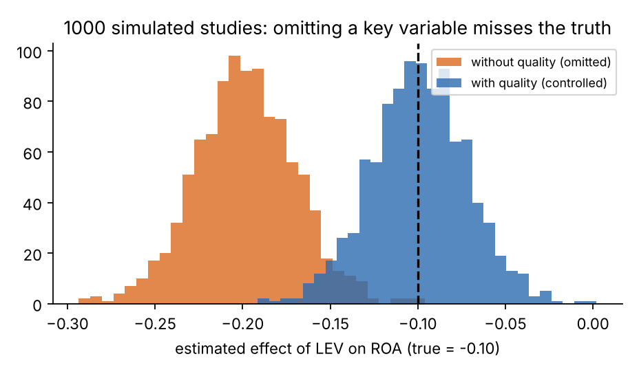
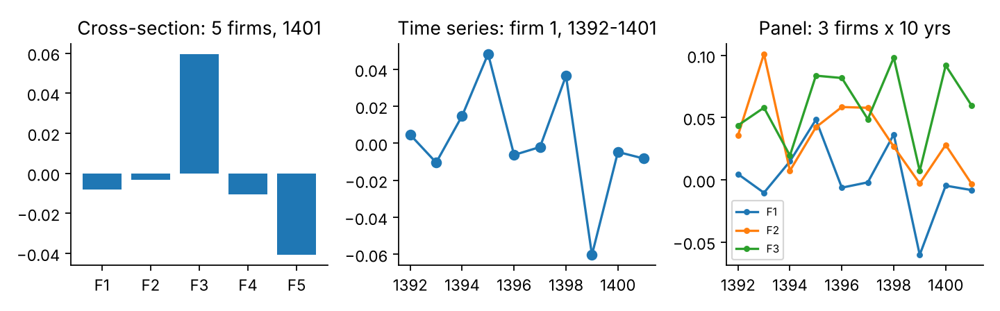
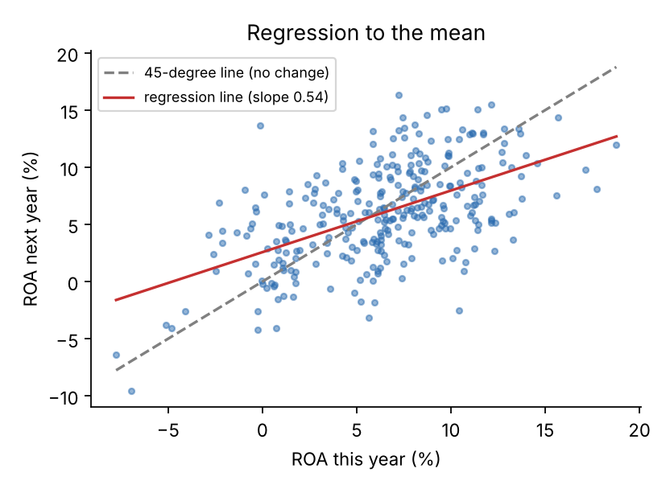
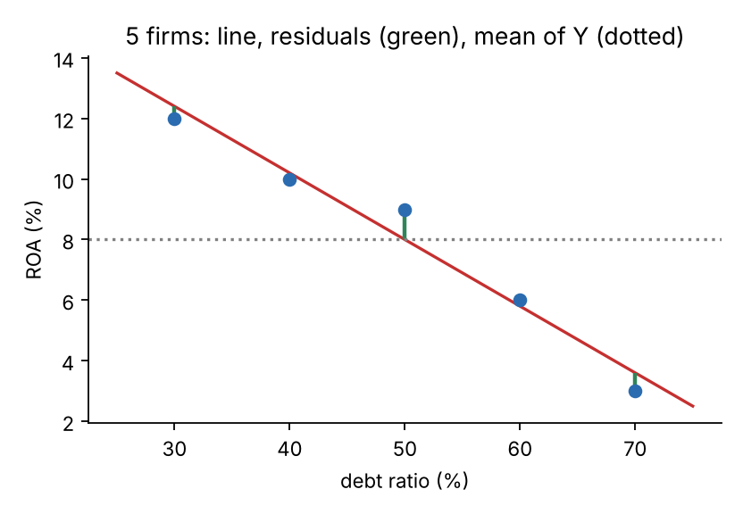
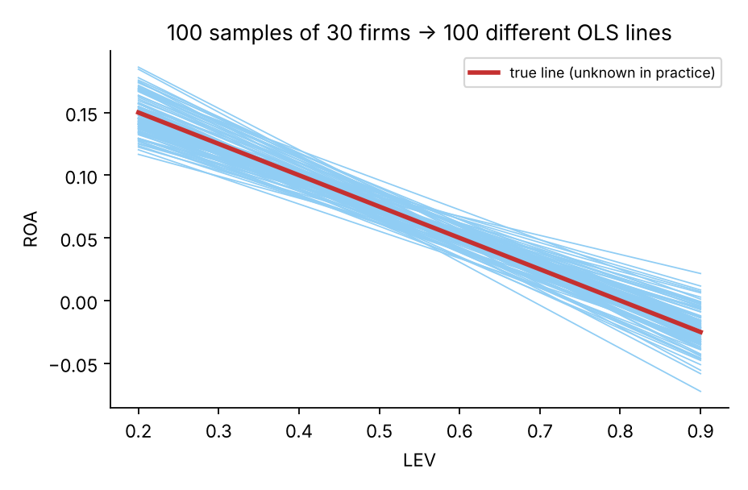
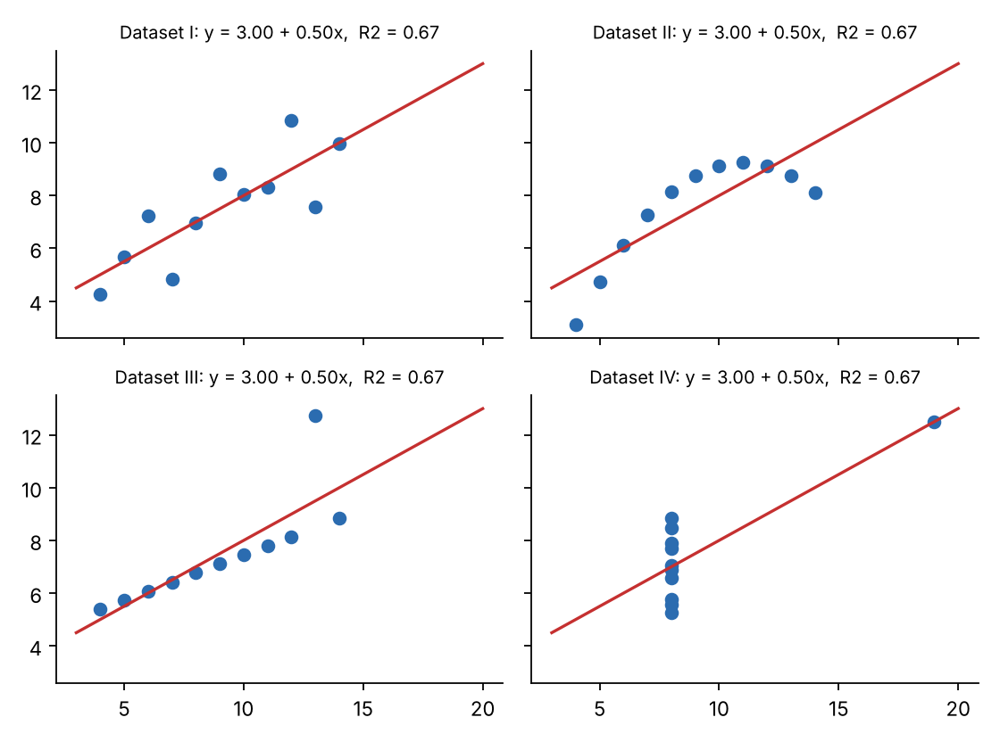

<div dir="rtl" lang="fa">

# فصل اول
# اقتصادسنجی: هنر پاسخ دادن به «چقدر؟» و «چرا؟» با داده

> «اگر شکنجه‌اش کنید، داده‌ها هر چیزی را اعتراف می‌کنند.»
> — جمله‌ای که در میان اقتصاددانان دست‌به‌دست می‌شود؛ تلنگری برای کل این فصل.

---

## داستانی که هر دانشجوی مالی دیر یا زود با آن روبه‌رو می‌شود

فرض کنید ارشد حسابداری می‌خوانید و استاد راهنما از شما می‌خواهد دربارهٔ این پرسش پژوهش کنید:

**«آیا شرکت‌هایی که بیشتر وام می‌گیرند، کم‌سودتر می‌شوند؟»**

شما به سراغ صورت‌های مالی ۲۰۰ شرکت بورسی می‌روید، نسبت بدهی و بازده دارایی (ROA) را حساب می‌کنید و در Excel می‌بینید که شرکت‌های پُربدهی به‌طور متوسط ROA کمتری دارند. خوشحال می‌شوید. اما استاد می‌پرسد:

- «شاید شرکت‌های ضعیف‌تر مجبورند بیشتر وام بگیرند، نه این‌که وام آن‌ها را ضعیف کرده باشد. از کجا می‌دانید؟»
- «اگر اهرم ۱۰ درصد بالا برود، ROA دقیقاً چقدر پایین می‌آید؟ یک عدد می‌خواهم.»
- «این عدد برای ۲۰۰ شرکت شما درست است. از کجا معلوم برای بقیهٔ شرکت‌ها هم درست باشد؟ یا شانسی بوده؟»

این سه پرسش، **سه دلیل وجود اقتصادسنجی** هستند. بقیهٔ این فصل در واقع پاسخ ساده‌ای است به همین سه سؤال. در پایان فصل:

- ۱. می‌دانید اقتصادسنجی دقیقاً چه کاری می‌کند و با آمار و ریاضی مالی چه فرقی دارد؛
- ۲. می‌دانید چرا «مقایسهٔ ساده» گمراه‌کننده است و چه چیزی را باید «ثابت نگه داشت»؛
- ۳. می‌توانید یک خط رگرسیون را **با دست** برای چند شرکت حساب کنید و بفهمید نرم‌افزار چه می‌کند؛
- ۴. می‌دانید چرا هر ضریبی که برآورد می‌کنید **یک عدد تصادفی** است و خطای معیار و p-value برای چیست؛
- ۵. نقشهٔ یک پژوهش و اشتباهات رایج دانشجویان را می‌شناسید.

> **دربارهٔ منابع این فصل.** این فصل نوشتهٔ تازه‌ای است، اما شیوهٔ آموزشی‌اش را از بهترین کتاب‌های درسی این حوزه وام گرفته است: ایدهٔ «آزمایش آرمانی» و تعریف علیت از **Stock & Watson**؛ نگاه ساختار داده و «سایر چیزها ثابت» (ceteris paribus) از **Wooldridge**؛ بحث «سوگیری انتخاب» از **Angrist & Pischke**؛ ساده‌سازی‌های شهودی و «ده فرمان» از **Peter Kennedy**؛ و تعریف‌های کلاسیک مدل جامعه/نمونه از **Gujarati**. فهرست کامل در پایان فصل آمده است و توصیه می‌کنم حتماً سراغشان بروید.

---

## ۱. اقتصادسنجی برای چه ساخته شده؟

### سه نوع پرسش

اقتصادسنجی (Econometrics) یعنی **استفاده از آمار برای پاسخ دادن به پرسش‌های اقتصادی و مالی با داده‌های واقعی**. پرسش‌ها معمولاً از یکی از این سه نوع‌اند:

| نوع پرسش | مثال در مالی و حسابداری |
|---|---|
| **آیا؟** (آزمون فرضیه) | آیا اهرم مالی بر سودآوری اثر دارد؟ |
| **چقدر؟** (برآورد اندازه) | اگر نسبت بدهی ۱۰ واحد درصد بالا برود، ROA چقدر تغییر می‌کند؟ |
| **چه می‌شود؟** (پیش‌بینی) | با این ویژگی‌ها، سود شرکت سال بعد چقدر خواهد بود؟ |

تقریباً تمام کتاب‌های درسی اقتصادسنجی، از جمله Stock و Watson، کار خود را از همین‌جا شروع می‌کنند: از **پرسش**، نه از فرمول.

### تفاوت با آمار و ریاضی مالی

سه دانش را با یک مثال مقایسه کنید:

- **آمار** می‌گوید: «میانگین ROA شرکت‌های نمونه ۵٫۳٪ است و انحراف معیارش ۴٫۸٪.» یعنی داده را **توصیف** می‌کند.
- **ریاضی مالی** می‌گوید: «اگر ROA ثابت ۵٫۳٪ بماند و نرخ تنزیل ۲۵٪ باشد، ارزش شرکت چنین می‌شود.» یعنی با **فرض‌های معلوم**، محاسبه می‌کند.
- **اقتصادسنجی** می‌گوید: «با ثابت نگه داشتن اندازه و رشد، هر ۱۰ واحد درصد اهرم بیشتر با حدود ۱٫۵ واحد درصد ROA کمتر همراه است، و این رابطه به‌احتمال زیاد شانسی نیست.» یعنی **رابطه را از دل داده درمی‌آورد، اندازه‌اش را می‌دهد و می‌گوید چقدر به آن اطمینان داریم**.

اقتصادسنجی روی دوش آمار سوار است، اما یک چیز اضافه دارد: **نظریه**. مدل شما از نظریهٔ مالی می‌آید (مثلاً نظریهٔ ساختار سرمایه)، و آمار فقط برای آزمودنش به کار می‌رود.

### یک محدودیت بنیادین: ما آزمایش نمی‌کنیم، فقط نگاه می‌کنیم

فیزیک‌دان می‌تواند شرایط را کنترل کند. شما نمی‌توانید ۱۰۰ شرکت را تصادفی دو دسته کنید و به نیمی بگویید «وام بگیر» و به نیم دیگر «نگیر». آنچه دارید **داده‌های مشاهده‌ای** است: شرکت‌ها خودشان تصمیم گرفته‌اند و شما نتیجه را می‌بینید. بخش بزرگی از هنر اقتصادسنجی تلاش برای این است که با همین داده‌های ناکامل، تا حد امکان به نتیجه‌ای شبیه آزمایش واقعی برسیم. بخش بعد دربارهٔ همین است.

---

## ۲. مهم‌ترین ایدهٔ اقتصادسنجی: «سایر چیزها ثابت»

### آزمایش آرمانی

Stock و Watson ایدهٔ علیت را این‌گونه شروع می‌کنند: فرض کنید می‌توانستیم یک آزمایش **آرمانی** (تصادفی و کنترل‌شده) انجام دهیم. شرکت‌ها را قرعه‌کشی کنیم؛ نیمی را به‌زور با بدهی بالا و نیمی را با بدهی پایین راه بیندازیم؛ سپس ROA دو گروه را مقایسه کنیم. چون **قرعه** گروه‌ها را ساخته، دو گروه در همه چیز شبیه‌اند (اندازه، مدیریت، صنعت، شانس) مگر در یک چیز: اهرم. پس اختلاف ROA فقط به اهرم برمی‌گردد. این اختلاف را **اثر علّی** می‌نامیم.

در دنیای واقعی قرعه‌کشی نمی‌کنیم. پس هر مقایسه‌ای که می‌کنیم، باید از خود بپرسیم: «این مقایسه چقدر به آن آزمایش آرمانی نزدیک است؟»

### چرا مقایسهٔ ساده گمراه می‌کند؟

شرکت‌هایی که بدهی زیاد دارند، فقط در «بدهی» با بقیه فرق ندارند. شاید شرکت‌هایی هستند که:

- مدیریت ضعیف‌تری دارند و بانک‌ها هم به آن‌ها شرایط سخت‌تری می‌دهند؛
- در صنعتی سرمایه‌بر کار می‌کنند و ذاتاً حاشیهٔ سود کمتری دارند؛
- کوچک‌اند و به منابع ارزان دسترسی ندارند.

Angrist و Pischke (در کتاب Mastering 'Metrics) به این مشکل **سوگیری انتخاب** (Selection Bias) می‌گویند: گروه‌هایی که مقایسه می‌کنیم **خودشان را** در آن گروه قرار داده‌اند، نه قرعه. اختلافی که می‌بینیم ترکیبی است از اثر واقعی بدهی **و** تفاوت‌های از پیش موجود.

اقتصاددانان برای نام‌بردن از همین ایده، عبارت لاتین **ceteris paribus** (سایر چیزها ثابت) را به کار می‌برند. Wooldridge هم تمام بحث علیت در فصل اول کتابش را حول همین عبارت می‌چیند: وقتی می‌گوییم «اهرم بر سودآوری اثر دارد»، منظورمان این است که **اگر بقیهٔ چیزهای مؤثر ثابت بودند**، با تغییر اهرم، سودآوری چه می‌شد.

### یک شبیه‌سازی که این را نشان می‌دهد

بیایید یک «دنیای ساختگی» بسازیم که حقیقتش را خودمان می‌دانیم:

- **حقیقت:** هر ۱ واحد افزایش نسبت بدهی، ROA را `0.10` کاهش می‌دهد (یعنی ۱۰ واحد درصد بدهی بیشتر ← ۱ واحد درصد ROA کمتر).
- یک عامل پنهان داریم: «کیفیت مدیریت». مدیران بهتر ROA بالاتری می‌سازند **و** کمتر وام می‌گیرند.

اگر ۲۰۰ شرکت از این دنیا بسازیم و ساده ROA را روی بدهی رگرسیون کنیم، ضریب چه می‌شود؟ این کار را ۱۰۰۰ بار تکرار کردم (هر بار با ۲۰۰ شرکت تازه):



**نتیجه:** وقتی کیفیت مدیریت را نادیده می‌گیریم، میانگین ضریب برآوردی تقریباً **−۰٫۲۰** است؛ **دو برابر حقیقت** (−۰٫۱۰). وقتی آن را کنترل می‌کنیم، میانگین **−۰٫۰۹۹** است؛ تقریباً دقیق. جهت درست بود، اما **اندازه** را دو برابر بزرگ‌نمایی کردیم. بخشی از «اثر» اهرم در واقع اثر مدیریت بود که در ضریب اهرم «چسبیده» بود.

این پدیده **سوگیری متغیر جاافتاده** (Omitted Variable Bias) نام دارد و مهم‌ترین تهدید پایان‌نامه‌های مالی و حسابداری است. درس عملی‌اش: **هر عاملی که هم روی Y اثر دارد و هم با X همراه است، باید در مدل بیاید (به‌عنوان متغیر کنترل).**

> **کاربرد در پایان‌نامه.** در بخش روش‌شناسی، برای هر متغیر کنترل بنویسید «چرا» آن را آورده‌اید: به‌صورت «اندازهٔ شرکت هم بر سودآوری اثر دارد و هم با میزان دسترسی به بدهی همراه است؛ بنابراین برای جلوگیری از سوگیری، کنترل شد.» این یک جمله، تفاوت یک متغیر کنترل «تقلیدی» با یک متغیر کنترل «مستدل» است.

---

## ۳. داده‌ها چه شکلی‌اند؟

### اول، یک جدول

هر داده‌ای که در اقتصادسنجی با آن کار می‌کنید در عمل یک **جدول** است: هر **ردیف** یک مشاهده (Observation) و هر **ستون** یک متغیر (Variable). این‌که ردیف‌ها چه چیزی هستند، نوع داده را مشخص می‌کند. Wooldridge در همان فصل اول چهار ساختار را معرفی می‌کند؛ ما سه ساختار اصلی را می‌گوییم:

**۱) داده مقطعی (Cross-section):** چند واحد، در یک زمان. هر ردیف یک شرکت است.
مثال: ROA و اهرم ۲۰۰ شرکت در سال ۱۴۰۱.

**۲) سری زمانی (Time series):** یک واحد، در چند زمان. هر ردیف یک دوره است.
مثال: ROA سالانهٔ «یک» شرکت از ۱۳۹۲ تا ۱۴۰۱؛ یا شاخص کل بورس به‌صورت روزانه.

**۳) داده تابلویی (Panel):** چند واحد، در چند زمان. هر ردیف یک «شرکت-سال» است.
مثال: ۲۰ شرکت × ۱۰ سال = ۲۰۰ ردیف.



بیشتر پایان‌نامه‌های حسابداری از نوع **تابلویی** هستند، چون در آن‌ها هم تفاوت شرکت‌ها دیده می‌شود و هم تغییر در طول زمان؛ و تعداد مشاهدات بیشتر است. جدول زیر تکه‌ای از داده‌ای است که در همین کتاب با آن کار می‌کنیم:

| شرکت | سال | ROA | اندازه (SIZE) | اهرم (LEV) |
|---|---|---|---|---|
| ۱ | ۱۳۹۲ | ۰٫۰۰۵ | ۱۲٫۸۱ | ۰٫۷۳ |
| ۱ | ۱۳۹۳ | −۰٫۰۱۰ | ۱۳٫۰۲ | ۰٫۶۶ |
| ۱ | ۱۳۹۴ | ۰٫۰۱۵ | ۱۳٫۱۱ | ۰٫۶۱ |
| ۲ | ۱۳۹۲ | … | … | … |

*(داده‌های این کتاب شبیه‌سازی شده‌اند؛ واقعی نیستند.)*

### هر نوع داده، دردسر مخصوص خودش را دارد

- در **مقطعی**، شرکت‌های بزرگ و کوچک پراکندگی متفاوتی دارند (بعداً: ناهمسانی واریانس).
- در **سری زمانی**، سود امسال به سود پارسال وابسته است (بعداً: خودهمبستگی) و بعضی سری‌ها روند دارند.
- در **تابلویی**، هر شرکت ویژگی‌های ثابت و نامشاهده‌ای دارد (فرهنگ سازمانی، مدیریت) که باید با ابزار ویژه‌ای مهار شود (بعداً: اثرات ثابت و تصادفی).

الان لازم نیست این اصطلاح‌ها را بدانید؛ فقط یادتان باشد که **اولین کار در هر پژوهش، نوشتن یک جملهٔ ساده دربارهٔ داده است:** «داده‌های من تابلویی و شامل N شرکت در T سال، جمعاً n مشاهده است.»

---

## ۴. مدل: یک خط، یک فرمول، یک جملهٔ خطا

### رگرسیون یعنی «میانگین به شرط»

شاید قدیمی‌ترین داستان رگرسیون، از **فرانسیس گالتون** در سال ۱۸۸۶ باشد. او قد پدران و پسرانشان را اندازه گرفت و دید: پدران بسیار قدبلند، پسرانی دارند که **به‌طور متوسط** از خودشان کوتاه‌ترند (هرچند هنوز بلندتر از میانگین جامعه)؛ و پدران بسیار کوتاه، پسرانی دارند که به‌طور متوسط بلندترند. او این پدیده را «بازگشت به سوی میانگین» (regression to the mean) نامید، و نام «رگرسیون» از همین‌جا ماند.

همین پدیده در مالی بسیار آشناست. نمودار زیر، ROA یک گروه شرکت را در دو سال متوالی نشان می‌دهد:



خط خاکستری یعنی «سال بعد دقیقاً مثل امسال». اما خط قرمز (رگرسیون) **شیب کمتری دارد** (حدود ۰٫۵). یعنی شرکتی که امسال ROA فوق‌العاده داشته، سال بعد معمولاً کمی به سمت میانگین برمی‌گردد (بخشی از موفقیتش شانس بوده است). اگر این را ندانید، ممکن است مدیرانی را که یک سال خوب داشتند «نابغه» و آن‌ها را که یک سال بد داشتند «ناتوان» بپندارید.

**پس رگرسیون چیست؟** ساده‌ترین تعریف: **«میانگین Y را به شرط معلوم بودن X» نشان می‌دهد.** به زبان ساده: «شرکت‌هایی که X=این مقدار دارند، به‌طور متوسط Y چقدر دارند؟» خط رگرسیون همان «میانگین شرطی» است.

### معادلهٔ مدل

ساده‌ترین مدل، یک خط است:

```
ROA = β0 + β1 · LEV + u
```

بیایید تک‌تک اجزایش را بشناسیم:

| نماد | نام | معنی به زبان ساده |
|---|---|---|
| `ROA` | متغیر وابسته (Y) | چیزی که می‌خواهیم توضیح دهیم |
| `LEV` | متغیر مستقل (X) | چیزی که فکر می‌کنیم اثر دارد |
| `β0` | عرض از مبدأ | مقدار انتظاری ROA وقتی LEV صفر باشد (نقطهٔ شروع خط) |
| `β1` | شیب | هر ۱ واحد افزایش LEV، ROA را به‌طور متوسط چقدر عوض می‌کند |
| `u` | جملهٔ خطا | همهٔ آنچه روی ROA اثر دارد و در مدل نیست |

برای چند متغیر، فقط جمله‌های بیشتری اضافه می‌شود:

```
ROA = β0 + β1·SIZE + β2·LEV + β3·GROWTH + β4·CFO + u
```

**ضریب هر متغیر، اثر آن را در حالی نشان می‌دهد که بقیهٔ متغیرهای مدل ثابت‌اند**: همان ceteris paribus که در بخش قبل دیدیم و دلیل اصلی ورود متغیرهای کنترل.

### «پارامتر» و «برآورد»: دو چیز متفاوت

- **پارامتر** (مثل `β1`) عدد **واقعی و ناشناختهٔ جامعه** است. هرگز آن را نمی‌بینیم.
- **برآورد** (با کلاه: `β̂1`) عددی است که از **نمونهٔ ما** در می‌آید. با نمونهٔ دیگر، عدد دیگری می‌شد.

گوجاراتی (Gujarati) در کتاب «مبانی اقتصادسنجی» همین تفاوت را با دو اصطلاح می‌گوید: **تابع رگرسیون جامعه** (آنچه واقعاً هست) و **تابع رگرسیون نمونه** (آنچه از داده درآورده‌ایم). هدف ما این است که دومی تا حد ممکن به اولی نزدیک باشد.

### جملهٔ خطا از کجا می‌آید؟

`u` بی‌دلیل در مدل نیست. چهار منبع دارد:

- ۱. **متغیرهای حذف‌شده:** کیفیت مدیریت، روابط با بانک‌ها، که اندازه‌گیری نمی‌شوند.
- ۲. **خطای اندازه‌گیری:** ارقام حسابداری شامل برآوردها و اقلام تعهدی‌اند و دقیق نیستند.
- ۳. **ساده‌سازی شکل رابطه:** شاید رابطهٔ واقعی خط راست نیست.
- ۴. **تصادف ذاتی:** شوک‌های پیش‌بینی‌ناپذیر، مثل تحریم یا نوسان ناگهانی ارز.

> **تفاوت «خطا» و «باقیمانده».** `u` خطای **واقعی** و نامشاهده است. بعد از برآورد، چیزی که ما واقعاً محاسبه می‌کنیم **باقیمانده** (`e`) است: «ROA واقعی منهای ROA پیش‌بینی‌شدهٔ خط». باقیمانده، تخمینی از خطاست.

---

## ۵. خط را با دست بکشیم: روش کمترین مربعات (OLS)

### ایدهٔ اصلی

فرض کنید پنج شرکت داریم. می‌خواهیم بهترین خط را از میان نقطه‌هایشان بگذرانیم. «بهترین» یعنی چه؟ روش کمترین مربعات معمولی (OLS: Ordinary Least Squares) جواب می‌دهد: **خطی که مجموع مربعات فاصلهٔ عمودی نقطه‌ها تا خط کمترین باشد.**

چرا «مربع»؟ سه دلیل ساده دارد: (۱) فاصله‌های بالای خط و پایین خط، همدیگر را خنثی نمی‌کنند؛ (۲) خطاهای بزرگ بیشتر جریمه می‌شوند (فاصلهٔ ۲ برابر، جریمهٔ ۴ برابر)؛ (۳) ریاضی‌اش یک جواب یکتا و ساده می‌دهد.

### مثال قدم‌به‌قدم با پنج شرکت

| شرکت | نسبت بدهی (X، به درصد) | ROA (Y، به درصد) |
|---|---|---|
| الف | ۳۰ | ۱۲ |
| ب | ۴۰ | ۱۰ |
| پ | ۵۰ | ۹ |
| ت | ۶۰ | ۶ |
| ث | ۷۰ | ۳ |

**گام ۱: میانگین‌ها.** میانگین X برابر ۵۰ و میانگین Y برابر ۸.

**گام ۲: انحراف از میانگین.** برای هر شرکت، X و Y را از میانگین کم می‌کنیم و ضرب می‌کنیم:

| شرکت | X − ۵۰ | Y − ۸ | حاصل‌ضرب | مربع (X − ۵۰) |
|---|---|---|---|---|
| الف | −۲۰ | +۴ | −۸۰ | ۴۰۰ |
| ب | −۱۰ | +۲ | −۲۰ | ۱۰۰ |
| پ | ۰ | +۱ | ۰ | ۰ |
| ت | +۱۰ | −۲ | −۲۰ | ۱۰۰ |
| ث | +۲۰ | −۵ | −۱۰۰ | ۴۰۰ |
| **جمع** | | | **−۲۲۰** | **۱۰۰۰** |

**گام ۳: شیب.** جمع حاصل‌ضرب‌ها تقسیم بر جمع مربع‌ها:

```
β̂1 = (−220) / 1000 = −0.22
```

شهود: صورت کسر نشان می‌دهد X و Y چقدر «با هم حرکت می‌کنند» (اینجا خلاف جهت هم)؛ مخرج نشان می‌دهد X خودش چقدر پراکنده است. شیب = «هم‌حرکتی» تقسیم بر «پراکندگی X».

**گام ۴: عرض از مبدأ.** خط همیشه از نقطهٔ میانگین‌ها `(50, 8)` می‌گذرد:

```
β̂0 = 8 − (−0.22)(50) = 8 + 11 = 19
```

**نتیجه:** `ROA^ = 19 − 0.22 × LEV`

**تفسیر:** هر ۱ واحد درصد نسبت بدهی بیشتر، به‌طور متوسط با ۰٫۲۲ واحد درصد ROA کمتر همراه است؛ یا ۱۰ واحد درصد بدهی بیشتر ← ۲٫۲ واحد درصد ROA کمتر.



خطوط سبز، **باقیمانده‌ها**ند. جدول مقادیر پیش‌بینی‌شده و باقیمانده‌ها:

| شرکت | ROA واقعی | ROA پیش‌بینی‌شده (۱۹ − ۰٫۲۲X) | باقیمانده e |
|---|---|---|---|
| الف | ۱۲ | ۱۲٫۴ | −۰٫۴ |
| ب | ۱۰ | ۱۰٫۲ | −۰٫۲ |
| پ | ۹ | ۸٫۰ | +۱٫۰ |
| ت | ۶ | ۵٫۸ | +۰٫۲ |
| ث | ۳ | ۳٫۶ | −۰٫۶ |

مجموع باقیمانده‌ها صفر است، و مجموع مربعاتشان `0.16 + 0.04 + 1 + 0.04 + 0.36 = 1.6` است. هیچ خط دیگری مجموع مربعاتی کمتر از ۱٫۶ نمی‌دهد.

### R²: خط چقدر خوب است؟

اگر هیچ مدلی نداشتیم، بهترین پیش‌بینی برای ROA هر شرکت همان میانگین (۸) بود و مجموع مربعات خطایش برابر است با `16+4+1+4+25 = 50` (این را «مجموع مربعات کل» می‌نامیم). با خط، به ۱٫۶ رسیدیم. ضریب تعیین:

```
R² = 1 − (مجموع مربعات باقیمانده) / (مجموع مربعات کل) = 1 − 1.6/50 = 0.968
```

یعنی **۹۷٪ پراکندگی ROA این پنج شرکت با اهرم توضیح داده شد.** R² همیشه بین صفر و یک است؛ صفر یعنی مدل هیچ کمکی نکرد، یک یعنی همهٔ نقطه‌ها دقیقاً روی خط‌اند.

> **هشدار.** این مثال عمداً تمیز ساخته شده. در داده‌های واقعی بورس، R² معمولاً بین ۰٫۱ و ۰٫۵ است و این طبیعی است. در داده ۲۰۰تایی کتاب، رگرسیون ساده ROA روی اهرم `R² = 0.16` دارد (`ROA^ = 0.142 − 0.156·LEV`). **R² بالا هدف نیست؛ فهم رابطه و درستی برآورد هدف است.**

### وقتی چند متغیر داریم

با چند متغیر مستقل ایده همان است؛ فقط به‌جای یک خط، یک «صفحه» در فضای چندبعدی می‌گذرانیم. فرمول ماتریسی `β̂ = (X'X)⁻¹X'Y` همین را برای نرم‌افزار حساب می‌کند. شما کافی است بدانید: **EViews و هر نرم‌افزار دیگر، دقیقاً همین حداقل‌کردن مجموع مربعات را انجام می‌دهد**؛ فقط سریع‌تر.

---

## ۶. ضریب شما یک عدد تصادفی است!

### چرا نمونهٔ دیگر، عدد دیگری می‌دهد؟

مثال قبل ضریب `−۰٫۲۲` داد. اگر به‌جای این پنج شرکت، پنج شرکت دیگر انتخاب کرده بودیم، احتمالاً عدد دیگری می‌شد. پس `β̂1` یک **متغیر تصادفی** است: مقدارش به این بستگی دارد که کدام نمونه به دستمان افتاده.

برای دیدن این ایده، دنیای ساختگی دیگری ساختم که در آن حقیقت `β1 = −0.25` است. ۱۰۰ بار، هر بار ۳۰ شرکت تصادفی انتخاب کردم و برای هرکدام خط OLS کشیدم:



خط قرمز، حقیقت است. هر خط آبی، «یک پژوهشگر» است که نمونه‌اش را دارد. دو نکتهٔ مهم می‌بینید:

- ۱. خطوط **حول** خط حقیقی پراکنده‌اند و میانگین ۱۰۰ ضریب برابر `−0.244` بود؛ بسیار نزدیک `−0.25`. پس روش «به‌طور متوسط درست» است. به این ویژگی **نااریبی** (Unbiasedness) می‌گویند.
- ۲. هیچ پژوهشگری دقیقاً به حقیقت نمی‌رسد. پراکندگی ضرایب (انحراف معیار ۰٫۰۳۸) نشان می‌دهد هر نمونه چقدر ممکن است خطا کند. این پراکندگی همان **خطای معیار** (Standard Error) است.

### خطای معیار، t و p-value: سه نام برای یک ایده

- **خطای معیار** (S.E.): «اگر پژوهش را با نمونه‌های دیگر تکرار کنیم، ضریب به‌طور معمول چقدر بالا و پایین می‌رود؟» هرچه کوچک‌تر، برآورد دقیق‌تر. نمونهٔ بزرگ‌تر و پراکندگی بیشتر X، خطای معیار را کم می‌کنند؛ نویز زیاد در خطا، آن را زیاد می‌کند.
- **آمارهٔ t**: ضریب تقسیم بر خطای معیار. می‌پرسد «ضریب چند خطای معیار از صفر دور است؟» قاعدهٔ سرانگشتی: اگر `|t|` بیشتر از حدود ۲ باشد، به‌سختی می‌توان آن را شانسی دانست.
- **p-value**: «اگر در واقعیت هیچ رابطه‌ای نبود (β=۰)، چقدر احتمال داشت صرفاً به‌خاطر شانس در نمونه رابطه‌ای به این قوت ببینیم؟» p کوچک (مثلاً کمتر از ۰٫۰۵) یعنی چنین چیزی بعید است؛ پس رابطه را «معنادار» می‌نامیم.

**ادامهٔ مثال پنج شرکت:** خطای معیار شیب `0.0231` است (از رابطهٔ `√(1.6/3 ÷ 1000)`، چون ۳ درجهٔ آزادی داریم: پنج مشاهده منهای دو پارامتر). آنگاه `t = −0.22/0.0231 = −9.5`. با تنها سه درجهٔ آزادی، مقدار بحرانی ۵٪ برابر ۳٫۱۸ است، پس معنادار است. بازهٔ اطمینان ۹۵٪ برای شیب `−0.22 ± 3.18×0.0231`، یعنی تقریباً از `−0.29` تا `−0.15` است.

> **سه برداشت غلط دربارهٔ p-value.** (۱) p-value احتمال درست‌بودن فرض صفر **نیست**. (۲) p بسیار کوچک یعنی اثر **بزرگ** نیست؛ فقط یعنی برآورد دقیق است. (۳) معنادار نشدن یعنی «اثر نیست» **نیست**؛ شاید نمونه کوچک بوده. در پایان‌نامه، همیشه اندازهٔ ضریب را هم تفسیر کنید.

---

## ۷. هرگز فقط به عدد اعتماد نکنید: چهارتایی آنسکوم

این بخش را از یک مثال جالب شروع می‌کنم. آماردان انگلیسی فرانک آنسکوم (Anscombe) در سال ۱۹۷۳ چهار مجموعه داده ساخت که **در همهٔ شاخص‌های رگرسیون عین هم‌اند**: میانگین X یکسان، میانگین Y یکسان، همبستگی ۰٫۸۱۶، همان خط `y = 3 + 0.5x` و همان `R² = 0.67`. اگر فقط جدول خروجی نرم‌افزار را ببینید، هیچ تفاوتی حس نمی‌کنید. اما نمودارهایشان:



- **I:** رابطهٔ خطی معمولی؛ خط مناسب است.
- **II:** رابطه خمیده است؛ خط مناسب نیست (شکل تابعی غلط).
- **III:** یک مشاهدهٔ پرت، خط را کج کرده است.
- **IV:** همه‌چیز به یک نقطهٔ پرت وابسته است؛ بدون آن، X اصلاً تغییری ندارد.

**درس:** پیش از رگرسیون و پس از آن، **نمودار بکشید**. نمودار پراکندگی داده، نمودار باقیمانده‌ها، هیستوگرام. این ساده‌ترین و ارزان‌ترین تشخیص خطا است و Kennedy آن را «آزمون ضربهٔ بصری» (interocular trauma test) می‌نامد: وقتی چیزی آن‌قدر واضح است که «مستقیم به چشم‌تان می‌خورد».

---

## ۸. چه زمانی می‌توان به OLS اعتماد کرد؟

OLS ابزاری قدرتمند است، اما ضمانت‌نامه دارد. ایدهٔ **قضیهٔ گاوس–مارکوف** این است: اگر چند شرط برقرار باشند، OLS در میان همهٔ روش‌های «خطی و نااریب»، **دقیق‌ترین** است. به این برآوردگر **BLUE** می‌گویند (Best Linear Unbiased Estimator: بهترین برآوردگر خطی نااریب). شرط‌ها را به زبان آدمی بگوییم:

| شرط به زبان ساده | اگر برقرار نباشد چه می‌شود؟ | بیشتر در کدام فصل؟ |
|---|---|---|
| مدل از نظر شکل درست باشد (رابطه واقعاً خطی در ضرایب است) | ضریب‌ها سوگیر می‌شوند | فصل ۳ |
| هیچ عامل مهمی را فراموش نکرده باشیم و X با «بقیهٔ عوامل» (u) هم‌بستگی نداشته باشد | **ضریب سوگیر و غلط است** (مثل شبیه‌سازی بخش ۲) | فصل ۳ |
| پراکندگی خطا در همهٔ شرکت‌ها یکسان باشد (همسانی واریانس) | ضریب درست است ولی **خطای معیار غلط** است | فصل ۳ |
| خطاهای شرکت‌ها/سال‌ها به هم وابسته نباشند | ضریب درست ولی خطای معیار غلط | فصل ۳ |
| متغیرهای مستقل «اطلاعات تکراری» نداشته باشند (عدم همخطی) | خطای معیار بزرگ می‌شود | فصل ۳ |
| خطا تقریباً نرمال باشد | فقط در نمونهٔ کوچک اهمیت دارد | فصل ۳ |

**یک تمایز حیاتی:** این شرط‌ها دو دسته‌اند.

- شرط‌هایی که اگر نقض شوند، **خود ضریب غلط است** (شکل مدل، متغیر جاافتاده، درون‌زایی). این‌ها خطرناک‌اند و با «خطای معیار مقاوم» درست نمی‌شوند؛ باید مدل را درست کرد.
- شرط‌هایی که اگر نقض شوند، **ضریب درست است ولی انحراف معیارش را اشتباه می‌گوییم** (ناهمسانی، خودهمبستگی). این‌ها با روش‌های مقاوم معمولاً درمان می‌شوند.

فصل سوم همین شرط‌ها را یکی‌یکی و با EViews آزمون می‌کند. فعلاً همین شهود کافی است: **OLS ضمانت‌نامه دارد، و کار ما چک کردن شرایط ضمانت‌نامه است.**

---

## ۹. متغیرها چند جنس‌اند؟

بیشتر پایان‌نامه‌ها با همین چند نوع متغیر ساخته می‌شوند. هرکدام را با یک مثال ساده ببینیم.

**۱) وابسته و مستقل.** وابسته آنچه می‌خواهید توضیح دهید (ROA)؛ مستقل آنچه فرض می‌کنید اثر دارد (اهرم). متغیرهای **کنترل**، متغیرهای مستقلی‌اند که فقط برای «ثابت نگه داشتن» آن‌ها وارد می‌کنید.

**۲) مجازی (Dummy).** فقط ۰ یا ۱. برای ویژگی‌های کیفی: «۱ اگر سال ۱۳۹۹ یا بعد، ۰ در غیر این صورت». ضریب مجازی یعنی **«گروه ۱ به‌طور متوسط چقدر از گروه ۰ بالاتر یا پایین‌تر است».** مثال: ضریب `−0.03` برای مجازی کرونا یعنی ROA پس از ۱۳۹۹ حدود ۳ واحد درصد کمتر بوده، با ثابت بودن بقیه. قاعدهٔ مهم: اگر یک ویژگی k گروه دارد، فقط **k−۱** مجازی وارد کنید.

**۳) لگاریتمی.** به‌جای `X`، `ln(X)` را وارد می‌کنیم؛ مثلاً اندازه: `SIZE = ln(دارایی)`. دو دلیل: توزیع دارایی‌ها خیلی چوله است، و ضرایب به «درصد» تفسیر می‌شوند. لگاریتم فقط برای مقدار **مثبت** تعریف است. قاعدهٔ تفسیر:

| مدل | یعنی |
|---|---|
| `Y` روی `X` | یک واحد X ← β واحد Y |
| `ln Y` روی `ln X` | ۱٪ تغییر X ← β٪ تغییر Y (**کشش**) |
| `ln Y` روی `X` | یک واحد X ← تقریباً ۱۰۰β٪ تغییر Y |
| `Y` روی `ln X` | ۱٪ تغییر X ← β/۱۰۰ واحد تغییر Y |

**۴) وقفه‌ای (Lagged).** مقدار دورهٔ قبل (`X` در `t−1`). کاربردش: وقتی اثر یک عامل دیر ظاهر می‌شود، یا وقتی می‌خواهیم نگرانی «علیت معکوس» را کمتر کنیم (اهرم پارسال نمی‌تواند از ROA امسال متأثر شده باشد). هزینه‌اش: یک سال داده از دست می‌رود.

**۵) تعاملی (Interaction).** حاصل‌ضرب دو متغیر، مثلاً `LEV × COVID`. می‌پرسد: «آیا اثر اهرم بعد از کرونا با قبل از آن فرق دارد؟» ضریب تعامل، **تغییر شیب** را نشان می‌دهد.

> **کاربرد در پایان‌نامه.** برای هر متغیر، در جدول «تعریف عملیاتی» بنویسید: نام، نماد، فرمول محاسبه، نوع (وابسته/مستقل/کنترل/مجازی)، و علامت مورد انتظار ضریب (از نظریه).

---

## ۱۰. نقشهٔ یک پژوهش: از پرسش تا نتیجه

یک پژوهش اقتصادسنجی، در همهٔ کتاب‌ها تقریباً به یک ترتیب پیش می‌رود. این نقشه را روی میز بگذارید:

- ۱. **پرسش و فرضیه:** پرسش را روشن و جهت‌دار بنویسید («اهرم، ROA را کاهش می‌دهد»).
- ۲. **نظریه:** چرا باید چنین باشد؟ (هزینهٔ بدهی، ریسک ورشکستگی.) این نظریه، متغیرهای کنترل و علامت‌های مورد انتظار را به شما می‌دهد.
- ۳. **مدل:** معادله را بنویسید. متغیرها، شکل تابعی، علامت‌ها.
- ۴. **داده:** جامعه، نمونه، منبع، فیلترها؛ و **نگاه کردن** به داده (آمار توصیفی، نمودار، پرت‌ها).
- ۵. **برآورد:** اجرای رگرسیون.
- ۶. **بازبینی:** ضرایب را با نظریه بسنجید؛ شروط ضمانت‌نامه (مفروضات) را آزمون کنید.
- ۷. **تفسیر:** معنادار بودن، **و** اندازهٔ اثر، **و** محدودیت‌ها.
- ۸. **استحکام‌سنجی:** نتیجه را با تغییر مدل، نمونه یا تعریف متغیرها دوباره امتحان کنید. نتیجه‌ای که با کمی تغییر از بین می‌رود، قابل‌اتکا نیست.

### «ده فرمان» پیتر کندی (خلاصه)

پیتر کندی (Peter Kennedy)، نویسندهٔ کتاب شهیر «راهنمای اقتصادسنجی» (A Guide to Econometrics)، مقاله‌ای دارد با عنوان «Sinning in the Basement» که ده قاعدهٔ اخلاق و عقل سلیم در اقتصادسنجی کاربردی را می‌گوید. خلاصهٔ آن (با بیان خودم):

- ۱. **از عقل سلیم و نظریه استفاده کنید.** اگر ضریبی خلاف همهٔ منطق است، اول خودتان را بازبینی کنید.
- ۲. **پرسش درست را بپرسید.** مدل برای پاسخ به یک سؤال ساخته می‌شود، نه برای نشان دادن مهارت.
- ۳. **زمینه را بشناسید.** شرایط حسابداری و اقتصادی ایران را بدانید؛ مثلاً اثر تورم یا قیمت‌گذاری دستوری.
- ۴. **داده را ببینید.** نمودار و آمار توصیفی را فراموش نکنید.
- ۵. **مدل را ساده نگه دارید.** مدل پیچیده‌تر همیشه بهتر نیست.
- ۶. **به آزمون «ضربهٔ بصری» اعتماد کنید.** اگر نمودار دروغ می‌گوید، آماره را باور نکنید.
- ۷. **هزینه و فایدهٔ داده‌کاوی را بدانید.** امتحان کردن ده‌ها مدل تا یکی «معنادار» شود، تقلب است.
- ۸. **اهل مصالحه باشید.** هیچ مدلی کامل نیست؛ آگاهانه بپذیرید.
- ۹. **معناداری آماری را با بزرگی اثر اشتباه نگیرید.**
- ۱۰. **تحلیل حساسیت گزارش کنید.** نشان دهید نتیجه با تغییر مدل چقدر تغییر می‌کند.

---

## ۱۱. هشت اشتباه رایج دانشجویان

| # | اشتباه | راه درست |
|---|---|---|
| ۱ | ضریب را بدون واحد و اندازه گزارش می‌کنند («معنادار است») | بگویید ۱۰ واحد درصد X ← چند واحد درصد Y؛ و آن را با میانگین Y مقایسه کنید |
| ۲ | R² بالا را «مدل خوب» می‌دانند | R² تعدیل‌شده، تفسیر ضرایب و درستی شرایط OLS مهم‌ترند |
| ۳ | همبستگی را علیت می‌گیرند | از زبان محتاط استفاده کنید («همراه با»)، و بحث درون‌زایی را بیاورید |
| ۴ | آزمون مفروضات را انجام نمی‌دهند یا فقط نامشان را می‌نویسند | عدد و تصمیم و اقدام را گزارش کنید |
| ۵ | پرت‌ها و چولگی را بررسی نمی‌کنند | نمودار بکشید؛ وینزورایز را در نظر بگیرید |
| ۶ | متغیرها را بدون توجه به واحد ترکیب می‌کنند (ریال و درصد) | همه را نسبت یا لگاریتم کنید |
| ۷ | داده تابلویی را مثل مقطعی تحلیل می‌کنند | ناهمگنی شرکت‌ها را مدل کنید (فصل بعدی) |
| ۸ | پس از دیدن نتایج مدل را عوض می‌کنند تا «معنادار» شود | مدل را از پیش بنویسید؛ همهٔ مدل‌های آزمون‌شده را گزارش کنید |

---

## خلاصهٔ فصل

- **اقتصادسنجی** با آمار، «رابطه» را از داده درمی‌آورد، «اندازه»اش را می‌دهد و «میزان اطمینان» را می‌گوید؛ و بر نظریه استوار است.
- داده‌های ما **مشاهده‌ای‌اند**، پس باید مواظب **سوگیری انتخاب** و **متغیر جاافتاده** باشیم. هدف، رسیدن به مقایسهٔ «سایر چیزها ثابت» است.
- **رگرسیون** میانگین Y به شرط X است. معادله: `Y = β0 + β1X + u`؛ پارامتر ناشناختهٔ جامعه است و برآورد، عددی تصادفی از نمونه.
- **OLS** خطی را می‌یابد که مجموع مربعات باقیمانده‌ها کمینه باشد؛ شیب = هم‌حرکتی ÷ پراکندگی X. **R²** نشان می‌دهد خط چقدر از پراکندگی Y را توضیح می‌دهد.
- هر ضریب یک **عدد تصادفی** است؛ **خطای معیار** پراکندگی‌اش، **t** فاصله‌اش از صفر و **p-value** احتمال شانسی بودنش را می‌گوید.
- **همیشه نمودار بکشید** (آنسکوم).
- OLS در صورت برقراری چند شرط **BLUE** است؛ بعضی نقض‌ها ضریب را غلط می‌کنند (خطرناک)، بعضی فقط خطای معیار را.
- پژوهش خوب یک **نقشه** دارد: پرسش ← نظریه ← مدل ← داده ← برآورد ← بازبینی ← تفسیر ← استحکام‌سنجی.

### واژه‌های کلیدی

اقتصادسنجی (Econometrics) · داده مشاهده‌ای (Observational data) · سایر چیزها ثابت (Ceteris paribus) · سوگیری انتخاب (Selection bias) · سوگیری متغیر جاافتاده (Omitted variable bias) · مقطعی / سری زمانی / تابلویی (Cross-section / Time series / Panel) · متغیر وابسته / مستقل / کنترل / مجازی · پارامتر (Parameter) · برآورد (Estimate) · جملهٔ خطا (Error term) · باقیمانده (Residual) · OLS · R² · خطای معیار (Standard error) · آمارهٔ t · p-value · نااریبی (Unbiasedness) · BLUE

---

## تمرین‌ها

**تمرین ۱ (مفهومی).** سه تفاوت میان «همبستگی» و «اثر علّی» را با مثال از بازار سرمایه بنویسید.

**تمرین ۲ (داده).** برای هر مورد، نوع داده (مقطعی/سری زمانی/تابلویی) را مشخص کنید:
(الف) سود خالص ۱۵۰ شرکت در سال ۱۴۰۱؛ (ب) شاخص کل بورس به‌صورت ماهانه طی ۱۰ سال؛ (پ) نسبت‌های مالی ۳۰ بانک در ۸ سال.

**تمرین ۳ (محاسبه).** داده‌های زیر برای چهار شرکت است. خط OLS را با دست بکشید.

| شرکت | X (اندازه، لگاریتم دارایی) | Y (ROA، درصد) |
|---|---|---|
| ۱ | ۱۲ | ۲ |
| ۲ | ۱۳ | ۴ |
| ۳ | ۱۴ | ۵ |
| ۴ | ۱۵ | ۹ |

(الف) `β̂1` و `β̂0` را بیابید. (ب) برای شرکتی با X=۱۳٫۵ ROA را پیش‌بینی کنید. (پ) باقیمانده‌ها را حساب کنید و مجموعشان را بررسی کنید.

**تمرین ۴ (تفسیر).** در یک پایان‌نامه آمده: «ضریب اهرم برابر −۰٫۱۸ است (p=۰٫۰۱).» در یک پاراگراف چهار خطی، آن را به‌طور کامل و با ذکر واحد و محتاطانه تفسیر کنید.

**تمرین ۵ (تشخیص).** چرا ممکن است شرکت‌هایی که پژوهش و توسعهٔ بیشتری دارند سودآورتر هم به نظر برسند، بدون این‌که پژوهش و توسعه علت باشد؟ دو توضیح بدهید.

### پاسخ‌های کوتاه

- **۲:** (الف) مقطعی؛ (ب) سری زمانی؛ (پ) تابلویی.
- **۳:** میانگین X=۱۳٫۵ و میانگین Y=۵. `Sxy = (−1.5)(−3) + (−0.5)(−1) + (0.5)(0) + (1.5)(4) = 11` و `Sxx = 2.25+0.25+0.25+2.25 = 5`، پس `β̂1 = 11/5 = 2.2` و `β̂0 = 5 − 2.2×13.5 = −24.7`. (ب) برای X=۱۳٫۵ پیش‌بینی برابر ۵ است (خط از نقطهٔ میانگین‌ها می‌گذرد). (پ) مقادیر برازش‌شده ۱٫۷ و ۳٫۹ و ۶٫۱ و ۸٫۳ است؛ باقیمانده‌ها `+0.3` و `+0.1` و `−1.1` و `+0.7` و جمعشان صفر است.
- **۴:** نمونه: «به ازای هر ۱ واحد افزایش اهرم (یعنی ۱۰۰ واحد درصد)، ROA به‌طور متوسط ۰٫۱۸ کمتر است؛ یا به ازای ۱۰ واحد درصد اهرم بیشتر، حدود ۱٫۸ واحد درصد ROA کمتر، با ثابت بودن بقیه. این رابطه در سطح ۵٪ معنادار است، ولی داده مشاهده‌ای است و نمی‌توان علیت قطعی ادعا کرد.»
- **۵:** (۱) شرکت‌های سودآور پول بیشتری برای پژوهش دارند (علیت معکوس)؛ (۲) عامل سومی مثل اندازه یا صنعت هر دو را بالا می‌برد (متغیر جاافتاده).

---

## منابع برای مطالعهٔ بیشتر

این فصل بر ایده‌های آموزشی این کتاب‌ها تکیه دارد. به ترتیب مناسب برای دانشجوی مالی و حسابداری:

1. **Angrist, J. & Pischke, J.-S. (2015). *Mastering 'Metrics: The Path from Cause to Effect*. Princeton University Press.** بسیار کم‌ریاضی و گفت‌وگومحور؛ بهترین کتاب برای فهم «چرا»ی علیت، سوگیری انتخاب و ceteris paribus.
2. **Stock, J. & Watson, M. *Introduction to Econometrics*.** مقدمهٔ منظم و روشن؛ فصل اول دربارهٔ پرسش‌های اقتصادی، آزمایش آرمانی و انواع داده. مناسب برای مقایسهٔ رگرسیون با آزمایش.
3. **Wooldridge, J. *Introductory Econometrics: A Modern Approach*.** فصل اول دربارهٔ ماهیت اقتصادسنجی، مراحل تحلیل تجربی، ساختار داده و علیت؛ برای کار کاربردی و ساختار داده عالی است (کمی فنی‌تر).
4. **Kennedy, P. *A Guide to Econometrics*.** مرجعی شهودی با تأکید بر «درک» بیش از «فرمول»؛ و مقالهٔ *Sinning in the Basement* (Journal of Economic Surveys, 2002) برای ده فرمان.
5. **Gujarati, D. & Porter, D. *Basic Econometrics*.** مرجع کلاسیک (ترجمهٔ فارسی نیز موجود است)؛ تعریف‌های رگرسیون جامعه/نمونه و مفروضات به‌صورت مرحله‌به‌مرحله.
6. **Anscombe, F. (1973). Graphs in Statistical Analysis. *The American Statistician*, 27(1).** مقالهٔ کوتاه چهارتایی آنسکوم.
7. **Angrist, J. & Pischke, J.-S. (2009). *Mostly Harmless Econometrics*.** نسخهٔ پیشرفته‌تر و کوتاه‌تر برای وقتی که بخواهید عمیق‌تر شوید.

> **یادداشت صداقت.** ساختار فصل اول سه کتاب Wooldridge، Stock & Watson و Angrist & Pischke را از فهرست فصل‌هایشان در جست‌وجوی وب بررسی کردم؛ نقل‌قول مستقیم نیاورده‌ام و ایده‌ها را با بیان خودم نوشته‌ام. محتوای مربوط به Kennedy، Gujarati و Anscombe را از دانش خودم بازگو کرده‌ام و برای آن‌ها صفحه‌ای بررسی نکرده‌ام. پیش از ارجاع در پایان‌نامه، شمارهٔ صفحه و ویراست را از نسخهٔ خودتان بگیرید. اعداد شبیه‌سازی‌ها را خودم اجرا کرده‌ام (کد: `scripts/ch1_figures.py`).

</div>
